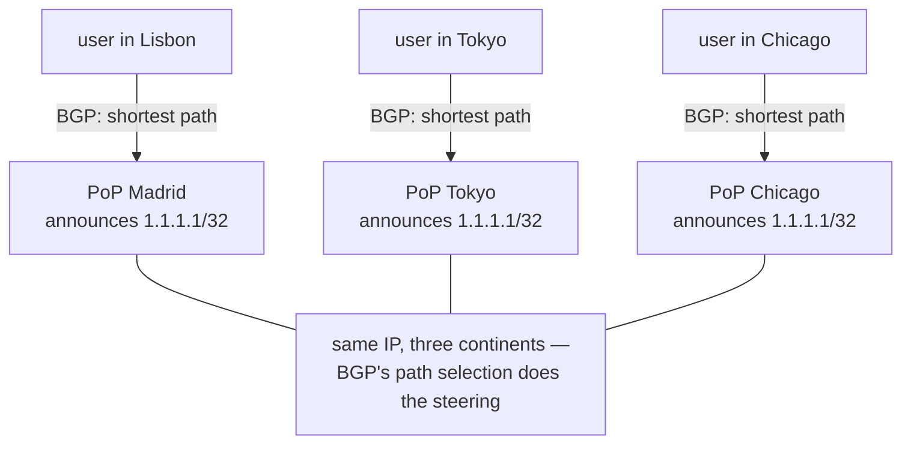

## In simple terms

Normally an IP address belongs to one machine. Anycast lets the same IP address be announced by many machines in different cities simultaneously. When your packet travels toward that address, BGP's normal path-selection finds the nearest announcer and delivers your packet there. You asked for `1.1.1.1` — you reach Cloudflare's nearest data centre, not some specific server. Every user gets the same address but a different server.

## The Visual Map



## More detail

Anycast is not a protocol — it's a routing technique that exploits BGP's normal operation. Multiple **anycast nodes** (in different ASes or data centres) announce the same prefix (e.g. `1.1.1.1/32`) into the global BGP table. BGP's shortest-AS-path selection causes each upstream router to prefer the geographically closest announcer. Users in Europe reach a European node; users in Asia reach an Asian node — transparently, via the same IP.

**Use cases where anycast excels:**

- **DNS:** The 13 DNS root server IP addresses are served by hundreds of anycast instances. `198.41.0.4` (a-root) resolves from the nearest of ~1000 physical servers worldwide.
- **DDoS mitigation:** spreading an attack across all anycast nodes absorbs it; no single location is overwhelmed. Cloudflare's network handles multi-terabit attacks via anycast absorption.
- **CDN edge delivery:** Cloudflare, Fastly, and Akamai use anycast to route HTTP requests to the nearest PoP.
- **NTP:** pool.ntp.org and Google's time.cloudflare.com use anycast.

Anycast is the reason Cloudflare can run 300+ data centres all reachable at the same IP and deliver both low latency (nearest-node routing) and DDoS resilience (traffic distributed globally). It's also why DNS is fast globally — you resolve against a root server 1–5 ms away, not a server on another continent.

## Under the Hood

From a routing-table perspective, anycast is just the same prefix learned via multiple paths — and standard path selection picking one:

```python
# what a transit router sees in its BGP table for an anycast prefix
routes_for_1_1_1_1 = [
    {"next_hop": "peer-A", "as_path": [3356, 13335]},          # via Level3 -> Cloudflare
    {"next_hop": "peer-B", "as_path": [1299, 2914, 13335]},    # via Telia -> NTT -> Cloudflare
    {"next_hop": "peer-C", "as_path": [6939, 13335]},          # via HE -> Cloudflare
]

best = min(routes_for_1_1_1_1, key=lambda r: len(r["as_path"]))
print("chosen:", best["next_hop"], "as_path", best["as_path"])
# Different routers around the world have different tables,
# so each picks a different (nearby) Cloudflare site. That asymmetry IS anycast.
```

Note all paths legitimately end in AS13335 — the same origin AS announcing the same prefix from many sites. Nothing special happens on the wire; geography emerges from ordinary path selection.

## Engineering Trade-offs

- **Statefulness breaks anycast.** BGP can route consecutive packets from the same client to different nodes (especially during route convergence). Stateless protocols (UDP-based DNS, NTP) handle this fine; TCP sessions break if the path changes mid-session — TCP anycast needs shared state, consistent hashing, or short-lived connections to be safe.
- **Geographic routing isn't load balancing.** All users at the same ISP hit the same anycast node regardless of its load; distributing load within a region needs another layer (DNS geo-routing or a [load balancer](/t/load-balancer) behind the anycast IP).
- **BGP proximity isn't network proximity.** Shortest AS path can differ wildly from lowest latency — a "nearby" node by BGP can be an ocean away. Operators tune announcements (prepending, communities, selective advertisement) to correct BGP's coarse view.
- **Convergence windows lose packets.** When a node dies, traffic keeps arriving until BGP withdraws the route (seconds to minutes). Health-check-driven route withdrawal automation shrinks but never eliminates the window.

## Real-world examples

- `1.1.1.1` (Cloudflare DNS), `8.8.8.8` (Google DNS), and all 13 DNS root server addresses are anycast.
- Cloudflare absorbs multi-terabit DDoS attacks by anycast-spreading traffic across 300+ PoPs.
- The `.com` and `.net` TLD servers (operated by Verisign) are anycast from 200+ locations.

## Common misconceptions

- **"Anycast means the same server everywhere."** The same IP, many servers — BGP picks the nearest one. The servers must synchronise state if the protocol is stateful.
- **"Anycast is load balancing."** It distributes traffic by geography, not by load. Two clients at the same ISP both hit the same node regardless of that node's load. Local load balancing is separate.

## Try it yourself

Ask `1.1.1.1` *which* of its hundreds of sites you actually reached — resolvers answer a special `id.server` query with their PoP code:

```bash
# requires: network
python3 -c "
import socket, struct
pkt = struct.pack('>HHHHHH', 0x4242, 0x0100, 1, 0, 0, 0)
for label in ('id', 'server'):
    pkt += bytes([len(label)]) + label.encode()
pkt += b'\x00' + struct.pack('>HH', 16, 3)        # TXT record, CHAOS class
s = socket.socket(socket.AF_INET, socket.SOCK_DGRAM)
s.settimeout(3)
s.sendto(pkt, ('1.1.1.1', 53))
resp, _ = s.recvfrom(512)
# the TXT answer sits at the tail: one length byte, then the text
n = next(L for L in range(1, 32) if resp[len(resp)-1-L] == L)
print('PoP id:', resp[-n:].decode(errors='replace'))
"
```

The answer (e.g. `lhr10`, `fra04`) starts with the IATA airport code of the Cloudflare site BGP chose for *you* — a friend in another country gets a different answer from the same IP.

## Learn next

- [BGP](/t/bgp) — the routing protocol whose path selection does the steering.
- [CDN](/t/cdn) — the application built on anycast's nearest-node delivery.
- [DNS](/t/dns) — the stateless protocol anycast fits best.
- [Load balancer](/t/load-balancer) — what distributes load after anycast picks the region.
