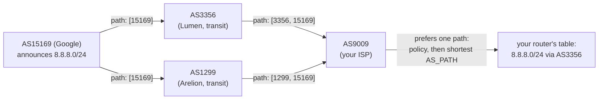

## In simple terms

The internet is not one network — it's tens of thousands of independently operated networks (ISPs, cloud providers, universities) each called an **Autonomous System (AS)**. BGP is the protocol they use to tell each other: "I can reach these IP address ranges; here's the path through me." Every router on the internet builds a routing table from BGP announcements, and packets hop from AS to AS until they reach their destination. If BGP breaks, large swaths of the internet go dark.

## The Visual Map



## More detail

Each AS has a unique **AS Number (ASN)** (e.g. AS15169 = Google, AS16509 = Amazon). BGP sessions run over TCP port 179 between routers at AS boundaries (**eBGP**, external) or within an AS for consistent routing (**iBGP**, internal).

**BGP UPDATE messages** announce or withdraw **prefixes** (IP ranges like `8.8.8.0/24`) along with **attributes**:

- **AS_PATH** — the list of ASes the prefix has traversed. Loop prevention: reject if your own ASN is in the path. Longer paths are less preferred.
- **NEXT_HOP** — the IP to forward to for this prefix.
- **LOCAL_PREF** — used within an AS to prefer exit points. Not shared across ASes.
- **MED (Multi-Exit Discriminator)** — hint to a neighbouring AS about the preferred entry point.
- **COMMUNITY** — arbitrary tags for policy tagging (e.g. "no-export", "blackhole").

**Path selection** (when multiple paths to the same prefix exist) follows a deterministic tie-breaking sequence: highest LOCAL_PREF → shortest AS_PATH → lowest MED → eBGP over iBGP → IGP metric → lowest router-id.

**BGP security** is notoriously weak. **BGP hijacking** (announcing someone else's prefix) occurs regularly — accidentally (fat-finger, misconfiguration) and maliciously. RPKI (Resource Public Key Infrastructure) cryptographically ties prefixes to ASNs and is gradually being adopted to verify origin. BGPSEC extends this to path signing.

BGP is literally the protocol that makes the internet work as one network instead of thousands of disconnected ones. A BGP misconfiguration can and regularly does take down significant fractions of internet reachability. Understanding BGP explains why the internet is resilient to some failures and fragile to others, how anycast works, and how traffic engineering is done at scale.

## Under the Hood

BGP's path-selection algorithm, reduced to its decision ladder:

```python
def best_path(paths):
    return sorted(paths, key=lambda p: (
        -p["local_pref"],        # 1. business policy beats everything
        len(p["as_path"]),       # 2. then fewest AS hops
        p["med"],                # 3. then the neighbour's entry-point hint
        p["ibgp"],               # 4. prefer routes learned from outside (eBGP=0)
        p["router_id"],          # 5. final deterministic tie-break
    ))[0]

paths = [
    {"via": "cheap peer",    "local_pref": 200, "as_path": [64500, 15169], "med": 0, "ibgp": 0, "router_id": 2},
    {"via": "fast transit",  "local_pref": 100, "as_path": [3356, 15169],  "med": 0, "ibgp": 0, "router_id": 1},
]
print(best_path(paths)["via"])   # "cheap peer" — policy (LOCAL_PREF) outranks path length
```

The crucial fact is step 1: operators set LOCAL_PREF by *commercial* relationships (customer > peer > paid transit). Internet routing optimises for money first, topology second — most BGP behavior that looks irrational is economics.

## Engineering Trade-offs

- **Trust vs verification.** BGP believes whatever its neighbours announce — that openness let the internet grow without central coordination, and it's why a single fat-fingered announcement can redirect a country's traffic. RPKI origin validation is closing the gap, but only where deployed.
- **Policy expressiveness vs predictability.** LOCAL_PREF, MED, and communities let every AS encode its business logic — which means no one can compute end-to-end paths from topology alone, and debugging "why does my traffic go via Madrid?" requires understanding other people's contracts.
- **Stability vs convergence speed.** Route-flap dampening and conservative timers keep the global table from thrashing, at the cost of seconds-to-minutes of blackholed traffic after a failure — an eternity compared to MPLS Fast ReRoute's ~50 ms local repair.
- **Table growth has no brake.** Every de-aggregated /24 announced for traffic engineering lands in ~1M-route tables in every default-free router on Earth. The cost of one operator's precision is paid by everyone else's TCAM.

## Real-world examples

- In 2008 Pakistan Telecom announced a more-specific prefix for YouTube (attempting a block), accidentally attracting YouTube's global traffic and taking it down for ~2 hours.
- Facebook's October 2021 outage: an automated BGP configuration tool withdrew all of Facebook's prefixes, making its DNS and all services unreachable for six hours.
- Cloudflare, Akamai, and AWS use BGP [anycast](/t/anycast) to route users to the nearest data centre.
- Network operators configure BGP communities to signal DDoS blackholing: "drop all traffic to this prefix" propagated to upstream providers.

## Common misconceptions

- **"The internet is centrally managed."** BGP is decentralised — no single authority controls it. Any AS can (incorrectly) announce any prefix, and the internet will (often) believe it.
- **"BGP is secure."** The base protocol has no authentication of prefix ownership. RPKI adds this, but adoption is incomplete and not universal.

## Try it yourself

Ask the global routing system who announces an IP — Team Cymru's whois service maps addresses to origin ASNs:

```bash
# requires: network
python3 -c "
import socket
s = socket.create_connection(('whois.cymru.com', 43), timeout=10)
s.sendall(b' -v 1.1.1.1\r\n')
data = b''
while chunk := s.recv(4096):
    data += chunk
print(data.decode())
"
```

The reply shows the origin AS (13335, Cloudflare), the announced prefix, and the registry — the same facts every BGP router on the internet is acting on right now. Try your own public IP.

## Learn next

- [Router](/t/router) — the devices whose tables BGP fills.
- [Anycast](/t/anycast) — the BGP trick behind global one-IP services.
- [IPv6](/t/ipv6) — the second address family the global table carries.
- [MPLS](/t/mpls) — the intra-carrier layer below BGP's inter-AS routing.
