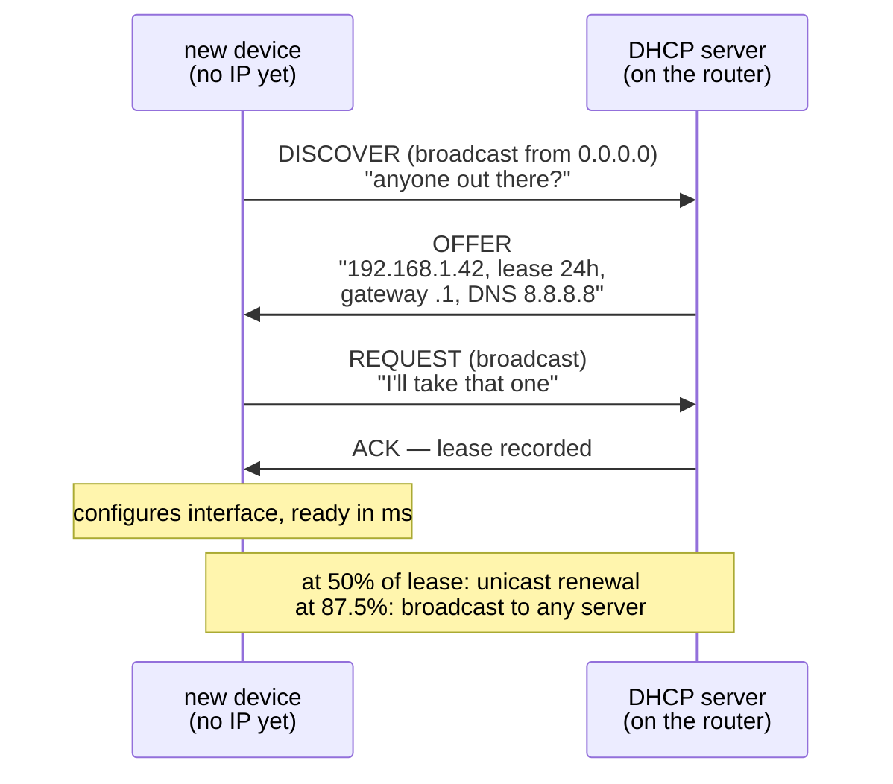

## In simple terms

When your laptop connects to a Wi-Fi network, it needs an IP address to communicate — but it doesn't know which address to use. DHCP solves this: the device broadcasts "I need an IP!" and a DHCP server on the network responds "Here's `192.168.1.42`, valid for 24 hours, use `192.168.1.1` as your gateway and `8.8.8.8` as your DNS." The whole exchange happens in milliseconds, silently, every time a device connects.

## The Visual Map



## More detail

The DHCP exchange is four steps (DORA):

1. **Discover** — the new client (with no IP yet) broadcasts `DHCPDISCOVER` from `0.0.0.0` to `255.255.255.255` via UDP port 67.
2. **Offer** — any DHCP server on the segment replies with `DHCPOFFER`, proposing an IP address, lease duration, and configuration (subnet mask, gateway, DNS).
3. **Request** — the client broadcasts `DHCPREQUEST` accepting the first offer (and informing other servers their offers are declined).
4. **Acknowledge** — the server confirms with `DHCPACK`. The client configures its interface.

**Lease time and renewal:** the address is leased for a finite period (hours to days). At 50% of lease time the client sends a unicast `DHCPREQUEST` renewal; at 87.5% it broadcasts to any server. If the server is unreachable at expiry, the client must release the address and start over.

**DHCP options** extend beyond the basics: NTP server, domain search suffix, WINS server, PXE boot server (for network boot), WPAD proxy auto-config URL, and vendor-specific options for VoIP phones and printers.

**DHCP relay agents** forward DHCP broadcasts between subnets so a single DHCP server can serve multiple VLANs — otherwise DHCP broadcasts would not cross routers.

**DHCPv6** serves IPv6 addresses but is used alongside or replaced by **SLAAC** (Stateless Address Auto-Configuration), which lets devices self-assign from the network prefix without any server. Many IPv6 deployments use SLAAC for address assignment and DHCPv6 only for DNS server information.

DHCP is why home and enterprise networks require no IP management by users — without it, every device would need a manually configured, conflict-free address. Lease logs double as an audit trail of which device held which IP when.

## Under the Hood

A DHCP message is a fixed binary layout (inherited from BOOTP) plus a list of typed options:

```python
import struct

xid = 0x39174542                      # random transaction id ties DORA together
mac = bytes.fromhex("aabbccddeeff")

discover = struct.pack("!BBBBIHH4s4s4s4s16s",
    1, 1, 6, 0,                       # op=request, htype=ethernet, hlen=6, hops=0
    xid, 0, 0x8000,                   # secs, flags (broadcast bit)
    b"\0"*4, b"\0"*4, b"\0"*4, b"\0"*4,   # ciaddr/yiaddr/siaddr/giaddr: all zero
    mac + b"\0"*10)                   # chaddr (padded)
discover += b"\0"*192                 # legacy BOOTP sname/file fields
discover += bytes.fromhex("63825363") # DHCP magic cookie
discover += bytes([53, 1, 1])         # option 53: message type = DISCOVER
discover += bytes([55, 3, 1, 3, 6])   # option 55: please send subnet, router, DNS
discover += bytes([255])              # end option

print(f"{len(discover)} bytes, sent from 0.0.0.0:68 to 255.255.255.255:67")
print(discover[:16].hex(" "))
```

Option 53 makes it a DISCOVER; option 55 is the client's shopping list. The server's OFFER comes back in the same layout with `yiaddr` ("your address") filled in.

## Engineering Trade-offs

- **Zero-touch convenience vs zero authentication.** Any box answering on the segment can hand out leases — a rogue DHCP server offering itself as gateway or DNS silently intercepts traffic. Enterprise switches counter with DHCP snooping; the protocol itself has no defense.
- **Lease length: stability vs pool churn.** Long leases keep devices on stable addresses and quiet the network, but a guest-heavy network (café Wi-Fi) exhausts its pool on departed phones; short leases recycle fast at the cost of constant renewal chatter.
- **Central state vs availability.** The lease database is authoritative state: lose the DHCP server and new devices can't join. Redundancy needs failover protocols or split scopes — compare IPv6 SLAAC, which removed the server (and with it, the central lease audit trail).
- **Broadcast bootstrap doesn't route.** Starting from "no address" forces link-level broadcast, which routers won't forward — every subnet needs either its own server or a relay agent, a recurring cost in segmented networks.

## Real-world examples

- Your home router runs a DHCP server that assigns addresses from `192.168.1.2` to `.254`; your devices auto-configure.
- Enterprise networks use Windows Server DHCP or ISC Kea for centralised lease management with reservations (fixed address per MAC).
- Docker and Kubernetes assign container/pod IPs via internal DHCP-like mechanisms within their virtual networks.
- PXE boot: a DHCP option points a booting machine to a TFTP server to download an OS image — how data centres provision bare-metal servers.

## Common misconceptions

- **"DHCP assigns a permanent IP."** It assigns a *lease* — the IP is reserved for a period, then released. Most home routers renew leases automatically, so the same device keeps the same IP, but this isn't guaranteed.
- **"DHCP is insecure."** By default it has no authentication, making it vulnerable to rogue servers. DHCP snooping (switch feature) and 802.1X port authentication mitigate this in enterprise networks.

## Try it yourself

Inspect the lease your machine is currently living on:

```bash
ip -4 addr show | grep -A1 dynamic     # addresses tagged "dynamic" came from DHCP
ip route show default                  # the gateway the lease handed you

# the resolver configuration DHCP (or its successor) delivered:
cat /etc/resolv.conf | grep -v '^#' | head -5
```

The `valid_lft` countdown on the dynamic address is your lease timer — watch it reset when the renewal at 50% fires. (On WSL the address comes from a virtual DHCP-like service; on real Wi-Fi you'll see your router's lease.)

## Learn next

- [IP address](/t/ip-address) — the resource DHCP hands out.
- [NAT](/t/nat) — the partner mechanism: DHCP assigns private addresses, NAT shares the public one.
- [IPv6](/t/ipv6) — where SLAAC lets devices configure themselves with no server at all.
- [DNS](/t/dns) — the other essential setting every lease delivers.
