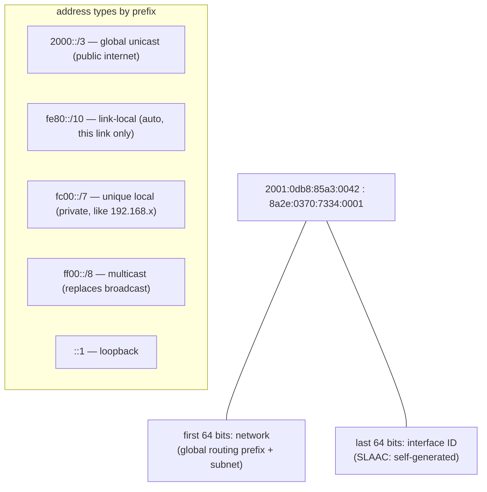

## In simple terms

IPv4 addresses are 32-bit numbers (`192.168.1.1`) — enough for about 4 billion addresses. The internet ran out of them. IPv6 expands to 128 bits (`2001:db8::1`), giving enough addresses that every grain of sand on Earth could have billions. Beyond sheer space, IPv6 eliminates [NAT](/t/nat), simplifies the packet header, and bakes in features that IPv4 retrofitted awkwardly — like stateless address configuration and mandatory IPsec support.

## The Visual Map



## More detail

An **IPv6 address** is 128 bits written as eight groups of four hex digits separated by colons: `2001:0db8:85a3:0000:0000:8a2e:0370:7334`. Leading zeros in a group can be omitted, and one contiguous run of all-zero groups can be replaced with `::`, so the above becomes `2001:db8:85a3::8a2e:370:7334`.

**Address types:**
- **Global unicast** (`2000::/3`) — routable on the public internet, the equivalent of public IPv4.
- **Link-local** (`fe80::/10`) — auto-assigned on every interface, usable only on the local link; replaces IPv4 APIPA.
- **Loopback** (`::1`) — equivalent of `127.0.0.1`.
- **Multicast** (`ff00::/8`) — one-to-many; replaces broadcast. Router solicitation uses multicast.
- **Unique local** (`fc00::/7`) — private addressing, similar to IPv4 RFC 1918 (`192.168.x.x`).

**Key improvements over IPv4:**

- **No NAT required** — every device gets a globally routable address. End-to-end connectivity is restored.
- **Stateless Address Auto-Configuration (SLAAC)** — a device generates its own address from the network prefix (advertised by the router) and its MAC address or a random value. No DHCP server needed for basic connectivity.
- **Simpler header** — fixed 40-byte header (vs. variable 20–60 byte IPv4 header). Extension headers replace IPv4 options; routers skip unrecognised extensions.
- **Mandatory ICMPv6** — neighbour discovery (replacing ARP), router advertisement, and path MTU discovery are all part of the protocol, not bolted on.
- **No fragmentation at routers** — only the source can fragment; routers drop oversized packets and send ICMPv6 "Packet Too Big" back. Reduces router work.

**Dual-stack deployment:** most networks today run both IPv4 and IPv6 simultaneously. Hosts negotiate which to use; DNS returns both `A` (IPv4) and `AAAA` (IPv6) records. Browsers use "Happy Eyeballs" — race a connection attempt on each, use whichever connects first.

IPv4 exhaustion is complete — IANA ran out in 2011, regional registries through 2019. NAT patched the shortage at the cost of breaking peer-to-peer connectivity and complicating mobile networks; IPv6 removes all of that, and mobile and IoT deployments are increasingly IPv6-only.

## Under the Hood

The notation rules and the network/host split, mechanically:

```python
import ipaddress

a = ipaddress.ip_address("2001:0db8:85a3:0000:0000:8a2e:0370:7334")
print(a.compressed)            # 2001:db8:85a3::8a2e:370:7334  (:: swallows the zeros)
print(a.exploded)              # full form back again
print(f"{int(a):#x}")          # one 128-bit integer underneath

net = ipaddress.ip_network("2001:db8:85a3::/64")
print(a in net)                # True — first 64 bits match
print(f"{net.num_addresses:.3e} addresses in ONE /64 subnet")   # 1.8e19

for addr in ("fe80::1", "::1", "ff02::1", "fc00::42"):
    ip = ipaddress.ip_address(addr)
    print(addr, "->", "link-local" if ip.is_link_local else
          "loopback" if ip.is_loopback else
          "multicast" if ip.is_multicast else
          "unique-local" if ip.is_private else "global")
```

A single standard /64 subnet holds 4 billion times the entire IPv4 internet — which is why IPv6 design conversations are about prefix delegation, never about conserving addresses.

## Engineering Trade-offs

- **Abundance vs migration cost.** The address space problem is solved permanently, but IPv6 isn't backwards compatible — every host, router, firewall rule, monitoring pipeline, and hard-coded IPv4 literal needs touching, which is why adoption took decades and dual-stack (running both, doubling operational surface) remains the norm.
- **End-to-end reachability vs the NAT comfort blanket.** Every device being globally addressable restores peer-to-peer simplicity — and removes the accidental shield NAT provided. IPv6 networks must rely on explicit stateful firewalls; "unreachable by default" is now a choice, not a side effect.
- **SLAAC autonomy vs administrative control.** Devices configuring themselves with no server is operationally beautiful, but it surrendered the central lease ledger DHCP provided — enterprises wanting per-device tracking re-add DHCPv6 on top.
- **Privacy vs stability.** Deriving interface IDs from MAC addresses made devices trackable across networks; privacy extensions (random, rotating addresses) fix that but complicate logging, allow-listing, and debugging.

## Real-world examples

- Google, Facebook, Cloudflare, and major CDNs are fully dual-stack; their primary address family is IPv6 on mobile networks.
- AWS, Azure, and GCP support IPv6 on all new services; many are dual-stack by default.
- ISPs like T-Mobile US run their mobile network as IPv6-only with IPv4-as-a-service (464XLAT translation).
- IoT devices in smart-home and industrial deployments use IPv6 mesh networks (Thread protocol) where every sensor has a global address.

## Common misconceptions

- **"IPv6 is not deployed."** As of 2024, IPv6 carries ~45% of Google's traffic and is the majority of mobile traffic in many markets. Adoption is real and growing.
- **"AAAA records are slow."** Browsers use Happy Eyeballs: IPv4 and IPv6 race. If IPv6 is slower, IPv4 wins. The record lookup itself is parallel.

## Try it yourself

Check your machine's IPv6 story — every interface has at least a link-local address, even with no IPv6 internet:

```bash
ip -6 addr show | head -10      # fe80:: link-local is always there; global = real IPv6

# requires: network
python3 -c "
import socket
for fam, _, _, _, addr in socket.getaddrinfo('google.com', 443, proto=socket.IPPROTO_TCP):
    print('AAAA' if fam == socket.AF_INET6 else 'A   ', addr[0])
"
```

If the AAAA lines appear but you can't reach them, you're seeing exactly the gap dual-stack and Happy Eyeballs exist to paper over.

## Learn next

- [IP address](/t/ip-address) — the addressing fundamentals IPv6 extends.
- [NAT](/t/nat) — the workaround IPv6 was designed to retire.
- [DNS](/t/dns) — AAAA records, the other half of IPv6 connectivity.
- [Router](/t/router) — where router advertisements and prefix delegation happen.
