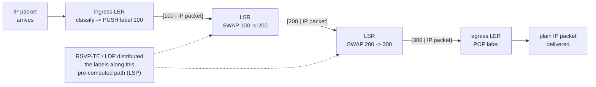

## In simple terms

Normal IP routing looks up the destination address in a routing table at every hop — expensive for carrier-scale routers handling millions of packets per second. MPLS attaches a short **label** (20 bits) to each packet at the network edge. Core routers swap labels based on a simple lookup table — no IP header parsing, just "label 100 in → label 200 out, exit via port 3." The edge removes the label at the destination. This is faster, more predictable, and enables traffic to follow explicit paths instead of whatever BGP happens to route.

## The Visual Map



## More detail

An MPLS **Label Switched Path (LSP)** is a predetermined path through the network. Labels are stacked (LIFO) — a packet can carry multiple labels for nested tunnelling (VPNs inside VPNs).

**Components:**
- **Label Edge Router (LER)** — the ingress router that classifies traffic and pushes a label (PUSH operation); the egress router that pops the label (POP) and delivers the IP packet.
- **Label Switch Router (LSR)** — core router that swaps labels and forwards. Does not look at the IP header.
- **Forwarding Equivalence Class (FEC)** — the classification rule that determines which label to assign (can be based on destination prefix, IP precedence, ingress interface, etc.).

**Label Distribution Protocol (LDP)** or **RSVP-TE** distributes labels between routers. RSVP-TE also allows bandwidth reservation along a path.

**Key applications:**

- **Traffic engineering (TE):** force traffic to follow an explicit path (not just shortest BGP path) to utilise available bandwidth and avoid congested links. A router can send voice traffic on a low-latency path and bulk data on a longer but higher-bandwidth path.
- **MPLS VPNs (L3VPN, L2VPN):** carriers sell private network services over a shared MPLS backbone. Customer traffic is isolated by VPN labels; the customer sees it as a private WAN.
- **Pseudo-wires:** emulate Ethernet, ATM, or Frame Relay circuits over an MPLS backbone.
- **Fast ReRoute (FRR):** pre-compute backup LSPs; on failure, switch to backup in ~50 ms rather than waiting for BGP convergence (minutes).

MPLS is the backbone of most ISP and enterprise WAN networks — SD-WAN, private leased lines, and MPLS VPNs are all built on it. Understanding it explains carrier SLAs (guaranteed bandwidth, latency bounds) and why some paths are predictable while internet paths are not. As SDN and segment routing mature, some carriers are moving toward SR-MPLS or SRv6.

## Under the Hood

Label switching is a chain of constant-time table lookups — simulate a three-hop LSP:

```python
# each router's label table: in_label -> (action, out_label, out_port)
lsr_a = {100: ("SWAP", 200, "port3")}
lsr_b = {200: ("SWAP", 300, "port1")}
ler_z = {300: ("POP", None, "deliver")}

def forward(router, label):
    action, out, port = router[label]      # one dict lookup — no prefix matching
    return action, out, port

packet = ("label", 100, "payload: the IP packet, never inspected in the core")
for name, router in (("LSR-A", lsr_a), ("LSR-B", lsr_b), ("LER-Z", ler_z)):
    action, out, port = forward(router, packet[1])
    print(f"{name}: label {packet[1]} -> {action} {out or ''} via {port}")
    packet = ("label", out, packet[2])
```

Compare with IP forwarding's longest-prefix match over ~1M routes: MPLS replaced an ordered search with an exact-match lookup — and, more importantly, made the *path* an explicit, engineerable object instead of an emergent property of routing.

## Engineering Trade-offs

- **Explicit paths vs operational complexity.** RSVP-TE gives carriers deterministic latency and bandwidth guarantees — and a mesh of per-path state to compute, signal, and maintain. Segment routing's rise is largely a revolt against that state burden.
- **Guaranteed circuits vs internet economics.** An MPLS VPN delivers SLA-backed predictability; commodity internet plus encryption (WireGuard, SD-WAN over broadband) delivers most of the value at a fraction of the price. That spread is why enterprises have been migrating off carrier MPLS for a decade.
- **Fast ReRoute vs pre-provisioned waste.** ~50 ms failover requires backup LSPs computed and reserved *before* any failure — capacity held idle against a bad day, versus BGP's slow-but-free convergence.
- **Core simplicity, edge intelligence.** Pushing all classification to the LER keeps the core dumb and fast, but concentrates configuration (FECs, VPN membership, QoS policy) at the edges — where most MPLS outages are born.

## Real-world examples

- Enterprise "MPLS circuits" from AT&T, Verizon, or BT are leased paths through an MPLS backbone with guaranteed bandwidth and latency.
- Mobile carriers use MPLS in their backhaul networks to carry signalling and data between cell towers and core networks.
- The GÉANT research network uses MPLS TE for bandwidth management across European universities.

## Common misconceptions

- **"MPLS is just for telcos."** MPLS is the internal fabric of large data centre networks (Clos fabrics), not just carrier WANs — it just looks different (shortest-path MPLS vs. TE MPLS).
- **"VPNs require MPLS."** Application-layer VPNs (WireGuard, OpenVPN) do not use MPLS at all. MPLS VPNs are a carrier service concept, not the same as a user-installed VPN.

## Try it yourself

Decode a real MPLS label stack entry — four bytes carrying label, traffic class, bottom-of-stack flag, and TTL:

```bash
python3 -c "
entry = 0x000C8140            # a 32-bit label stack entry off the wire
label = entry >> 12           # top 20 bits
tc    = (entry >> 9) & 0x7    # 3 bits traffic class (QoS)
s     = (entry >> 8) & 0x1    # bottom-of-stack flag
ttl   = entry & 0xFF          # 8 bits TTL, same job as IP's
print(f'label={label} tc={tc} bottom-of-stack={bool(s)} ttl={ttl}')
assert label == 200 and ttl == 64
print('20-bit label space: ', 2**20, 'labels per link — local, not global, scope')
"
```

That 4-byte shim between the Ethernet and IP headers is the entire on-wire footprint of MPLS.

## Learn next

- [BGP](/t/bgp) — the inter-AS routing MPLS complements inside carriers.
- [Router](/t/router) — the longest-prefix machinery MPLS bypasses in the core.
- [QUIC](/t/quic) — part of the encrypted-overlay stack replacing private MPLS WANs.
