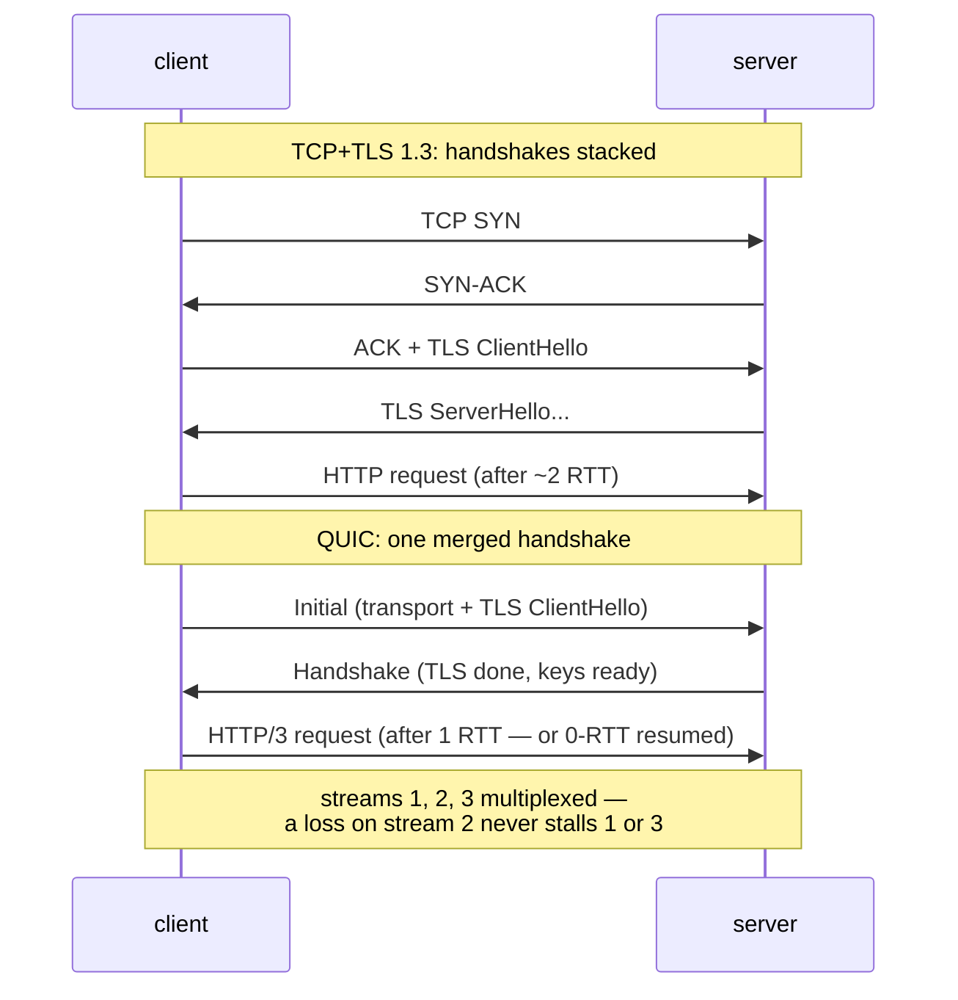

## In simple terms

TCP + TLS has a problem: setting up a secure connection takes 2–3 round trips before data can flow, and if one packet is lost, everything else in the stream must wait (head-of-line blocking). QUIC rebuilds reliable, encrypted transport on top of UDP, combining the handshake into one round trip and multiplexing streams so a lost packet only stalls its own stream, not all the others. HTTP/3 runs over QUIC; as of 2024 it carries around 30% of web traffic.

## The Visual Map



## More detail

**Key improvements over TCP+TLS 1.3:**

- **0-RTT or 1-RTT connection setup.** QUIC merges the transport handshake and the TLS 1.3 handshake into a single exchange. A first connection takes 1-RTT; a resumed connection can use 0-RTT data (with replay-attack caveats).
- **No head-of-line blocking.** TCP is a single ordered byte stream: a lost packet blocks all subsequent data. QUIC multiplexes independent **streams** within a connection. A lost packet only stalls the stream it belongs to; other streams keep flowing. This is the key win for HTTP/3: images, scripts, and CSS load in parallel without one stalling the others.
- **Connection migration.** A QUIC connection is identified by a **Connection ID** (a random number), not by IP+port. When a phone switches from Wi-Fi to cellular, the connection ID stays valid and the connection migrates without a new handshake.
- **Always encrypted.** QUIC encrypts all payload and most header fields with TLS 1.3; middleboxes (NATs, firewalls) cannot inspect or tamper with the content.
- **Built at user space.** QUIC runs in user-space libraries (not the kernel), so new features can be deployed without waiting for OS updates. Google, Facebook, and Cloudflare all have production QUIC implementations.

**UDP as the substrate:** QUIC uses UDP because UDP passes through existing firewalls and NATs, and because user-space implementations can evolve independently. QUIC implements its own reliability, congestion control (CUBIC, BBR, or QUIC-specific variants), and flow control.

QUIC eliminates the latency taxes of TCP+TLS that show up most on mobile networks (high loss rates, network switching) and for pages with many parallel resources. HTTP/3 is now standard across Google, Cloudflare, and Meta, and QUIC generalises beyond HTTP to tunnels and gaming protocols.

## Under the Hood

Head-of-line blocking, demonstrated: the same lossy packet arrival, delivered through one ordered stream (TCP) vs independent streams (QUIC):

```python
# packets arrive out of order; packet 2 (stream B) was lost and arrives last
arrivals = [("A", 1), ("B", 3), ("A", 2), ("C", 1), ("B", 2)]   # (stream, seq)
lost_then_retransmitted = ("B", 1)

# TCP: one global sequence — EVERYTHING waits for the earliest hole
print("TCP-like : nothing delivered until the lost packet arrives;",
      f"{len(arrivals)} packets buffered behind one hole")

# QUIC: per-stream sequencing — only stream B waits
buffers, delivered = {}, []
for stream, seq in arrivals:
    buffers.setdefault(stream, []).append(seq)
    if stream != "B":
        delivered.append((stream, seq))
print("QUIC-like: delivered immediately:", delivered)
print("           only stream B buffers, waiting for its own retransmit")
```

The architectural shift is exactly this: loss recovery scoped to the stream that suffered the loss. HTTP/3 maps each resource (image, script, stylesheet) to its own stream, so one dropped packet no longer freezes the whole page.

## Engineering Trade-offs

- **User-space agility vs kernel efficiency.** Living in libraries lets QUIC ship features at app-update speed (the anti-ossification win), but it forgoes decades of kernel TCP optimisation — QUIC burns measurably more CPU per byte, a real cost at video-scale traffic.
- **Encrypting the transport headers.** Hiding sequence numbers and connection state from middleboxes prevents the meddling that froze TCP — and blinds network operators' diagnostic tooling; the spec added an explicit "spin bit" as a deliberate, minimal concession to RTT measurement.
- **0-RTT speed vs replay risk.** Sending data in the very first packet of a resumed connection saves a round trip, but that data can be replayed by an attacker — safe only for idempotent requests, enforced by application policy.
- **UDP's second-class network status.** Some networks throttle or block UDP, so every QUIC deployment carries a TCP+TLS fallback (negotiated via Alt-Svc) — you ship and operate two stacks, not one.

## Real-world examples

- Google has run QUIC in production since 2013; it carries a large fraction of Google.com and YouTube traffic.
- Cloudflare's edge network handles HTTP/3 for millions of domains.
- All major browsers (Chrome, Firefox, Safari, Edge) support HTTP/3 over QUIC.
- Meta's MVFST library powers QUIC for WhatsApp, Instagram, and internal services.

## Common misconceptions

- **"QUIC is just UDP."** QUIC provides reliability, ordering, congestion control, and encryption on top of UDP — everything TCP+TLS provides, but without the ossification and blocking.
- **"HTTP/3 means the web gets slower."** Some middleboxes block or throttle UDP; in those environments HTTP/3 falls back to HTTP/2. But where QUIC reaches the server, it is almost always faster than TCP for multi-resource page loads.

## Try it yourself

Servers advertise HTTP/3 over the *old* protocol first — read the Alt-Svc header that invites the upgrade:

```bash
# requires: network
python3 -c "
import urllib.request
for site in ('https://www.cloudflare.com', 'https://www.google.com'):
    req = urllib.request.Request(site, method='HEAD',
                                 headers={'User-Agent': 'curiosity/1.0'})
    with urllib.request.urlopen(req, timeout=5) as r:
        print(site, '->', r.headers.get('alt-svc', '(no HTTP/3 advertised)')[:60])
"
```

`h3=":443"` means "I also speak HTTP/3 over QUIC on UDP 443" — your browser remembers it and switches transports on the next visit.

## Learn next

- [TCP](/t/tcp) — the stream model whose limits QUIC was built to escape.
- [UDP](/t/udp) — the deliberately empty substrate QUIC builds on.
- [TLS](/t/tls) — the handshake QUIC absorbed into its own.
- [HTTP](/t/http) — whose version 3 is QUIC's flagship application.
