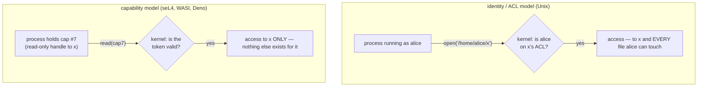

## In simple terms

In traditional Unix security, a process has an identity (user ID), and the OS checks permissions by looking up that identity in access control lists. The problem: a process has *ambient authority* — if it can read files as user `alice`, it can read *all* alice's files, even in code you didn't intend to give file access to. Capability-based security flips this: you don't check identities; you hold an unforgeable token (a capability) for each resource you're allowed to use. If you don't have the capability, you cannot use the resource — period. Passing a capability to another function is an explicit grant of authority.

## The Visual Map

The same request under the two models:



Under ACLs, authority is ambient — it follows the identity everywhere. Under capabilities, authority is exactly the set of tokens you were handed.

## More detail

A **capability** is an unforgeable reference to an object that includes the rights to perform certain operations on it. The holder of a file capability can read or write the file; they cannot fabricate capabilities for files they haven't been given. Capabilities are passed explicitly — you cannot exercise authority you don't possess, and you cannot obtain authority by guessing names.

**Contrast with ACL/identity-based models:**
- **ACL model:** the subject has an identity; the kernel checks a permission table at each access. Problems: confused deputy attack (a privileged program does something harmful on behalf of an unprivileged caller), ambient authority (a library call can silently exercise all the caller's permissions), and identity is checked at the time of access (revocation is hard).
- **Capability model:** the subject must hold the capability. No identity check — the capability itself encodes authority. The confused deputy is impossible: the caller must explicitly pass the capability to the deputy to give it access.

**Confused deputy problem:** a compiler (running with the user's permissions) is asked by a malicious user to write its output to `/etc/passwd`. In an ACL system, the compiler runs as the user, has ambient authority to write system files, and may comply. In a capability system, the compiler only holds capabilities given to it — it doesn't have a capability for `/etc/passwd` unless explicitly granted.

**Operating system implementations:**
- **EROS / Coyotos / seL4** — kernel objects are accessed only via capabilities. All IPC is capability-passing. seL4's capability system is formally verified.
- **CHERI (Capability Hardware Enhanced RISC Instructions)** — hardware extension (ARM Morello prototype) that embeds capabilities in CPU pointers; every memory access is checked against the capability's bounds and permissions. Prevents buffer overflows and use-after-free by hardware enforcement.
- **Plan 9 / Inferno** — everything is a file/name; capabilities are proxied through the file namespace.

**Software object capabilities:**
- **E language, Spritely Goblins, Joule** — programming languages where objects are capabilities. Functions only have access to objects explicitly passed to them.
- **WebAssembly Component Model** — uses capability-based imports; a Wasm component can only call imported functions (capabilities); it cannot freely access host resources.
- **WASI (WebAssembly System Interface)** — capability-based: modules receive specific file descriptor capabilities rather than ambient filesystem access.

Capability-based security is considered the gold standard for access control by security researchers, and the Principle of Least Authority (POLA) is most cleanly implemented with it. Understanding capabilities matters for anyone designing security-sensitive systems, evaluating microkernel architectures, or working with WebAssembly and modern sandboxing.

## Under the Hood

Unix already contains a working capability in miniature: the **file descriptor**. Once you hold it, the *name* and even the ACL no longer matter:

```python
import os

# acquire the capability (the ACL check happens ONCE, at open time)
fd = os.open("secret.txt", os.O_RDONLY)

os.remove("secret.txt")           # the name is gone from the namespace...
os.chmod                           # ...and no later permission check occurs:

print(os.read(fd, 100))           # the fd still grants access — it IS the
os.close(fd)                      # authority, transferable to children,
                                  # revoked only by closing it
```

This is exactly why WASI and Deno build on "preopened" descriptors: hand a sandboxed module *one* directory fd, and arbitrary `open("/etc/passwd")` simply has no token to present.

## Engineering Trade-offs

- **Precise authority vs administration model.** ACLs answer "who can access this file?" by reading one table — auditors love it. Capabilities answer "what can this process touch?" precisely — but "list everyone with access to X" now requires tracing every token ever delegated. Each model makes the other's primary question hard.
- **Delegation: power and peril.** Passing capabilities is frictionless delegation — no admin, no sudo. That same ease means authority can flow somewhere you didn't anticipate; disciplined systems wrap capabilities in attenuating proxies (read-only views, revocable forwarders), which adds design work ACLs never need.
- **Revocation.** An ACL edit revokes instantly at the next check. A raw capability, once handed out, works until destroyed — revocation requires planning ahead (indirection objects you can null out). It's the model's classic weak spot.
- **Retrofit cost.** The Unix/Windows world assumes ambient authority everywhere; pure capability systems (seL4, CHERI) rebuild from the kernel or the hardware up. The pragmatic adoption path has been new platforms (Wasm/WASI, Deno, Fuchsia) rather than converting old ones.

## Real-world examples

- seL4 is capability-based at the kernel level; all process communication is via capability-passed endpoints.
- ARM Morello / CHERI prototype: Microsoft is evaluating CHERI for Cheriot (secure IoT), and Cambridge runs a full capability-based OS (CheriBSD).
- WebAssembly + WASI: a Wasm module that processes images can be given only a preopened directory capability — it cannot open arbitrary files.
- Deno (JavaScript runtime): uses a capability-based security model — you must explicitly grant `--allow-read`, `--allow-net`, etc.

## Common misconceptions

- **"Unix permissions and capabilities are the same."** Linux has a "capabilities" feature (`CAP_NET_ADMIN`, etc.) that is *not* object capabilities — it's a refinement of the Unix privilege model (splitting root into granular privileges). True object capabilities are a different paradigm.
- **"Capability-based systems are impractical."** seL4 runs production drones and automotive systems. WASI is standardised. Deno is widely used. The model is practical — it's the defaults (Unix ACLs everywhere) that make it seem unusual.

## Try it yourself

Hold a file's capability while its name disappears (Linux/WSL semantics):

```bash
cd "$(mktemp -d)"
echo "the fd is the authority" > secret.txt
python3 -c "
import os
fd = os.open('secret.txt', os.O_RDONLY)   # token acquired
os.remove('secret.txt')                   # name destroyed
print('file gone from namespace:', not os.path.exists('secret.txt'))
print('but the capability still reads:', os.read(fd, 100))
os.close(fd)
"
```

If you have Deno installed, the model is even more visible: `deno run script.ts` can touch *nothing* — every `--allow-read=...` flag is you handing the process one capability.

## Learn next

- [Authorization](/t/authorization) — the general problem capabilities are one answer to.
- [Sandbox](/t/sandbox) — where capability thinking dominates modern designs.
- [Microkernel vs monolithic](/t/microkernel-vs-monolithic) — the kernel architecture capabilities pair with.
