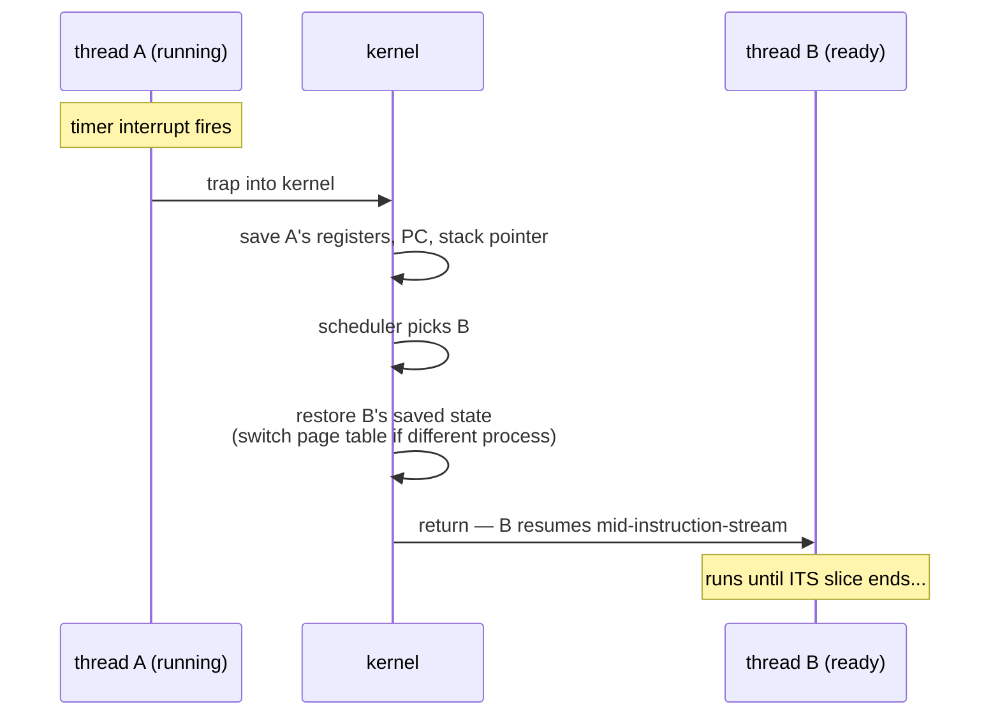

## In simple terms

A CPU core can run only one thread at a time. To create the illusion of running many threads at once, the operating system periodically pauses the current thread, saves its CPU state (registers, instruction pointer), loads another thread's saved state, and lets it run for a bit. That swap is a **context switch**. Modern OSes do thousands of them per second per core.

## The Visual Map



## More detail

What gets saved and restored:

- **General-purpose registers** (16+ values on x86-64).
- **Floating-point / SIMD registers** (much more state — often hundreds of bytes).
- **Instruction pointer** (where to resume).
- **Stack pointer** (each thread has its own stack).
- **Page table** (if switching across processes, not just threads in the same process).

A context switch happens for one of three reasons:

1. **Preemption** — a timer interrupt fires; the scheduler decides another thread should run.
2. **Blocking** — the current thread asked for something (file I/O, lock, network) that isn't ready, so it voluntarily yields.
3. **Wakeup** — a higher-priority thread becomes runnable; the kernel preempts whatever was running.

The cost is small but not negligible — typically 1-10 microseconds for a thread switch on the same process, more for a full process switch (which also flushes the TLB and disrupts the cache). High-throughput servers care a lot because at 100k requests per second, even microseconds add up.

Strategies to reduce context switches:

- **User-space scheduling** (goroutines, async runtimes, fibers) — multiplex many "tasks" onto fewer OS threads, switching in user space without the kernel involved.
- **CPU pinning** — keep a thread on one core to preserve cache state.
- **Avoid sync I/O** — async / event-loop patterns block fewer threads.

Context switches are the price you pay for the illusion of concurrent execution on a finite number of cores. Knowing the cost helps you reason about why naive "spawn a thread per request" doesn't scale, why Node.js / async Rust win for high-concurrency I/O work, and why pinning matters on latency-critical systems.

## Under the Hood

Force two threads to hand a token back and forth — every hand-off is a pair of context switches:

```python
import threading, time

N = 20_000
ping, pong = threading.Event(), threading.Event()

def player(my_turn, their_turn):
    for _ in range(N):
        my_turn.wait()          # block -> context switch away
        my_turn.clear()
        their_turn.set()        # wake the other -> it gets switched in

a = threading.Thread(target=player, args=(ping, pong))
b = threading.Thread(target=player, args=(pong, ping))
t = time.perf_counter()
a.start(); b.start(); ping.set()
a.join(); b.join()
elapsed = time.perf_counter() - t
print(f"{2*N} hand-offs in {elapsed:.2f}s -> ~{elapsed/(2*N)*1e6:.1f} µs per switch")
```

Each `wait()` parks the thread in the kernel; each `set()` wakes the other. The measured microseconds-per-switch is the scheduler's real overhead on your machine.

## Engineering Trade-offs

- **Preemption frequency: responsiveness vs throughput.** Switching often keeps interactive threads snappy but burns more time in save/restore and cold caches; long slices favour batch throughput. Kernel tunables (`sched_min_granularity`) exist because no single answer fits both.
- **Direct cost vs cache pollution.** The register save/restore is the visible microsecond; the hidden cost is returning to a core whose L1/L2 now holds someone else's data. For cache-heavy code, the indirect cost dominates — and motivates CPU pinning.
- **OS threads vs user-space tasks.** A kernel switch costs ~1–10 µs; a goroutine/async-task switch costs nanoseconds because it's a function call in user space. The price: user-space schedulers can't preempt a task stuck in a tight loop or blocking syscall as cleanly.
- **Thread-per-request vs event loop.** Thread-per-request is simple but at 10k connections spends real CPU just switching; event loops keep one thread busy with many connections, trading callback/async complexity for near-zero switching.

## Real-world examples

- A pgbench run against PostgreSQL can spend 10–20% of CPU just on context switches when configured naively; pooling connections cuts this dramatically.
- Linux's CFS scheduler uses a target latency of 6 ms with a minimum granularity of 0.75 ms — meaning ~8 context switches per second per runnable thread on a fully-loaded core.
- Game engines often pin physics, audio, and render threads to specific cores to avoid scheduler-induced context switches that cause frame hitches.

## Common misconceptions

- **"Context switches are free."** Each one costs at least a few microseconds *plus* the cost of warming the cache back up. Cache effects often dominate.
- **"All threads are equally expensive."** A user-space task (goroutine, async future) switches in nanoseconds because it doesn't cross into the kernel.

## Try it yourself

Run the ping-pong benchmark from Under the Hood and read your machine's per-switch cost off the last line. Then, on Linux, watch a process's switch counters live:

```bash
grep ctxt /proc/self/status
# voluntary_ctxt_switches:    (blocked and yielded)
# nonvoluntary_ctxt_switches: (preempted by the scheduler)
```

`vmstat 1` shows the system-wide rate in the `cs` column — watch it spike when you launch anything busy.

## Learn next

- [Scheduler](/t/scheduler) — the policy deciding when switches happen.
- [Interrupt](/t/interrupt) — the timer tick that triggers preemption.
- [System call](/t/system-call) — the other mode transition, and why it's cheaper.
