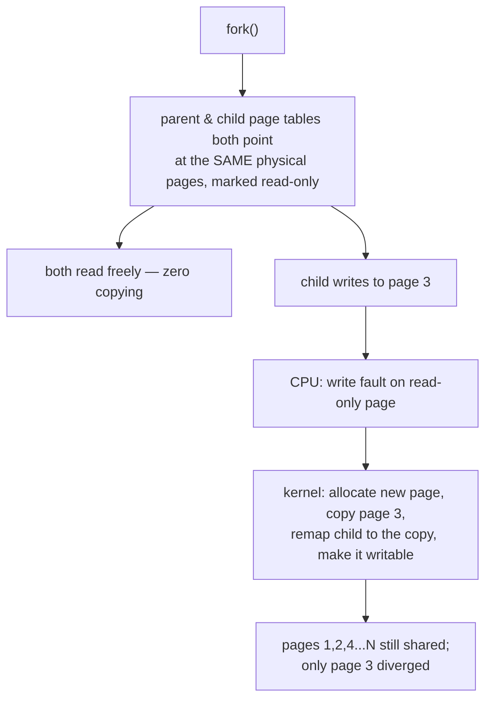

## In simple terms

When a Unix process forks a child, the child is a copy of the parent — potentially hundreds of megabytes. Copying all that memory immediately would be slow and wasteful if the child immediately calls `exec()` anyway. Copy-on-write (COW) defers the copy: child and parent share the same physical pages, marked read-only. The moment either party writes to a page, the OS intercepts the write fault, copies just that one page (4 KB), and lets the write proceed on the private copy. If neither ever writes, the copy never happens.

## The Visual Map



## More detail

**How it works:**
1. On `fork()`, the OS marks all parent and child page table entries as read-only and shared (pointing to the same physical pages). Reference counts are incremented.
2. When either process writes to a shared page, the CPU raises a protection fault.
3. The OS fault handler detects this is a COW fault (not a real permission violation), allocates a new physical page, copies the old page content, updates the faulting process's page table to point to the new page, marks the new page writable, and resumes execution.
4. The original page remains shared with the other process (and its reference count decremented).

**Benefits:**
- `fork()` is O(1) in the common case (just copies page tables, ~microseconds for a large process).
- `fork()` + `exec()` (the typical shell/server pattern) barely touches the parent's memory.
- Process memory is only duplicated proportionally to actual divergence.

**Where COW is used:**
- **Unix `fork()`** — the canonical use. Linux, macOS, and all Unix-derived systems implement this.
- **mmap with `MAP_PRIVATE`** — multiple processes can map the same file; writes create private copies.
- **Persistent data structures** — immutable/persistent data structures (Clojure, Haskell's ropes, Redis's AOF fork) share structure; modifications copy only the affected nodes.
- **Container image layers** — Docker layers and overlay filesystems use COW semantics: a new container layer copies only modified files from the base image.
- **Snapshotting in databases/VMs** — QEMU/KVM snapshots use COW on disk images (qcow2 format). ZFS and Btrfs use COW for all writes (snapshots are free).
- **Redis `BGSAVE`** — forks the process; the child writes the RDB snapshot using shared COW pages. The parent continues serving writes; only written pages incur copy overhead.

**COW and garbage collection:** managed runtimes (JVM, Python) moving GC that updates pointers in a forked process can cause high COW page faults — because GC touches many pages, making most pages diverge. This is why Redis warns about "copy-on-write amplification" during BGSAVE when the parent is under heavy write load.

COW makes `fork()` fast, enables cheap snapshots, and underlies container layering and persistent data structures. Any engineer working with Unix processes, containers, databases with snapshot capabilities, or functional data structures needs to understand COW to reason about memory usage and performance — especially the counterintuitive cost: writes *after* a fork or snapshot are more expensive than usual because they trigger page copies.

## Under the Hood

COW observed from user space — fork a process holding a big buffer and watch memory accounting (Linux):

```python
import os, mmap, time

big = mmap.mmap(-1, 200 * 1024 * 1024)        # 200 MB, touched once
big.write(b"x" * len(big)); big.seek(0)

def rss_mb():
    with open("/proc/self/status") as f:
        for line in f:
            if line.startswith("VmRSS"):
                return int(line.split()[1]) // 1024

pid = os.fork()                               # instant — no 200 MB copy
if pid == 0:                                  # child
    print("child RSS just after fork:", rss_mb(), "MB (shared)")
    for i in range(0, 50 * 1024 * 1024, 4096):
        big[i] = 0x79                         # write -> COW-copy that page
    print("child RSS after dirtying 50 MB:", rss_mb(), "MB")
    os._exit(0)
os.wait()
```

The fork returns in microseconds regardless of the 200 MB; the child's resident memory grows only as it *writes* — one 4 KB page per fault, exactly the deferred copy in action.

## Engineering Trade-offs

- **Deferred cost vs predictable cost.** COW makes creation (fork, snapshot) effectively free and moves the price to later writes — each first-write takes a page fault plus a 4 KB copy. For fork+exec that's a pure win; for a long-lived child that dirties everything, you pay the full copy anyway, *plus* a million page faults of overhead.
- **Memory accounting gets fuzzy.** With pages shared between N processes, "how much memory does this process use?" has three answers (RSS, PSS, USS) and naive monitoring double-counts. Worse, total commitment can exceed RAM silently — until simultaneous writes de-share pages and summon the OOM killer mid-snapshot (the classic Redis BGSAVE incident pattern).
- **Write amplification in CoW storage.** File systems that never overwrite in place (ZFS, Btrfs) get free snapshots and crash consistency, but every logical write becomes new-block writes plus metadata updates — fragmenting files and inflating I/O for random-write workloads like databases. ZFS tuning guides exist mostly because of this.
- **GC vs COW.** Runtimes that touch every object header (refcounts, mark bits) de-share pages wholesale after fork — CPython forks lose most sharing within one GC cycle. This shapes real designs: Redis is C partly so BGSAVE's COW stays cheap.

## Real-world examples

- Linux `fork()` uses COW; `strace` shows `clone()` completing in microseconds for a 1 GB process.
- Redis BGSAVE: parent writes during snapshot increase RSS of both parent and child due to COW. Redis tracks `rdb_cow_size` in INFO.
- Docker: `overlay2` storage driver uses COW — modifying a file in a container copies it to the container's writable layer, leaving the image layer unchanged.
- ZFS: every write goes to a new block; old blocks are snapshotted for free. ZFS snapshots are O(1) and near-zero overhead at creation.

## Common misconceptions

- **"COW means the copy is free."** COW defers cost, not eliminates it. Heavy write traffic after a fork leads to many page faults — sometimes worse than copying upfront.
- **"COW only applies to memory."** COW is a general technique applied to file systems (ZFS, Btrfs, APFS), container layers, and data structures — not just OS page management.

## Try it yourself

Time the headline benefit — fork is constant-time no matter how big the process (Linux/WSL):

```bash
python3 -c "
import os, time, mmap

big = mmap.mmap(-1, 500 * 1024 * 1024)     # half a gigabyte of dirty memory
big.write(b'x' * len(big))

t = time.perf_counter()
pid = os.fork()
if pid == 0:
    os._exit(0)                            # child does nothing
os.wait()
print(f'fork+exit of a 500 MB process: {(time.perf_counter()-t)*1000:.1f} ms')
"
```

Milliseconds, not the seconds a real 500 MB copy would take — because nothing was copied. Re-run with the child writing into the buffer before exiting and watch the time climb with every dirtied page.

## Learn next

- [Paging](/t/paging) — the page-fault machinery COW is built from.
- [Process](/t/process) — fork/exec, the pattern COW exists to make cheap.
- [Container](/t/container) — COW layers as the basis of image storage.
