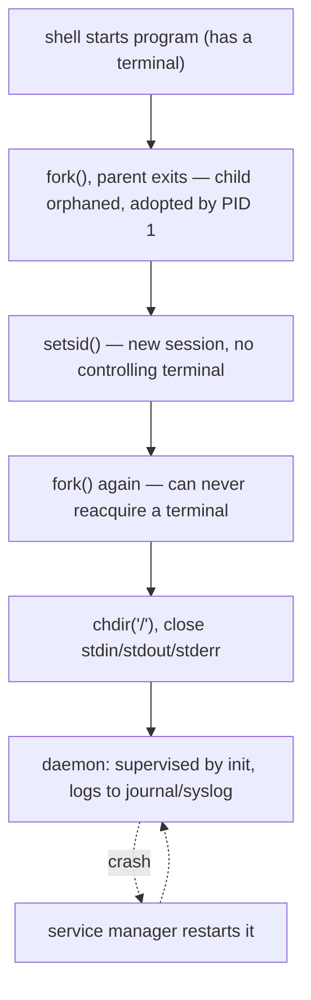

## In simple terms

A **daemon** is a program that runs quietly in the background, detached from any terminal, waiting to do its job — serving web pages, delivering mail, writing logs, syncing the clock. You never "see" a daemon the way you see an app window; it just sits there, usually started when the machine boots and shut down when it powers off. By convention many of their names end in *d*: `sshd`, `cron`, `systemd`, `journald`.

## The Visual Map

The classic daemonization recipe — how a terminal-bound process becomes a free-floating service:



## More detail

A daemon is an ordinary [process](/t/process) with a few deliberate properties: no controlling terminal (so it survives the user logging out), a parent of PID 1 (the init system), and its standard input/output wired to nowhere or to a log.

The classic Unix recipe for "daemonizing" is:

1. **`fork()`** and let the parent exit — the child is now an orphan, adopted by init.
2. **`setsid()`** — start a new session so the process has no controlling terminal.
3. **`fork()` again** — guarantee it can never reacquire a terminal.
4. **`chdir("/")`** — don't pin a mounted file system.
5. **Close stdin/stdout/stderr** and redirect them (to `/dev/null` or a log).

In practice you rarely write that by hand anymore. A **service manager** does the supervision: **systemd** on most Linux, **launchd** on macOS, **Windows Services** on Windows. The manager starts the daemon, restarts it if it crashes, collects its logs, enforces resource limits, and orders startup by dependency ("start the database before the web server"). Because a daemon has no terminal, its output goes to a logging facility — `syslog`, the systemd **journal**, or a file — not to a screen.

Well-behaved daemons often start as root to bind a privileged port or open a device, then **drop privileges** to an unprivileged user for everything after.

Almost everything a server *does* is a daemon: the web server listening on port 443, the database, the SSH login service, the metrics agent, the scheduled-job runner. Understanding the daemon lifecycle — how it's launched, supervised, restarted, and where its logs go — is most of what "running a service in production" actually means. When a service "won't start" or "keeps restarting," you're debugging daemon mechanics.

## Under the Hood

What the service manager replaced — and what a unit file actually says:

```ini
; /etc/systemd/system/myapp.service — the modern way to declare a daemon
[Unit]
Description=My background service
After=network.target          ; dependency ordering

[Service]
ExecStart=/usr/local/bin/myapp
Restart=on-failure            ; the supervision loop
User=myapp                    ; privilege dropping, declared not coded
StandardOutput=journal        ; stdout becomes structured logs

[Install]
WantedBy=multi-user.target    ; start at boot
```

Everything the double-fork dance achieved in code — detachment, supervision, logging, privilege drop — is now five declarative lines. The daemon itself can be a completely ordinary program that just runs in the foreground; systemd handles the rest.

## Engineering Trade-offs

- **Self-daemonizing vs foreground + supervisor.** The double-fork recipe makes a program independent of any manager — and invisible to one: the supervisor can't tell the real PID or notice crashes reliably. Modern practice inverts it: run in the foreground, log to stdout, let systemd/launchd/Kubernetes own the lifecycle. Simpler code, better supervision; the cost is assuming a manager exists.
- **Restart policy.** `Restart=always` masks crash loops (a service failing every 2 seconds looks "up"); no restart means 3 a.m. pages for transient faults. Backoff plus a failure budget (`StartLimitBurst`) is the usual compromise — and still needs alerting on the *rate* of restarts.
- **Root vs privilege separation.** Starting as root to bind port 443 then dropping privileges shrinks the blast radius of a compromise, but privilege-drop code is itself easy to get wrong (forgotten supplementary groups, inherited file descriptors). Capabilities (`CAP_NET_BIND_SERVICE`) and socket activation let many daemons never be root at all.
- **One daemon per job vs combined.** Many small daemons isolate failures and follow Unix philosophy but multiply ops surface (units, logs, monitoring per daemon). Consolidation simplifies operations and couples failure domains — the systemd-vs-traditional-init argument in miniature.

## Real-world examples

- `systemctl status sshd` shows whether the SSH daemon is running, its PID, and recent log lines; `journalctl -u nginx` tails a daemon's logs.
- `cron` wakes up every minute as a daemon and runs scheduled jobs — backups, certificate renewals, cleanup scripts.
- A containerized web app is typically one daemon process (the server) running as PID 1 inside the container, supervised by the orchestrator instead of systemd.

## Common misconceptions

- **"Daemon means something malicious."** No — the name is an old MIT joke (a helpful background spirit), not "demon." Malware sometimes *runs* as a daemon, but so does almost every legitimate service.
- **"Daemons must run as root."** Many start as root only to grab a privileged resource, then drop to a low-privilege user; plenty never need root at all.

## Try it yourself

Find the daemons on a Linux box — they're the processes with no terminal (`TTY` shows `?`):

```bash
ps -eo pid,ppid,tty,comm | awk '$3 == "?"' | head -12
```

Note how many have `PPID` 1 or 2 — children of init or the kernel. If the machine runs systemd, inspect one end to end:

```bash
systemctl status cron        # state, PID, uptime, recent log lines
journalctl -u cron -n 5      # its last five log entries
```

## Learn next

- [Process](/t/process) — the thing a daemon fundamentally is.
- [Shell](/t/shell) — the terminal-attached world daemons detach from.
- [Scheduler](/t/scheduler) — how background daemons share the CPU with your foreground work.
