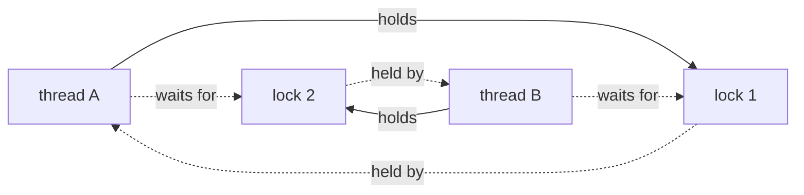

## In simple terms

A **deadlock** is when threads get stuck waiting for each other in a circle. Thread A holds lock 1 and wants lock 2. Thread B holds lock 2 and wants lock 1. Both wait forever. The classic example: two people approach a single-lane bridge from opposite sides, each politely refusing to back up until the other does.

## The Visual Map

The circular wait, drawn as the wait-for graph a detector would build:



Follow the dotted arrows: A → lock 2 → B → lock 1 → A. The cycle *is* the deadlock.

## More detail

Coffman et al. (1971) identified four conditions that must *all* hold for a deadlock to be possible:

1. **Mutual exclusion** — the resources can't be shared.
2. **Hold and wait** — a thread holds at least one resource while waiting for another.
3. **No preemption** — resources aren't forcibly taken back.
4. **Circular wait** — a cycle of threads each waiting for the next.

Eliminate any one and deadlock becomes impossible.

Practical avoidance strategies:

- **Lock ordering** — define a global order on all locks; every thread must acquire them in that order. Breaks circular wait.
- **Trylock + back off** — `try_lock` and release everything if any attempt fails. Adds livelock risk but no deadlock.
- **Use a single coarse lock** — one mutex around the whole subsystem. Often slower but always correct.
- **Avoid locks entirely** — atomic operations, lock-free data structures, message-passing, immutable data, single-writer queues.

Deadlock detection (when prevention is impractical):

- **Wait-for graph** — track which thread is waiting for which; a cycle means deadlock.
- **Database deadlock detector** — most RDBMSs detect transaction deadlocks and abort one transaction to break the cycle.
- **Watchdog timers** — declare deadlock if a lock has been waited on too long.

Related-but-different pathologies:

- **Livelock** — threads keep responding to each other and getting nowhere (two people in a hallway endlessly stepping aside in the same direction).
- **Starvation** — a thread is technically eligible but never scheduled because higher-priority work always arrives first.
- **Priority inversion** — a high-priority thread waits on a lock held by a low-priority thread the OS isn't bothering to schedule. Famously almost killed the Mars Pathfinder mission.

Deadlocks are nondeterministic — they happen under specific timing, often in production after stress builds up, and they bring a system to a complete halt. Designing concurrency to avoid them (or fail fast when they occur) is a core skill in any multi-threaded codebase.

## Under the Hood

The two-lock deadlock, defused with timeouts so it's safe to run — and the ordering fix beside it:

```python
import threading

lock1, lock2 = threading.Lock(), threading.Lock()

def worker_a():
    with lock1:                                   # A holds 1 ...
        ok = lock2.acquire(timeout=1)             # ... wants 2
        print("A got lock2:", ok)
        if ok: lock2.release()

def worker_b():
    with lock2:                                   # B holds 2 ...
        ok = lock1.acquire(timeout=1)             # ... wants 1 — the cycle
        print("B got lock1:", ok)
        if ok: lock1.release()

a, b = threading.Thread(target=worker_a), threading.Thread(target=worker_b)
a.start(); b.start(); a.join(); b.join()
# typically: both print False — each timed out waiting for the other.
# THE FIX: make worker_b take lock1 FIRST, then lock2 (same global order
# as worker_a). The cycle becomes impossible — condition 4 eliminated.
```

With real blocking `acquire()` calls this program would hang forever. The timeout converts a silent hang into a visible failure — which is itself a production strategy.

## Engineering Trade-offs

- **Prevention vs detection.** Lock ordering prevents deadlock by construction but demands global discipline nobody can see locally — one new code path acquiring out of order reintroduces the bug. Detection (databases' wait-for graphs) allows natural lock usage but requires every caller to handle "transaction aborted, retry".
- **Trylock-and-retry vs blocking.** Backing off on failure eliminates deadlock but invites *livelock* (everyone retrying in lockstep) and wastes work; randomised backoff mitigates it at the cost of latency jitter.
- **One big lock vs many small ones.** Coarse locking cannot deadlock with itself and is easy to reason about — and serialises everything. Fine-grained locking scales and multiplies the cycle possibilities. Most mature systems migrate coarse → fine only under measured contention, adding lockdep-style validation as they go.
- **Timeouts as last resort.** Watchdog timeouts turn infinite hangs into errors, but choosing the value is guesswork: too short misfires under load, too long means minutes of frozen service. They are a backstop, not a design.

## Real-world examples

- Most relational databases will abort one transaction with a `deadlock detected` error rather than wait forever — your code has to be prepared to retry.
- The infamous Therac-25 radiation therapy machine had a race condition adjacent to deadlock that overdosed multiple patients in the 1980s.
- Linux's `lockdep` infrastructure has caught thousands of *potential* deadlocks in kernel code that never actually fired in production.

## Common misconceptions

- **"Deadlocks only happen with explicit locks."** They happen any time there's a circular dependency on a finite resource — DB transactions, file handles, semaphores, message queues, network connections.
- **"Detecting a deadlock is enough."** Detection without a recovery plan (retry, rollback, abort) just turns silent hangs into noisy hangs.

## Try it yourself

Run the defused deadlock and watch both threads time out; then apply the ordering fix and watch it vanish:

```bash
python3 -c "
import threading
lock1, lock2 = threading.Lock(), threading.Lock()

def a():
    with lock1:
        print('A got lock2:', lock2.acquire(timeout=1))

def b():
    with lock2:
        print('B got lock1:', lock1.acquire(timeout=1))

ta, tb = threading.Thread(target=a), threading.Thread(target=b)
ta.start(); tb.start(); ta.join(); tb.join()
"
```

Both `False` (after a 1-second stare-down) is the deadlock, made visible. Edit `b()` to take `lock1` before `lock2` — same global order as `a()` — and both threads print `True` instantly.

## Learn next

- [Mutex](/t/mutex) — the primitive whose combinations create the cycle.
- [Semaphore](/t/semaphore) — counting resources, with the same circular-wait risks.
- [Thread](/t/thread) — the unit of execution that gets stuck.
