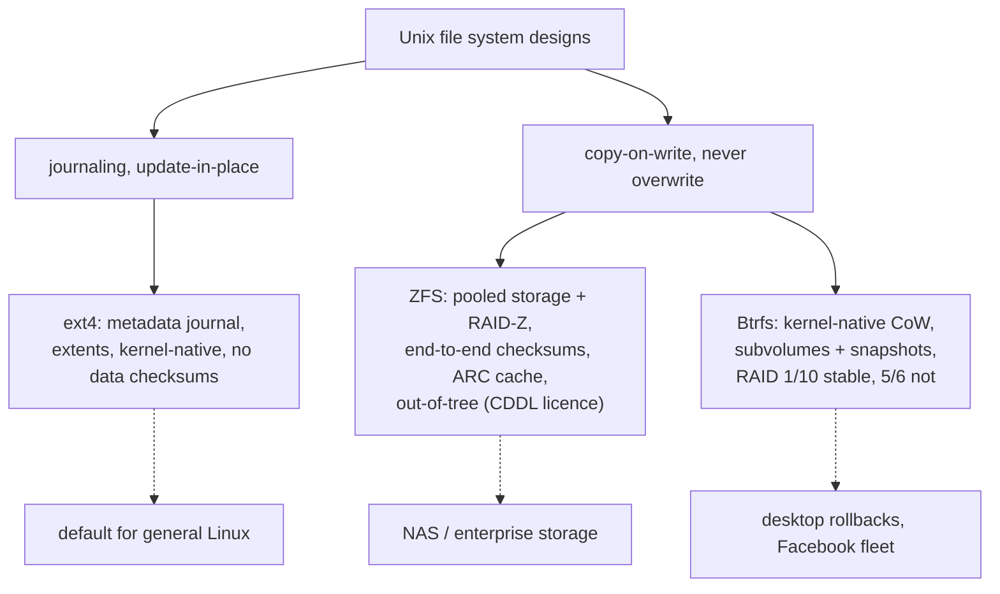

## In simple terms

A file system is the on-disk structure that organises files and directories. ext4 (the Linux default) is like a reliable, simple spreadsheet — it works, it's fast, but it doesn't self-check for corruption. ZFS is like a fortress: every block has a checksum, storage is pooled across drives, and snapshots are instant and free. Btrfs tries to bring ZFS-like features (COW, checksums, snapshots) to Linux as a native kernel module. Each suits different workloads and tolerance for complexity.

## The Visual Map

The design-philosophy split, at a glance:



## More detail

**ext4:**
Evolution of ext2 → ext3 → ext4. Default Linux file system for Ubuntu, Debian, Red Hat. Key features: extent-based allocation (replaces block-mapping for large files), journal (ext3-style write-ahead log for metadata consistency), delayed allocation, online defragmentation. Max file size: 16 TB; max filesystem: 1 EB.

*What ext4 lacks:* checksums on data blocks (corruption is silent), snapshots, pooled storage. It relies on external tools (RAID, LVM, mdadm) for redundancy. Mature and fast, but shows its age in enterprise storage requirements.

**ZFS:**
Designed at Sun Microsystems (2005), open-sourced as OpenZFS. Available on Linux (via OpenZFS module) and natively on FreeBSD. Core design: storage pool (zpool) aggregates multiple drives; ZFS manages RAID and file systems in one layer.

Key features:
- **End-to-end checksumming:** every block has a SHA-256 or Blake3 checksum; reads verify integrity and can self-heal using RAID parity. Detects and corrects silent data corruption (bit rot) that ext4 would pass through silently.
- **COW (copy-on-write):** writes go to new blocks; old blocks remain valid. Snapshots are instantaneous (just pin the current block tree) and space-efficient.
- **RAID-Z (1/2/3):** software RAID integrated into ZFS, without the "RAID-5 write hole" of traditional software RAID.
- **ARC cache:** adaptive read cache with optional L2ARC (SSD cache) and ZIL (ZFS Intent Log — synchronous write acceleration via NVMe).
- **Deduplication and compression:** LZ4 compression is always worth enabling (CPU overhead < I/O savings); dedup is storage-efficient but RAM-intensive.

*ZFS downside:* licensing (CDDL, not GPL) prevented inclusion in the Linux kernel; installed as out-of-tree module. RAM-hungry (1 GB ARC minimum for production). Resizing pools is more complex than LVM.

**Btrfs:**
Linux-native COW file system, merged into Linux kernel 2.6.29 (2009). Facebook, SUSE, and Synology use it in production.

Key features:
- **COW + snapshots:** instant, space-efficient snapshots. `btrfs subvolume snapshot` is near-instant. Used extensively by Fedora (Snapper), Timeshift (Linux backup).
- **RAID 0/1/5/6/10:** built-in software RAID. RAID 5/6 has had stability issues historically; RAID 1/10 is production-safe.
- **Checksums:** CRC32c (default) or SHA256 for data and metadata integrity. Scrub (`btrfs scrub start`) verifies all blocks.
- **Subvolumes:** independent file system trees within a single Btrfs volume; lightweight, can have separate mount options and quotas.
- **Compression:** LZO, ZLIB, ZSTD per-file or per-subvolume.

*Btrfs status:* RAID 5/6 is considered unstable; RAID 1 and single are production-safe. Btrfs is the default for Fedora and SLE (SUSE Linux Enterprise).

**Comparison summary:**

| Feature | ext4 | ZFS | Btrfs |
|---|---|---|---|
| Checksums | Metadata only | Full | Full |
| Snapshots | No | Yes (COW) | Yes (COW) |
| Built-in RAID | No | RAID-Z | Yes (RAID 1/10 stable) |
| Kernel-native | Yes | Out-of-tree | Yes |
| Maturity | Very mature | Mature (enterprise) | Maturing |
| Best for | General Linux use | Enterprise NAS/servers | Desktop Linux, NAS |

File system choice affects data integrity, performance, backup strategy, and administration complexity. ZFS's checksumming catches silent corruption that has historically caused data loss in ext4 systems running on aging hardware; Btrfs snapshots power Linux system rollbacks; ext4's simplicity keeps it the safe default. The choice shapes how you handle RAID, snapshots, and scrubbing.

## Under the Hood

The three day-to-day workflows, side by side:

```bash
# ext4: simple, but integrity and snapshots are someone else's job
mkfs.ext4 /dev/sdb1
mount /dev/sdb1 /data                  # snapshots? add LVM. checksums? none.

# ZFS: pool first, then file systems become cheap administrative objects
zpool create tank raidz2 sda sdb sdc sdd
zfs create tank/projects
zfs set compression=lz4 tank/projects
zfs snapshot tank/projects@before-upgrade        # instant, free
zfs rollback tank/projects@before-upgrade        # undo everything since

# Btrfs: subvolumes give snapshot/rollback inside one ordinary volume
mkfs.btrfs /dev/sdb1 && mount /dev/sdb1 /data
btrfs subvolume create /data/projects
btrfs subvolume snapshot /data/projects /data/projects-snap
btrfs scrub start /data                          # verify every checksum
```

The shape of the commands *is* the philosophy: ext4 manages a disk; ZFS manages a storage system; Btrfs retrofits the latter onto the former's habits.

## Engineering Trade-offs

- **Integrity vs overhead.** Checksumming every block (ZFS, Btrfs) catches bit rot that ext4 silently serves back to you — at the cost of CPU per I/O and metadata writes. For aging consumer drives holding family photos, that trade is obviously right; for a scratch build directory, obviously wrong.
- **CoW vs update-in-place for databases.** Databases doing random in-place writes fragment badly on CoW file systems and double-journal (the DB's WAL on top of CoW). Common practice: `nodatacow` for Btrfs database directories, or tuned `recordsize` on ZFS — partially disabling the features you chose the file system for.
- **Integrated RAID vs layered storage.** ZFS owning the whole stack (disks → pool → FS) closes the RAID-5 write hole and enables self-healing, but locks you into its management model. ext4-on-mdadm/LVM composes standard tools — and the RAID layer can't tell which copy is the corrupt one.
- **In-kernel vs out-of-tree.** Btrfs ships with every Linux kernel; ZFS's CDDL licence keeps it a separately-maintained module — a kernel upgrade can briefly strand your storage driver. Stability of code vs stability of packaging point in opposite directions here.

## Real-world examples

- Ubuntu, Debian, RHEL default to ext4 for the root filesystem.
- FreeBSD and TrueNAS (home NAS) use ZFS for all storage; TrueNAS is the most popular NAS OS.
- Facebook uses Btrfs on its Linux servers for its snapshot and self-healing features.
- Synology NAS devices support Btrfs (for snapshots) and ext4 (for compatibility).
- Oracle Solaris and illumos (OpenIndiana) use ZFS natively as both a volume manager and file system.

## Common misconceptions

- **"ZFS is only for enterprise storage."** ZFS on Linux (OpenZFS) works on a home server with a few drives and gives you integrity checking, compression, and snapshots for free.
- **"Btrfs is not production-ready."** RAID 1/10 and single-device Btrfs are production-safe. RAID 5/6 remain a known risk and should be avoided for critical data.

## Try it yourself

Find out what you're running on, then read the kernel's menu of supported file systems:

```bash
df -T /                  # the Type column: ext4? btrfs?
cat /proc/filesystems | head -20
findmnt -t ext4,btrfs,zfs,xfs    # every mount, by file system type
```

On a Btrfs system, try the headline feature risk-free in a loop device: `truncate -s 1G img && mkfs.btrfs img && mount -o loop img /mnt` — then create a subvolume, snapshot it, delete files, and roll back.

## Learn next

- [Copy-on-write](/t/copy-on-write) — the mechanism behind ZFS/Btrfs snapshots.
- [File system](/t/file-system) — the general concepts all three implement.
- [Inode](/t/inode) — the per-file metadata structure underneath the trees.
