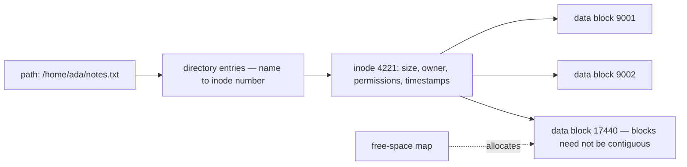

## In simple terms

A **file system** is the bookkeeping that turns a disk full of nameless bytes into folders and files you can open. It tracks where each file's bytes live, what its name and permissions are, how big it is, and what's free space.

## The Visual Map

What happens between a path and the bytes:



The name lives in the directory; everything else about the file lives in the inode.

## More detail

A file system manages four things on top of a block device:

1. **Namespace** — directories and filenames; usually a tree.
2. **Metadata** — size, owner, permissions, timestamps; stored in **inodes** on Unix-like systems, **MFT entries** on Windows.
3. **Data layout** — which physical blocks belong to which file.
4. **Free space** — bitmaps or trees of unused blocks.

Modern file systems also add:

- **Journaling** (ext4, NTFS, APFS) — log writes ahead so a crash doesn't corrupt the on-disk structure.
- **Snapshots and copy-on-write** (ZFS, Btrfs, APFS) — cheap point-in-time copies.
- **Checksums** — detect silent data corruption ("bit rot").
- **Compression and deduplication**.
- **Encryption at rest**.

Examples in 2026:

| OS        | Default file system | Notes                                 |
|-----------|---------------------|---------------------------------------|
| Linux     | ext4 / Btrfs / XFS  | ext4 is the conservative pick         |
| macOS     | APFS                | Copy-on-write, snapshots, encryption  |
| Windows   | NTFS / ReFS         | NTFS is universal; ReFS for servers   |
| Android   | F2FS / ext4         | F2FS tuned for flash                  |

There are also **network file systems** (NFS, SMB) that expose a remote machine's tree as if it were local, and **virtual file systems** like `/proc` and `/sys` on Linux that expose kernel state as if it were files.

Almost every program reads or writes a file, and the file system is what makes those operations meaningful and durable across reboots, crashes, and bad sectors. It's also the boundary at which most permission and security checks happen.

## Under the Hood

Everything the file system knows about a file, via one stat call:

```python
import os, stat, time

st = os.stat("/etc/hostname" if os.path.exists("/etc/hostname") else __file__)

print("inode:      ", st.st_ino)            # the file's real identity
print("size:       ", st.st_size, "bytes")
print("permissions:", stat.filemode(st.st_mode))   # e.g. -rw-r--r--
print("owner uid:  ", st.st_uid)
print("hard links: ", st.st_nlink)          # how many names point here
print("modified:   ", time.ctime(st.st_mtime))
```

Note what's *missing*: the filename. A file's name is not a property of the file — it's an entry in a directory that points at the inode. That's why hard links work and why a file can stay alive after deletion as long as a process holds it open.

## Engineering Trade-offs

- **Journaling vs copy-on-write.** Journaling (ext4, NTFS) logs metadata changes before applying them — fast, mature, crash-consistent, but the data itself can still be torn. CoW designs (ZFS, Btrfs, APFS) never overwrite live blocks, giving atomic updates, snapshots, and checksums — at the cost of fragmentation and heavier metadata.
- **Consistency vs speed.** Every durability guarantee costs writes: full data journaling roughly doubles them. Most systems default to metadata-only journaling and let applications call `fsync` when *their* data must survive — and databases do, constantly.
- **Small-file overhead vs large-file throughput.** Block-based allocation wastes up to a block per file (millions of 1 KB files on 4 KB blocks waste ~75%) and metadata operations dominate; large sequential files instead need extent-based allocation and readahead. Tuning for one workload penalises the other.
- **Local semantics vs network transparency.** NFS/SMB make remote storage look local, but hide failure modes local files never have — a `read` that hangs on a dead server, caching that breaks lock assumptions. "It's just a file" is the leakiest abstraction in the building.

## Real-world examples

- `ls`, `cd`, `mkdir`, `cp`, `mv`, `rm` — all file-system operations.
- A "disk full" error is the file system saying it has no free blocks.
- A USB stick that "needs to be repaired" is a file system whose metadata got inconsistent.
- Modern macOS uses APFS snapshots so Time Machine backups are nearly instant — they record only what changed between snapshots, not the whole disk.

## Common misconceptions

- **"Reformatting erases the data."** A quick format usually erases the index, not the bytes. Recovery tools can often resurrect files.
- **"Deleting a file frees disk immediately."** Many systems delay actual block reclamation; on SSDs the `TRIM` command is what finally tells the device the blocks are free.

## Try it yourself

Prove a filename is just a pointer — two names, one file:

```bash
cd "$(mktemp -d)"
echo "same file" > original.txt
ln original.txt alias.txt          # hard link: a second name for the same inode
ls -i original.txt alias.txt       # identical inode numbers
echo "edited via alias" >> alias.txt
cat original.txt                   # the "other" file sees the edit — same bytes
rm original.txt
cat alias.txt                      # still alive: the inode survives until the last name goes
```

## Learn next

- [Inode](/t/inode) — the metadata record at the centre of it all.
- [Storage](/t/storage) — the physical layer underneath the blocks.
- [ext4 vs ZFS vs Btrfs](/t/ext4-vs-zfs-vs-btrfs) — the journaling-vs-CoW trade-off in shipping systems.
