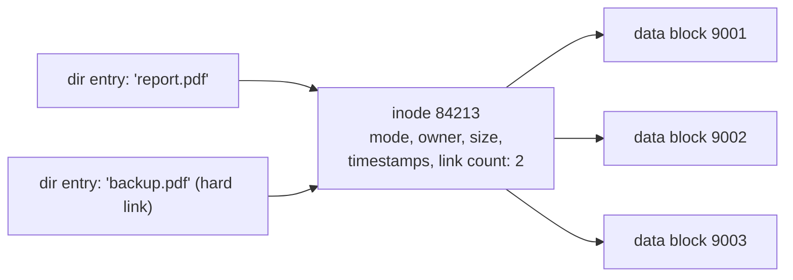

## In simple terms

An **inode** is the file system's record card for a single file. It holds everything *about* the file — how big it is, who owns it, what permissions it has, when it was last touched, and where on disk its bytes actually live — but it does **not** hold the file's name or its contents. The name lives in a directory; the contents live in data blocks. The inode is the glue in the middle.

## The Visual Map

Two names, one inode, one set of bytes — the hard-link picture:



## More detail

On Unix-like file systems (ext4, XFS, APFS, ZFS), every file is one inode, identified by an **inode number**. A directory is just a table mapping names to inode numbers:

```
directory entry      inode                data blocks
"report.pdf"  ───►   inode #84213  ───►   [block 9001][block 9002]...
```

An inode typically stores:

- **Mode** — file type (regular, directory, symlink, device) and permission bits.
- **Owner** — user and group IDs.
- **Size** in bytes.
- **Timestamps** — `atime` (accessed), `mtime` (modified), `ctime` (inode changed).
- **Link count** — how many directory entries point at this inode.
- **Block pointers / extents** — where the data lives, via direct pointers plus single, double, and triple **indirect blocks** (or modern *extent* ranges).

Two facts fall straight out of this design:

- **Hard links** are simply multiple names pointing at the *same* inode. `ln a b` doesn't copy anything — it adds a directory entry and bumps the link count. The file's data is freed only when the link count hits zero **and** no process still has it open.
- A file system has a **fixed number of inodes**, set at format time. You can run out of inodes while gigabytes of space remain free — common on a box with millions of tiny files. `df -i` shows inode usage separately from `df -h`.

Not every file system works this way: FAT has no inodes, and Windows' NTFS uses **MFT records** that serve a similar role.

The inode model explains a lot of otherwise-mysterious Unix behaviour: why renaming a file inside one file system is instant (you only rewrite a directory entry), why hard links and symlinks differ, why deleting a file that a running program still has open *doesn't* reclaim the space, and why a "disk full" error can appear when `df -h` says there's room. If you understand inodes, the file system stops being magic.

## Under the Hood

Read an inode directly, and prove the name isn't in it:

```python
import os

with open("demo.txt", "w") as f:
    f.write("hello inode")

st = os.stat("demo.txt")
print("inode number:", st.st_ino)
print("link count:  ", st.st_nlink)        # 1 — one name so far

os.link("demo.txt", "alias.txt")           # hard link: new NAME, same inode
print("after ln:    ", os.stat("alias.txt").st_ino == st.st_ino,  # True
      "| links:", os.stat("demo.txt").st_nlink)                   # 2

os.remove("demo.txt")                      # removes a NAME, not the file
print("survives:    ", open("alias.txt").read())   # data still there
os.remove("alias.txt")                     # link count 0 -> blocks freed
```

`os.link` creates no data; `os.remove` is really `unlink` — it deletes a directory entry. The inode (and the bytes) live until the last name and the last open handle are gone.

## Engineering Trade-offs

- **Fixed inode tables vs dynamic allocation.** ext4 sizes its inode table at format time: predictable layout and fast access, but a mail spool full of tiny files can exhaust inodes with the disk half empty. XFS, ZFS, and Btrfs allocate inodes dynamically — flexibility for slightly more metadata complexity.
- **Block pointers vs extents.** Classic indirect-block trees handle any file shape but need one pointer per 4 KB block — a 1 GB file means ~262k pointers. Extents ("blocks 9001–17000 are mine") collapse that to a few records for contiguous files, at the cost of degrading toward the old scheme when files fragment.
- **atime: information vs write amplification.** Updating the access timestamp turns every *read* into a metadata *write*. Linux defaults to `relatime` (update at most daily) — a deliberate compromise that broke a few tools relying on precise atime but saved enormous I/O.
- **Hard links vs symlinks.** Hard links are indestructible-by-rename and free, but can't cross file systems or point at directories, and make "how big is this folder really?" ambiguous. Symlinks are flexible, visible, and can dangle. Backup and dedup tools must understand both or silently double-count.

## Real-world examples

- `ls -i` prints each file's inode number; `stat report.pdf` dumps the whole inode (size, owner, link count, timestamps).
- `df -i` on a busy mail or build server often shows 100% inode usage with plenty of free bytes — the fix is fewer, larger files, not a bigger disk.
- A long-running process writing to a log file you already `rm`'d keeps the disk filling up: the link count is 0 but the open count isn't, so the blocks aren't freed until the process exits or reopens the file.

## Common misconceptions

- **"The filename is part of the file."** It isn't — the name lives in the directory entry, and one file (inode) can have many names.
- **"Deleting a file frees its space immediately."** Only when both the link count and the open-file count reach zero. Until then the bytes stay allocated.

## Try it yourself

The whole inode story in six shell commands:

```bash
cd "$(mktemp -d)"
echo "hello" > a.txt
ln a.txt b.txt              # second name, same inode
ls -i a.txt b.txt           # same inode number twice
stat a.txt | head -4        # size, blocks, links: 2
rm a.txt                    # unlink one name
cat b.txt                   # the file is fine — inode still has a name
```

Then check the two kinds of "full" on your system: `df -h .` (bytes) vs `df -i .` (inodes).

## Learn next

- [File system](/t/file-system) — the structure inodes live inside.
- [Storage](/t/storage) — the physical blocks the pointers point at.
- [Copy-on-write](/t/copy-on-write) — how modern file systems snapshot inodes cheaply.
