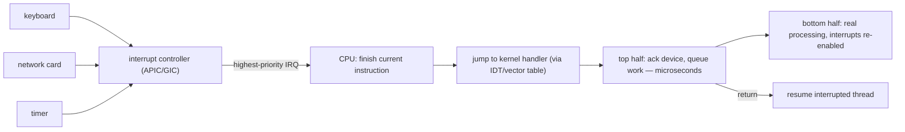

## In simple terms

An **interrupt** is the hardware equivalent of "excuse me, this needs attention right now." A device — keyboard, network card, timer chip — raises a signal on the CPU's interrupt line. The CPU finishes the current instruction, jumps to a handler the OS registered for that interrupt, deals with the event, and returns to whatever it was doing. Interrupts are how an OS finds out anything has happened in the outside world.

## The Visual Map



## More detail

Two flavours:

- **Hardware interrupts (IRQs)** raised by devices: timer, NIC, disk, keyboard, USB, GPU.
- **Software interrupts / exceptions** raised by the CPU itself: page fault, divide by zero, illegal instruction, syscall (on architectures that use the legacy mechanism).

The mechanism:

1. Device asserts an interrupt line.
2. The interrupt controller (APIC on x86, GIC on ARM) priorities and routes the interrupt to a CPU core.
3. The CPU saves the bare minimum state, jumps to the kernel's interrupt handler for that vector.
4. The handler usually does the *minimum* — acknowledge the device, queue work for later — and returns quickly.
5. The "later" work (bottom half / softirq / tasklet / DPC) runs with interrupts re-enabled.

Why "minimum"? While an interrupt handler runs, **other interrupts on the same line are usually masked**. A slow handler delays everything else — typing latency, packet loss, audio glitches.

Modern systems also use **interrupt coalescing** and **NAPI-style polling**: at high packet rates a NIC stops interrupting per packet and instead lets the kernel poll its receive queue. This is the difference between a 10 Gbps line maxing out a CPU on interrupts vs. saturating the line cleanly.

Interrupt vectors are numbered and registered in an **IDT** (interrupt descriptor table) on x86 or **vector table** on ARM. Each entry maps a vector number to a handler function in the kernel.

Interrupts are the OS's eyes and ears. Every keypress, every network packet, every disk completion, every timer tick is one. The performance and correctness of interrupt handling is what separates a responsive OS from a janky one — and is also the source of an entire class of difficult bugs (race conditions between handlers and threads, missed wakeups, IRQ storms).

## Under the Hood

The shape of every interrupt handler — top half fast, bottom half later. Signals are the user-space miniature of the same pattern:

```python
import signal

events = []                       # the "work queue"

def handler(signum, frame):       # the "top half": runs between two of
    events.append(signum)         # your instructions — keep it tiny

signal.signal(signal.SIGINT, handler)
signal.raise_signal(signal.SIGINT)        # simulate the async event

# back in the main loop — the "bottom half" drains the queue calmly
for e in events:
    print(f"handled deferred event: signal {e}")
```

Your main code was paused mid-stream, a registered handler ran, control returned — exactly the hardware sequence, one level up. The same rule applies too: do almost nothing inside the handler.

## Engineering Trade-offs

- **Interrupts vs polling.** Interrupts cost ~zero when idle and react instantly — perfect at low event rates. At high rates the per-event overhead drowns the CPU (an "IRQ storm"), so fast NICs flip to polling (NAPI, DPDK) under load: burn a core checking the queue, never miss a beat. Hybrid designs switch modes by load.
- **Handler brevity vs immediacy.** Doing work in the top half means it happens *now* but blocks every same-line interrupt meanwhile. Deferring to a bottom half keeps the system responsive at the cost of latency and a scheduling hop. Audio drivers and trading systems agonise over this line.
- **Coalescing: throughput vs latency.** Batching ten packets per interrupt cuts overhead 10× and adds up to one batch-window of delay to the first packet. NIC tuning knobs (`rx-usecs`) exist because the right answer differs between a file server and a game server.
- **IRQ affinity.** Steering all interrupts to one core keeps the others undisturbed (good for pinned latency-critical threads) but can bottleneck that core; spreading them shares load but jitters everyone. `irqbalance` picks for you; low-latency setups pick by hand.

## Real-world examples

- The Linux kernel routes IRQs across cores via `irqbalance` so one core doesn't become an "interrupt processing core" that drops everything else.
- A 100 Gbps NIC at line rate raises millions of interrupts per second if not coalesced — which is why drivers default to polling under load.
- macOS's "no nap" CPU mode (used by GarageBand and pro-audio apps) prevents IRQ-induced wakeups from disrupting real-time audio threads.

## Common misconceptions

- **"Interrupts are slow."** A single interrupt is nanoseconds-fast — the cost is *what the handler does* and what it blocks while it runs.
- **"An interrupt always preempts."** The kernel can mask interrupts during critical sections; some handlers run with interrupts disabled, which is exactly when you can lose interrupts.

## Try it yourself

Watch your machine's interrupts arrive, live (Linux):

```bash
head -8 /proc/interrupts            # one row per IRQ source, one column per core
watch -n1 'grep -E "timer|i8042|eth|nvme" /proc/interrupts | head'
```

Type, move the mouse, download something — the counters jump as you generate hardware events. Then run the Python signal demo from Under the Hood to feel the handler pattern from the inside.

## Learn next

- [System call](/t/system-call) — the software-initiated crossing into the same kernel.
- [Context switch](/t/context-switch) — what the timer interrupt triggers a thousand times a second.
- [Kernel](/t/kernel) — where every handler lives.
