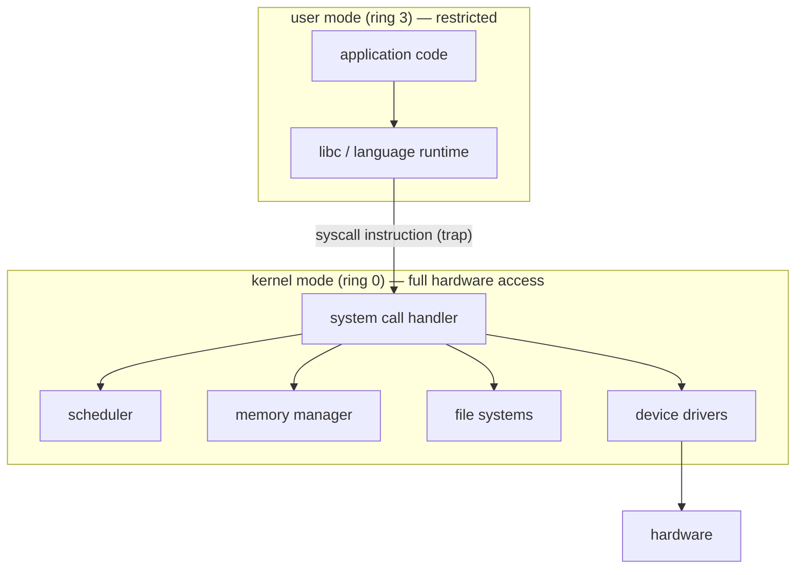

## In simple terms

The **kernel** is the heart of an operating system. It is the only program allowed to talk to hardware directly: the CPU, the memory controller, the disks, the network card. Every other program runs in a less-privileged mode and has to ask the kernel for help via **system calls**.

## The Visual Map

The privilege boundary, and the only legal way across it:



## More detail

The CPU itself has at least two privilege levels — typically called **kernel mode** (ring 0 on x86) and **user mode** (ring 3). Instructions that talk to hardware, change page tables, or mask interrupts can only run in kernel mode. The kernel switches to user mode before handing control to an application, and switches back when the application asks for a service.

A modern kernel's responsibilities:

- **Process and thread management** — fork, exec, exit, scheduling.
- **Memory management** — page tables, allocation, swapping.
- **File systems** — open, read, write, close, journaling.
- **Device drivers** — keyboards, displays, GPUs, network cards.
- **Networking** — TCP/IP stack, sockets.
- **IPC** — pipes, sockets, signals, shared memory.
- **Security** — permissions, capabilities, mandatory access control.

Two long-standing architectural choices:

- **Monolithic kernel** (Linux, FreeBSD) — drivers and most services live inside the kernel address space. Fast; one bug can crash everything.
- **Microkernel** (MINIX, seL4, parts of QNX, macOS Mach core) — keep the kernel tiny and run services as user-space processes. Robust; performance is the trade-off.

In practice the lines blur: Linux is monolithic but supports loadable modules; macOS is technically a hybrid (Mach + BSD); Windows is similar.

The kernel is the most security-sensitive code in the whole system. A bug in kernel mode can do anything — read any memory, corrupt any file, send any packet. That's why kernel changes are reviewed slowly and why kernel updates often need a reboot.

## Under the Hood

What "asking the kernel" literally looks like — a system call on x86-64 Linux, no libc:

```asm
; write(1, msg, 14); exit(0) — the raw conversation with the kernel
section .data
msg:    db  "hello, kernel", 10

section .text
global _start
_start:
    mov rax, 1          ; syscall number 1 = write
    mov rdi, 1          ; fd 1 = stdout
    mov rsi, msg        ; buffer
    mov rdx, 14         ; length
    syscall             ; trap into ring 0 — the kernel takes over here

    mov rax, 60         ; syscall number 60 = exit
    xor rdi, rdi        ; status 0
    syscall
```

The `syscall` instruction is the *only* doorway: it switches the CPU to kernel mode at a kernel-chosen entry point. Every `print`, every file read, every network packet in every language funnels down to this.

## Engineering Trade-offs

- **Monolithic vs microkernel.** In-kernel drivers call each other at function-call speed but share one fate — a single driver bug panics the machine. Microkernels isolate services in user space, surviving driver crashes, but pay message-passing overhead on every interaction. Linux's answer is pragmatic: monolithic core, plus escape hatches (FUSE, userspace drivers) for the risky parts.
- **Syscall overhead vs safety.** Every kernel crossing costs hundreds of cycles (mode switch, mitigations against Spectre/Meltdown made it worse). High-performance I/O designs amortise it (`io_uring` batches requests) or bypass the kernel entirely (DPDK) — trading the kernel's protections for speed.
- **Loadable modules vs attack surface.** Letting code load into the running kernel (drivers, eBPF) adds flexibility without reboots, but every loaded module runs at full privilege. eBPF threads this needle with a verifier that proves programs safe before they run.
- **Stability vs velocity.** Kernel ABIs are forever (Linux's "we don't break userspace") — which protects every application ever written and makes internal redesigns painfully slow.

## Real-world examples

- Linux 6.x is the kernel running most servers and Android phones.
- The Apple `xnu` kernel powers macOS, iOS, watchOS, and tvOS.
- The Windows NT kernel is the basis of all modern Windows, including Xbox.
- A driver loaded into the Linux kernel can crash the whole machine — which is why Linux is steadily moving non-critical drivers into userspace (FUSE filesystems, DRM render workers, USB-over-IP).

## Common misconceptions

- **"The kernel is the operating system."** It is the privileged core; an OS also includes a shell, libraries, system services, and a desktop environment.
- **"Kernel = open source."** Many production kernels are proprietary (Windows NT, macOS xnu — though parts of xnu are open).

## Try it yourself

Meet your kernel and count your conversations with it:

```bash
uname -sr                 # which kernel, which version
cat /proc/version         # the kernel introducing itself (Linux)

# count the system calls behind one trivial command   # requires: strace
strace -c ls > /dev/null
```

The `strace` table is eye-opening: a bare `ls` makes dozens of distinct system calls — opening libraries, mapping memory, reading the directory, writing output. None of it touches hardware except through the kernel.

## Learn next

- [System call](/t/system-call) — the doorway in detail.
- [Scheduler](/t/scheduler) and [virtual memory](/t/virtual-memory) — the kernel's two biggest jobs.
- [Microkernel vs monolithic](/t/microkernel-vs-monolithic) — the architecture debate, in depth.
