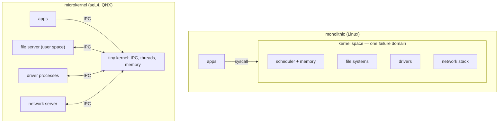

## In simple terms

A monolithic kernel (Linux, traditional Unix) puts everything in one giant privileged program: file systems, device drivers, networking, memory management — all running in kernel space with direct access to hardware. Fast, but a bug in one driver can crash the whole system. A microkernel (seL4, Mach, QNX) keeps the kernel tiny — just scheduling, message passing, and memory management — and runs everything else as user-space servers. More robust: a crashing file system driver doesn't take down the OS. The trade-off: inter-process messages replace direct function calls, which historically made microkernels slower.

## The Visual Map



In the monolithic box, components call each other directly — fast, shared fate. In the microkernel, each server is a process: a crash is restartable.

## More detail

**Monolithic kernel:**
All OS services — VFS, device drivers, networking stack, IPC, scheduler — are compiled into one binary running in ring 0. Kernel code calls other kernel code directly (C function calls). Advantages: speed (no message-passing overhead), easy state sharing, decades of optimisation (Linux). Disadvantages: a bug anywhere crashes the kernel (kernel panic); device drivers are a leading source of crashes; the kernel attack surface is enormous (millions of lines of C).

**Microkernel:**
The kernel provides only four things: address spaces (virtual memory), threads, IPC (message passing), and basic scheduling. Everything else — file systems, network drivers, device drivers, POSIX layer — is a separate user-space process communicating via IPC. A crashing driver is just a process crash: the OS restarts it without affecting other services.

*Why microkernels were once slow:* early systems (Mach) had message-passing overhead of ~hundreds of microseconds. L4 (Liedtke 1993) showed that a microkernel could be fast enough: by redesigning the IPC mechanism, L4 got message latency to ~1 µs — 50× better than Mach. Modern microkernels (seL4, Fiasco) achieve similar performance.

**Hybrid kernels:**
Windows NT and macOS (XNU) are "hybrid" — they have a microkernel-like structure (NT's executive components, XNU's Mach layer) but run many services in kernel space for performance. This is more monolithic than microkernel in practice.

**seL4:** formally verified microkernel (proof in Isabelle) — correctness and security are mathematically proved. Used in drones, automotive systems, classified computing. The verification guarantees no buffer overflows, no privilege escalation bugs in the kernel itself.

**Linux modules:** Linux is monolithic but supports loadable kernel modules (LKMs) for drivers. Modules run in kernel space; a bug crashes the kernel. Some distributions enable kernel live-patching (kpatch, livepatch) to update the kernel without rebooting.

**QNX:** commercial microkernel used in cars (BlackBerry QNX in GM, Ford, BMW infotainment) and medical devices. POSIX-compatible. Its reliability properties make it popular where safety matters.

The kernel architecture determines the OS's reliability, security posture, performance, and ability to be formally verified. Linux's monolithic design makes it fast and flexible; seL4's microkernel design makes it verifiable — and understanding the trade-offs explains why Linux dominates servers while microkernel RTOSes dominate safety-critical embedded systems.

## Under the Hood

The whole debate reduces to one substitution — function call vs message:

```c
/* monolithic: the VFS calls the ext4 driver DIRECTLY — nanoseconds,
   same address space, shared data structures, shared fate */
ssize_t vfs_read(struct file *f, char *buf, size_t n) {
    return f->f_op->read(f, buf, n);     /* an ordinary function pointer */
}

/* microkernel: the same request becomes an IPC round-trip to a
   file-server PROCESS — isolation, at the cost of two context switches */
ssize_t fs_read(cap_t fs_server, int fd, char *buf, size_t n) {
    msg_t req = { .op = OP_READ, .fd = fd, .len = n };
    ipc_call(fs_server, &req);           /* kernel-mediated message */
    memcpy(buf, req.payload, req.reply_len);
    return req.reply_len;
}
```

Everything else — crash containment, restartable drivers, verifiability, the performance gap — follows from which of these two lines your OS is built on.

## Engineering Trade-offs

- **Speed vs fault isolation.** A monolithic in-kernel call costs nanoseconds; a microkernel IPC round-trip costs ~1 µs even on seL4 — and a read may traverse several servers. In exchange, a microkernel survives what kills a monolith: QNX restarts a crashed driver in milliseconds, Linux panics.
- **Verifiability vs feature velocity.** seL4's ~10k lines were formally proved correct — feasible only because the kernel is tiny. Linux's ~30M lines could never be, but that mass is also 30 years of drivers, file systems, and tuning no microkernel ecosystem matches. Small enough to prove vs big enough to be useful.
- **Shared state vs message copies.** Monolithic subsystems share data structures freely (the page cache serves every file system at memory speed). Microkernel servers must marshal state into messages or carefully share memory regions — every interface becomes a protocol design problem.
- **Hybrid pragmatism.** NT and XNU started micro-ish and pulled services back into the kernel where benchmarks demanded; Linux stays monolithic but exports risky pieces to user space (FUSE, userspace drivers). Convergence from both ends suggests the pure positions are both wrong at the edges.

## Real-world examples

- Linux (monolithic) runs 97% of the world's top 500 supercomputers, all Android phones, and most cloud servers.
- seL4 (microkernel) is used in the US Air Force's drone programme and certified automotive systems.
- QNX (microkernel) runs in 195 million vehicles.
- Windows NT's driver model allows user-mode drivers for some device classes (UMDF); most drivers still run in kernel mode.

## Common misconceptions

- **"Microkernels are always slower than monolithic kernels."** Modern L4-derived microkernels (seL4, Fiasco.OC) achieve IPC latency of ~1 µs and competitive overall performance. The gap has narrowed significantly since the Mach era.
- **"Linux is modular because it has loadable modules."** Loadable modules run in kernel space — a buggy module crashes the kernel. This is convenience, not microkernel isolation.

## Try it yourself

Measure the cost difference at the heart of the debate — in-process call vs cross-process message:

```bash
python3 -c "
import time, subprocess, sys

def work(x):                       # 'driver' as an in-process function
    return x + 1

t = time.perf_counter()
for i in range(1_000_000):
    work(i)
call = time.perf_counter() - t

t = time.perf_counter()            # 'driver' as a separate process (IPC)
for i in range(20):
    subprocess.run([sys.executable, '-c', 'pass'])
ipc = time.perf_counter() - t

print(f'1,000,000 function calls: {call:.3f}s ({call/1e6*1e9:.0f} ns each)')
print(f'       20 process round-trips: {ipc:.3f}s ({ipc/20*1000:.1f} ms each)')
"
```

Real microkernel IPC is thousands of times faster than spawning processes, but the *shape* of the trade is exactly this: nanoseconds for shared-fate calls, real overhead for isolated ones.

## Learn next

- [Kernel](/t/kernel) — what both architectures are organising.
- [Capability-based security](/t/capability-based-security) — the access model the strictest microkernels pair with IPC.
- [Real-time OS](/t/real-time-os) — why safety-critical systems lean microkernel.
