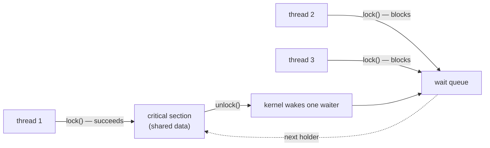

## In simple terms

A **mutex** ("mutual exclusion") is a lock. When a thread wants to touch shared data, it acquires the mutex; when it's done, it releases it. While one thread holds the mutex, any other thread that tries to acquire it has to wait. Used correctly, this prevents two threads from corrupting shared state by writing to it at the same time.

## The Visual Map



One door, one key, a queue outside — that's the entire mental model.

## More detail

The mutex API is small: `lock()` (acquire, blocking if needed) and `unlock()` (release). Most languages also offer `try_lock()` (return immediately if held).

How a modern mutex works under the hood:

1. **Fast path** — atomic compare-and-swap on a single memory word. If uncontended, the lock is acquired in nanoseconds without involving the kernel.
2. **Slow path** — if the lock is held, the thread spins briefly (in case the holder is about to release) then makes a kernel syscall (`futex` on Linux, `WaitOnAddress` on Windows) to sleep until woken.
3. **Wake** — when `unlock()` is called and others are waiting, the kernel wakes one of them.

Variants and adjacent primitives:

- **Recursive mutex** — same thread can lock it multiple times; must unlock the same number of times.
- **Read–write lock** — many concurrent readers OR one exclusive writer.
- **Spinlock** — busy-loops instead of sleeping; only safe in very specific kernel contexts.
- **Semaphore** — counts permits; mutex is a semaphore with count 1.
- **Condition variable** — used with a mutex to wait for a condition to become true.
- **Atomic operations** — for the smallest cases (counters, flags), no mutex needed.

Mutex hazards:

- **Deadlock** — two threads each hold a lock the other wants.
- **Lock contention** — many threads queue on one popular lock; throughput collapses.
- **Lock ordering** — different code paths acquire locks in different orders, causing deadlocks intermittently.
- **Forgetting to unlock** — RAII (Rust's `Drop`, C++'s `std::lock_guard`, Python's `with`) is the standard defence.

Almost every multithreaded program touches mutexes — even those that don't use them directly, because the standard library does. Understanding the cost (contention is often the bottleneck in well-tuned services) and the failure modes (deadlock, priority inversion) is essential to writing correct concurrent code.

## Under the Hood

The race, and the one-line cure:

```python
import threading

balance = 0
lock = threading.Lock()

def deposit_unsafe(times):
    global balance
    for _ in range(times):
        balance += 1            # read-modify-write: three steps, interruptible

def deposit_safe(times):
    global balance
    for _ in range(times):
        with lock:              # acquire ... release, even on exception
            balance += 1

# run either version with several threads to compare
threads = [threading.Thread(target=deposit_safe, args=(100_000,))
           for _ in range(4)]
for t in threads: t.start()
for t in threads: t.join()
print(balance)                  # safe: exactly 400000, every run
```

`with lock:` is the load-bearing line: it makes the three-step `balance += 1` (read, add, write) behave as one indivisible step. The `with` form also guarantees release if the body raises — the RAII defence against forgotten unlocks.

## Engineering Trade-offs

- **Coarse vs fine-grained locking.** One lock around a whole subsystem is simple and deadlock-resistant but serialises everything — Python's GIL is the cautionary tale. Per-object locks scale but multiply the ordering rules and deadlock surface. Start coarse; refine only where contention is measured.
- **Sleep vs spin.** A sleeping waiter frees the CPU but pays two context switches to nap and wake (~microseconds). A spinlock burns CPU but reacts in nanoseconds — right only when hold times are shorter than a context switch, which is why spinlocks live mostly inside kernels.
- **Mutex vs read–write lock.** RW locks let readers share — a win when reads vastly outnumber writes — but cost more per acquisition and can starve writers. Under mostly-write or short-critical-section workloads, a plain mutex is often faster.
- **Locks vs atomics vs no sharing.** For a lone counter or flag, an atomic beats a mutex. For complex invariants, a mutex beats clever atomics you'll get wrong. Best of all is often restructuring so threads don't share mutable state at all (channels, sharding per thread).

## Real-world examples

- The Linux kernel uses thousands of mutexes; lockdep, a built-in lock validator, has prevented countless cross-locking bugs by reporting on inconsistent lock ordering.
- Python's Global Interpreter Lock (GIL) is, mechanically, one giant mutex around the Python interpreter — the reason Python threads don't parallelise CPU-bound work in CPython.
- Database engines use fine-grained mutexes (often per-page or per-row) to allow concurrent transactions without serialising the whole engine.

## Common misconceptions

- **"Locking is slow."** Uncontended locking is a few nanoseconds; *contended* locking can stall a thread for milliseconds. The trick is to design for low contention, not to avoid locks.
- **"Lock everything to be safe."** Over-locking causes deadlocks and serialises code that could have run in parallel.

## Try it yourself

Measure what contention actually costs — the same work, alone vs fighting over one lock:

```bash
python3 -c "
import threading, time

lock = threading.Lock()
N = 500_000

def hammer():
    for _ in range(N):
        with lock:
            pass

t = time.perf_counter()
hammer()                                    # 1 thread: uncontended fast path
solo = time.perf_counter() - t

threads = [threading.Thread(target=hammer) for _ in range(4)]
t = time.perf_counter()
[x.start() for x in threads]; [x.join() for x in threads]
contended = time.perf_counter() - t

print(f'uncontended: {solo:.2f}s   4 threads contending: {contended:.2f}s')
"
```

Four threads doing 4× the acquisitions take far more than 4× the time — the surplus is the slow path: futex sleeps, wakeups, and cache-line ping-pong.

## Learn next

- [Deadlock](/t/deadlock) — the classic failure mode of multiple mutexes.
- [Semaphore](/t/semaphore) — the counting generalisation of a lock.
- [Lock-free programming](/t/lock-free-programming) — what avoiding mutexes entirely looks like.
