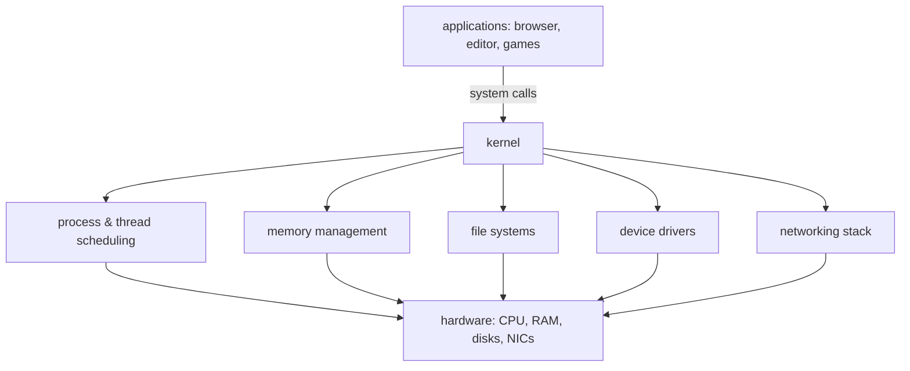

## In simple terms

An operating system is the program that runs all the other programs. It hides the messy details of the hardware and gives every app a clean, shared environment to live in.

## The Visual Map



## More detail

The job of an operating system is to manage three scarce things — CPU time, memory, and devices — and share them safely between many programs.

Its main responsibilities include:

- **Processes and scheduling** — deciding which program runs on the CPU and when
- **Memory management** — giving each program the illusion of its own private address space
- **File systems** — turning raw [storage](/t/storage) into named files and directories
- **Device drivers** — speaking to keyboards, displays, network cards, GPUs
- **Networking** — implementing protocols so programs can talk over a network
- **Security** — enforcing who can do what to whom

The core of an OS is called the **kernel**. It runs in a privileged mode where it can talk to hardware directly. Normal applications run in **user mode** and have to ask the kernel for help via **system calls**.

This is what makes a computer a *general-purpose* machine: without an OS you would have to write every program from scratch — including the code to talk to the screen, the disk, the network, and the keyboard.

Examples of operating systems include **Linux**, **macOS**, **Windows**, **iOS**, **Android**, and embedded OSes like **FreeRTOS**.

## Under the Hood

Even "hello world" is a conversation with the OS. Strip away the language runtime and what remains is a system call:

```python
import os

# print() eventually becomes this: "kernel, write these bytes to stdout"
os.write(1, b"hello from a system call\n")

# everything your process has, the OS gave it:
print("my PID:", os.getpid())
print("my working directory:", os.getcwd())
print("environment entries:", len(os.environ))
```

File descriptor `1` (stdout), the process ID, the working directory, the environment — none of these are language features. They are OS services every program inherits at birth.

## Engineering Trade-offs

- **General-purpose vs real-time.** Linux/Windows optimise for average throughput and fairness; a real-time OS (FreeRTOS, QNX) guarantees worst-case response times instead. You can't fully have both — desktop OSes occasionally pause any program, which is fine for a browser and fatal for an airbag controller.
- **Abstraction vs overhead.** Every OS service costs something: a system call is ~100× slower than a function call, and the file system adds layers between you and the disk. High-performance systems (databases, trading, games) sometimes bypass the OS deliberately (`O_DIRECT`, kernel-bypass networking) — accepting complexity to escape the abstractions.
- **Compatibility vs progress.** Windows still runs decades-old binaries; that promise constrains every new design decision. Apple breaks compatibility more freely and ships cleaner subsystems sooner. Both are defensible positions with real costs.
- **Monolithic vs microkernel.** Keeping drivers inside the kernel (Linux) is fast but means one buggy driver can crash everything; pushing them to user space (microkernels) contains failures at the price of message-passing overhead.

## Real-world examples

- Linux runs the majority of the world's servers and (via Android) most phones.
- macOS and iOS share a Unix-based kernel called Darwin.
- A microwave's controller runs a tiny real-time OS measuring kilobytes, not gigabytes.

## Common misconceptions

- **"The OS and the desktop are the same."** The desktop you see is a *user interface* running on top of the OS. The OS underneath is mostly invisible.
- **"You can install any program on any OS."** Programs are usually compiled for a specific OS and CPU architecture and will not run elsewhere without a compatibility layer.

## Try it yourself

Ask the OS what it is and what it's running:

```bash
uname -a                      # kernel name, version, architecture
ps aux | head -8              # the processes it is currently managing
python3 -c "import os; print('PID', os.getpid(), '| parent', os.getppid())"
```

Every line of that output is the OS doing its accounting job — naming itself, listing the programs it schedules, and tracking who started whom.

## Learn next

- [Kernel](/t/kernel) — the privileged core where all of this actually happens.
- [Process](/t/process) — the OS's unit of isolation and accounting.
- [File system](/t/file-system) — how raw storage becomes files and folders.
