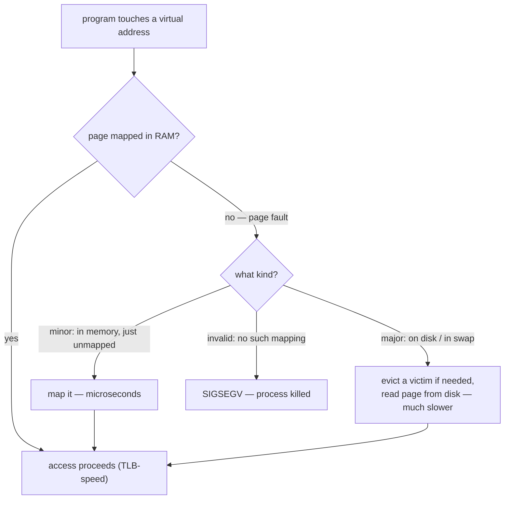

## In simple terms

**Paging** divides memory into fixed-size chunks (typically 4 KB) called **pages** and lets the OS move them between RAM and disk on demand. If a program reaches for a page that isn't currently in RAM, the CPU stops, the OS finds room, loads the page from disk (or from a swap file), and the program continues — usually without ever knowing.

## The Visual Map

The page-fault decision tree:



## More detail

The CPU's MMU maintains a **page table** for each process: a mapping from virtual page number to physical frame number (or "not present"). When code touches a virtual address:

1. The CPU asks the MMU for the physical address.
2. If the page is mapped, the access proceeds at full speed (often with a TLB hit, single-cycle).
3. If the page is *not* present, the CPU raises a **page fault** exception.
4. The kernel's page fault handler decides what to do:
   - **Minor fault** — the page is in memory but not yet mapped (e.g., shared with another process, fresh allocation). Just map it.
   - **Major fault** — the page is on disk in swap / a backing file. Read it back into a free frame, then map it.
   - **Invalid** — segmentation fault; the process is killed.

Key concepts:

- **Demand paging** — only load a page when first accessed; don't preload anything.
- **Page replacement** — when RAM is full and you need to bring in a new page, pick a victim to evict. LRU, clock, LRU-K, working set, etc.
- **Swapping** vs **paging** — historically "swap" meant moving entire processes; "paging" means moving individual pages. Today they're used interchangeably.
- **Thrashing** — when there's so little RAM that the system spends most of its time paging in and out. Symptom: disk light constantly on, everything molasses-slow.

Modern wrinkles:

- **Huge pages** (2 MB on x86) reduce TLB pressure but reduce paging granularity.
- **zRAM / zswap** compress pages in memory instead of writing to disk — sometimes faster than the disk.
- **NVMe SSDs** make swap viable again; old wisdom about "swap is always bad" was from spinning-disk days.
- **PSI** (Pressure Stall Information) on Linux tells you when paging is hurting performance, with much more nuance than just looking at "swap used".

Paging is what makes computers run programs bigger than their RAM, what isolates processes from each other, and what backs file-mapped memory (`mmap`), shared libraries, and copy-on-write fork. When tuning a database or a high-traffic service, paging behaviour is often the difference between fast and unusable.

## Under the Hood

Demand paging, observed — allocate a big region, then watch faults happen only on first touch:

```python
import mmap, time

PAGE = mmap.PAGESIZE              # 4096 on most systems
region = mmap.mmap(-1, 200_000 * PAGE)    # ~800 MB of address space, no RAM yet

t = time.perf_counter()
for i in range(0, 50_000 * PAGE, PAGE):
    region[i] = 1                 # first touch: page fault, kernel maps a page
first = time.perf_counter() - t

t = time.perf_counter()
for i in range(0, 50_000 * PAGE, PAGE):
    region[i] = 2                 # second touch: already mapped, no faults
second = time.perf_counter() - t

print(f"first touch (50k page faults): {first:.3f}s")
print(f"second touch (0 faults):       {second:.3f}s")
region.close()
```

Same loop, same memory — the first pass pays one minor fault per page, the second runs at full speed. That difference *is* demand paging.

## Engineering Trade-offs

- **Page size: TLB reach vs waste.** 4 KB pages waste little memory but a large process needs millions of mappings, thrashing the TLB. 2 MB huge pages multiply TLB coverage 512× — and waste up to 2 MB per small allocation, page in slower, and fragment. Databases and JVMs opt in deliberately; kernels apply them transparently with mixed results.
- **Swap: survival vs latency.** With swap, memory pressure degrades gradually (cold pages leave); without it, pressure ends in OOM kills. But a major fault is ~10⁵× slower than a RAM access, so latency-critical services often run swapless or `mlock` their hot data — choosing a clean death over a slow one.
- **Eviction policy.** True LRU is too expensive to track per-access, so kernels approximate (clock/second-chance, active/inactive lists). Better approximations cost CPU and memory themselves; the policy only matters when you're already short on RAM.
- **Preloading vs demand.** Pure demand paging makes startup lazy but every first touch stalls; readahead and `MAP_POPULATE` prefault pages, trading upfront work for smooth steady state. Wrong guesses waste RAM and I/O.

## Real-world examples

- PostgreSQL relies on the OS page cache for much of its caching: `shared_buffers` is the database's own cache, but a much larger working set typically lives in the kernel's page cache via paging.
- macOS's "memory pressure" indicator is basically a paging-pressure indicator — yellow means the kernel is compressing memory to avoid swap; red means it's actively swapping.
- The Linux OOM killer fires when paging can no longer keep up: someone has to die so the system can keep running.

## Common misconceptions

- **"Any swap is bad."** Some swap usage is healthy — it lets the kernel evict cold pages to make room for hot file cache. *Active* swapping under load is what's bad.
- **"Paging is slow."** Reading a page from disk is slow (microseconds on SSD, milliseconds on HDD). A *minor* page fault is fast — microseconds. Conflating them obscures what's actually happening.

## Try it yourself

Run the first-touch demo from Under the Hood, then check your page size and your processes' fault counts:

```bash
getconf PAGE_SIZE                        # almost certainly 4096
ps -o pid,min_flt,maj_flt,comm -p $$     # your shell's lifetime fault counters
```

`min_flt` (minor faults) climbs constantly and harmlessly; a growing `maj_flt` means real disk reads — the number to watch when something feels swap-bound.

## Learn next

- [Virtual memory](/t/virtual-memory) — the abstraction this machinery implements.
- [Memory hierarchy](/t/memory-hierarchy) — where disk-backed pages sit in the speed pyramid.
- [Copy-on-write](/t/copy-on-write) — the page-fault trick behind cheap fork and snapshots.
