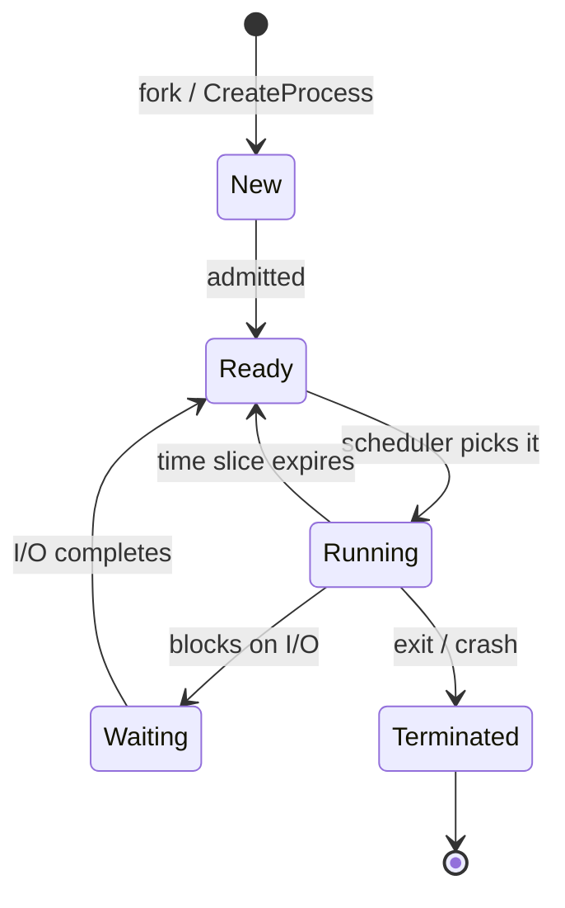

## In simple terms

A **process** is what a program becomes once it's running. When you double-click an app, the OS creates a process: a private slice of memory, a list of open files, a CPU it gets to share, and a name and number to track it by. Two copies of the same app running at the same time are two processes.

## The Visual Map

The lifecycle every process moves through:



## More detail

A process is the OS's main unit of accounting and isolation. Each process has:

- A **PID** (process ID) — a unique integer.
- Its own **virtual address space** — pretend memory the kernel maps to real RAM.
- A **state** — running, ready to run, blocked on I/O, stopped, or terminated.
- A **set of resources** — open file descriptors, sockets, environment variables.
- One or more **threads** of execution.
- A **parent** process (everything traces back to PID 1).

Processes are created by **forking** an existing process (Unix) or by an OS call like `CreateProcess` (Windows). Operating systems carefully prevent one process from reading another's memory unless they explicitly share it.

When a process exits, the OS reclaims its memory and closes its files. A misbehaving process usually only takes itself down, not the whole machine — that is the central benefit of process isolation, and it is why a single computer can run a browser, a video call, a code editor, and a backup all at once without each breaking the others. Processes are the primitive on top of which scheduling, security, and containers are built.

## Under the Hood

On Unix, every process is born by copying an existing one — `fork()` returns *twice*:

```c
#include <stdio.h>
#include <unistd.h>
#include <sys/wait.h>

int main(void) {
    pid_t pid = fork();          /* one process goes in, two come out */

    if (pid == 0) {
        printf("child:  PID %d, parent is %d\n", getpid(), getppid());
        execlp("echo", "echo", "child can replace itself with any program", NULL);
    } else {
        printf("parent: PID %d created child %d\n", getpid(), pid);
        wait(NULL);              /* reap the child to avoid a zombie */
    }
    return 0;
}
```

`fork()` duplicates the process; `exec()` replaces its program; `wait()` collects its exit status. Every shell command you've ever run is this exact trio.

## Engineering Trade-offs

- **Processes vs threads.** Processes give hard isolation (a crash or memory corruption stays contained); threads share everything and are far cheaper to create and communicate between. Chrome chose process-per-tab for safety and pays for it in memory; most servers choose threads or async tasks for density.
- **Isolation cost.** Crossing a process boundary means a context switch and serialised messages instead of a shared pointer — orders of magnitude slower than a function call. Architectures pay this where the failure-containment is worth it (browsers, sandboxes) and avoid it where it isn't.
- **fork() semantics.** Copy-on-write makes fork cheap, and fork+exec composes beautifully — but fork interacts badly with threads (only the calling thread survives) and with large heaps. That's why `posix_spawn` exists and why Windows skipped fork entirely.
- **Process-per-request vs pooling.** Spawning a process per task (CGI, serverless cold starts) is simple and isolated but slow; pools and long-lived workers amortise the creation cost at the price of state management between requests.

## Real-world examples

- The `ps` / Task Manager / Activity Monitor list of running programs is a list of processes.
- A web browser usually runs each tab as its own process for isolation.
- A crashing app shows up as a process that exited with a non-zero status.
- A serverless function invocation is, under the hood, a short-lived process the platform spins up to handle the request.

## Common misconceptions

- **"A process is a program."** A program is a file on disk; a process is one running instance of it. The same program can be many processes.
- **"More processes means more parallelism."** Only if they actually do work in parallel — many processes spend most of their time blocked on I/O.

## Try it yourself

Watch processes being born — spawn a child, inspect both ends:

```bash
python3 -c "
import os, subprocess
print('parent PID:', os.getpid())
result = subprocess.run(['python3', '-c',
    'import os; print(\"child  PID:\", os.getpid(), \"| my parent:\", os.getppid())'])
print('child exited with status', result.returncode)
"
```

Then see the whole family tree your shell lives in:

```bash
ps -ef | head -12     # PID, PPID columns: every process traces back to PID 1
```

## Learn next

- [Thread](/t/thread) — multiple lines of execution inside one process.
- [Scheduler](/t/scheduler) — how the OS picks which process runs next.
- [Virtual memory](/t/virtual-memory) — the private address space every process is wrapped in.
