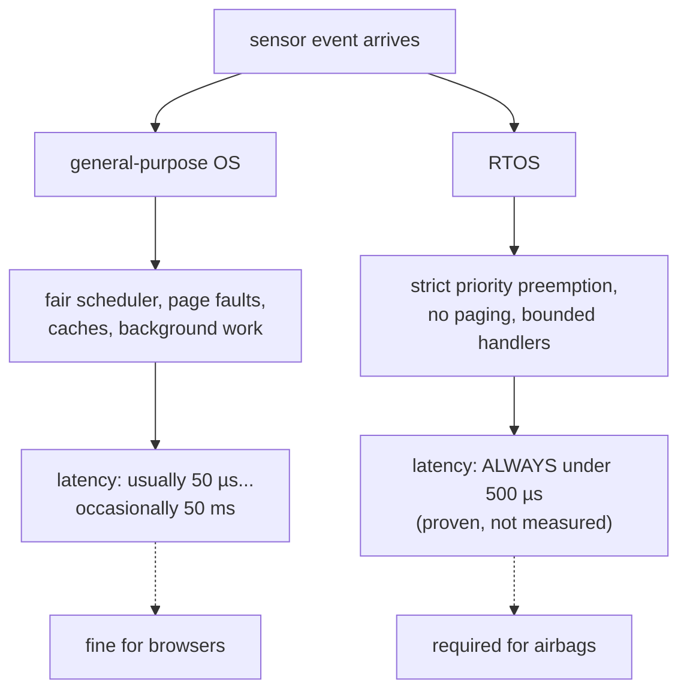

## In simple terms

A general-purpose OS (Linux, Windows) optimises for *average* throughput — it might delay your task for 10 milliseconds if something else is running. A real-time OS guarantees *worst-case* latency: "this task will start within 500 microseconds of its trigger, every time, no exceptions." For an airbag controller that must fire in 1 ms after a crash, "usually fast enough" means people die. RTOSes are designed so the worst case is bounded and guaranteed.

## The Visual Map

The same workload on two philosophies:



## More detail

**Hard vs. soft real-time:**
- **Hard real-time** — missing a deadline is a system failure. Airbag controllers, fly-by-wire, pacemakers. The system must guarantee every deadline, not just most.
- **Soft real-time** — missing occasional deadlines degrades quality but is not catastrophic. Video streaming (dropped frame = glitch), VoIP, financial trading (late order = profit loss, not crash).
- **Firm real-time** — missing a deadline is worthless but not catastrophic (a late sensor reading is discarded rather than used incorrectly).

**Scheduling:** RTOSes use priority-based preemptive scheduling. Higher-priority tasks preempt lower ones immediately. Key algorithms:
- **Rate-Monotonic Scheduling (RMS)** — assign priorities by period (shorter period → higher priority). Provably optimal for periodic tasks; schedulable if CPU utilisation ≤ 69%.
- **Earliest Deadline First (EDF)** — always run the task with the earliest deadline. Optimal for dynamic priority assignment; CPU utilisation up to 100%.
- **Fixed priority with priority inheritance** — handles priority inversion (low-priority task holding a resource needed by a high-priority task).

**Jitter and latency:** the worst-case interrupt latency and context-switch time must be bounded. General Linux has unbounded latency spikes from page faults, garbage collection (in GC languages), and network stack processing. PREEMPT_RT (now mainlined in Linux) patches the kernel to make most kernel code preemptible, bringing Linux worst-case latency from milliseconds to tens of microseconds.

**Common RTOSes:**
- **FreeRTOS** — open-source, widely used in IoT and microcontrollers (ESP32, ARM Cortex-M).
- **VxWorks** — commercial, used in aerospace (Mars rovers, F-35).
- **QNX** — commercial, POSIX-compliant, used in automotive (BlackBerry QNX).
- **Zephyr** — Linux Foundation RTOS, growing in IoT.
- **ThreadX (Azure RTOS)** — Microsoft, widely certified (DO-178C, IEC 61508).

**Memory management:** RTOSes typically avoid dynamic memory allocation (no `malloc`) because allocation latency is unpredictable. Pre-allocate all memory at startup, or use memory pools with fixed-size blocks.

RTOSes power the systems humans trust with their lives — medical devices, aircraft, cars, industrial robots. Even in non-embedded contexts, RTOS concepts (bounded latency, priority inversion, rate monotonic analysis) apply whenever you need predictable response times — trading systems, real-time audio, autonomous vehicles.

## Under the Hood

What RTOS application code actually looks like — FreeRTOS tasks with fixed priorities and a strict period:

```c
/* FreeRTOS: a 1 kHz control loop that must never miss its tick */
void motor_control_task(void *params) {
    TickType_t last_wake = xTaskGetTickCount();
    for (;;) {
        read_sensors();
        compute_pid();
        write_actuators();
        /* sleep until EXACTLY the next 1 ms boundary — no drift */
        vTaskDelayUntil(&last_wake, pdMS_TO_TICKS(1));
    }
}

void main(void) {
    /* highest number = highest priority; control beats logging, always */
    xTaskCreate(motor_control_task, "ctrl", 256, NULL, /*prio*/ 5, NULL);
    xTaskCreate(logging_task,       "log",  512, NULL, /*prio*/ 1, NULL);
    vTaskStartScheduler();          /* hand the CPU to the RTOS forever */
}
```

`vTaskDelayUntil` (not plain `delay`) anchors each cycle to an absolute schedule, and the priority gap guarantees the control loop preempts logging mid-line if it must. Note what's absent: no `malloc` in the loop, no unbounded work.

## Engineering Trade-offs

- **Worst-case guarantees vs average throughput.** Everything that makes Linux fast on average — caches you can't predict, demand paging, batched I/O — adds variance. RTOSes strip those out: lower peak performance, provable ceilings. You buy the guarantee with efficiency.
- **RMS vs EDF.** Rate-monotonic priorities are static, simple to analyse and certify, but only guarantee schedulability up to ~69% CPU use. EDF reaches 100% utilisation but with dynamic priorities that are harder to certify — and degrades unpredictably when overloaded. Safety-critical industries overwhelmingly pick the simpler math.
- **Static allocation vs flexibility.** Banning `malloc` after startup makes memory behaviour provable and fragmentation impossible — and means sizing every queue and pool at design time, wasting RAM as margin. Dynamic allocation is exactly the kind of unbounded-latency convenience an RTOS exists to forbid.
- **RTOS vs PREEMPT_RT Linux.** Real-time Linux gets tens-of-microseconds worst cases with the full Linux ecosystem — often the right trade for robots and audio. But its guarantees are empirical, not certified; pacemakers and flight control still require a dedicated, often formally analysed RTOS.

## Real-world examples

- NASA's Mars rovers run VxWorks; the Mars Ingenuity helicopter runs Linux (soft real-time for non-critical subsystems) alongside an RTOS for flight control.
- Modern cars have 50–100 ECUs (Electronic Control Units), each running an RTOS (often AUTOSAR on QNX or FreeRTOS).
- Implantable cardiac devices (pacemakers, defibrillators) run RTOSes with formal timing verification.
- Industrial robots (KUKA, Fanuc) use hard real-time loops at 1–4 kHz for motor control.

## Common misconceptions

- **"Linux is real-time with the right patches."** PREEMPT_RT Linux improves worst-case latency but cannot provide hard real-time guarantees — page faults and hardware unpredictability remain. For hard real-time, use a dedicated RTOS.
- **"Faster hardware solves real-time requirements."** Speed helps average latency but not worst-case bounds. A 1 GHz RTOS with 10 µs guaranteed latency beats a 10 GHz Linux system with 50 ms occasional spikes for a pacemaker.

## Try it yourself

Measure your general-purpose OS failing the real-time test — sleep jitter:

```bash
python3 -c "
import time
target = 0.001                      # ask for exactly 1 ms, 500 times
worst = 0.0; total = 0.0
for _ in range(500):
    t = time.perf_counter()
    time.sleep(target)
    actual = time.perf_counter() - t
    worst = max(worst, actual)
    total += actual
print(f'requested: 1.000 ms   average: {total/500*1000:.3f} ms   WORST: {worst*1000:.3f} ms')
"
```

The average is close to 1 ms; the worst case can be many times that — and it changes run to run. That gap between average and worst is precisely what an RTOS eliminates, and why "fast on average" can't fire an airbag.

## Learn next

- [Scheduler](/t/scheduler) — the general-purpose policies RTOSes replace with strict priority.
- [Interrupt](/t/interrupt) — bounded interrupt latency is where every RTOS guarantee starts.
- [Real-time systems](/t/real-time-systems) — the broader engineering discipline around deadlines.
