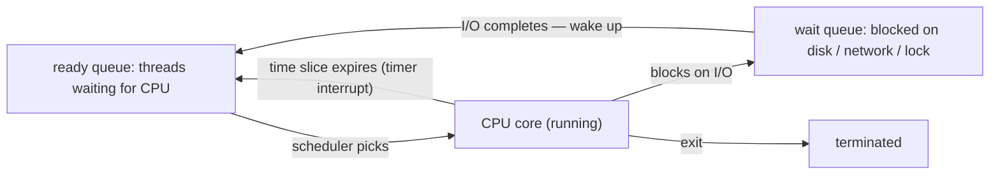

## In simple terms

A computer might have hundreds of threads wanting to run but only a handful of CPU cores. The **scheduler** decides which thread gets the next slice of CPU time, swaps it in, lets it run for a bit, then swaps in the next one — fast enough that everything feels simultaneous.

## The Visual Map



The triangle on the left is the scheduler's whole world: pick, preempt, repeat — thousands of times per second.

## More detail

A scheduler is judged on several axes that pull in different directions:

- **Throughput** — total work done per second.
- **Latency / responsiveness** — how quickly a thread that wakes up gets to run.
- **Fairness** — does every thread get its share?
- **Energy** — can we keep cores idle when we can?

Common scheduling families:

- **Round-robin** — each thread gets a fixed time slice in turn. Simple and fair.
- **Priority-based** — higher-priority threads run first; risk of starving low-priority ones.
- **Multilevel feedback queues** — classic Unix; threads move between priority queues based on behaviour (CPU-bound vs I/O-bound).
- **Completely Fair Scheduler (CFS)** — Linux's longtime default; tracks how much CPU each thread "deserves" and runs whoever is most behind (succeeded by EEVDF in recent kernels).
- **Real-time** — gives strict timing guarantees, used for control systems and audio.

The scheduler runs whenever a thread blocks, a timer fires, or a higher-priority thread becomes runnable. A **context switch** saves the current thread's registers, loads the next one's, and jumps to it — fast (microseconds), but not free.

The scheduler is the difference between a system that feels snappy and one that stutters. Every "I can do many things at once" claim a modern computer makes ultimately boils down to scheduling.

## Under the Hood

Round-robin in fifteen lines — the core loop of every scheduler, simplified:

```python
from collections import deque

QUANTUM = 3   # time units per turn
ready = deque([("editor", 4), ("compiler", 9), ("music", 5)])
clock = 0

while ready:
    name, remaining = ready.popleft()       # pick the next thread
    ran = min(QUANTUM, remaining)
    clock += ran
    if remaining - ran > 0:
        ready.append((name, remaining - ran))   # preempt: back of the queue
        print(f"t={clock:2}: {name} ran {ran}, preempted ({remaining - ran} left)")
    else:
        print(f"t={clock:2}: {name} ran {ran} and finished")
```

Real schedulers replace the FIFO queue with priority structures and add per-thread accounting — but "pick, run for a quantum, requeue" is the heartbeat underneath.

## Engineering Trade-offs

- **Throughput vs latency.** Long time slices amortise context-switch costs (good for batch compute); short slices make interactive apps feel instant. Desktop and server kernels tune this differently — and you can retune it.
- **Fairness vs priority.** Strict priorities give critical work the CPU first but can starve everything else — and invite *priority inversion*, where a low-priority thread holding a lock blocks a high-priority one (it famously rebooted the Mars Pathfinder). Fair-share schedulers avoid starvation but promise nothing about deadlines.
- **Migration vs cache affinity.** Moving a thread to an idle core balances load but abandons its warm L1/L2 cache. Schedulers weigh this constantly; latency-critical systems pin threads to cores to opt out of the gamble entirely.
- **General-purpose vs real-time.** CFS-style fairness optimises the average case; `SCHED_FIFO`/deadline scheduling guarantees the worst case at the cost of overall efficiency — and a runaway real-time thread can lock up the machine.

## Real-world examples

- Linux's CFS (now EEVDF) schedules every thread on most servers and Android phones.
- macOS and iOS use a priority scheduler with QoS (Quality of Service) classes you can set per task.
- Game engines often pin their threads to specific cores to avoid scheduler decisions.
- Mobile OS schedulers also factor in battery and thermal state, deliberately throttling background threads when the device is hot or unplugged.

## Common misconceptions

- **"The scheduler runs my code on demand."** It runs your thread when it decides to. A `sleep(0)` is a polite hint, not a guarantee.
- **"Higher priority makes a program faster."** Only relative to other threads on the same machine — and only if it was actually waiting for the CPU, not for I/O.

## Try it yourself

Run the round-robin simulator from Under the Hood, then watch the real one's bookkeeping:

```bash
python3 -c "
from collections import deque
QUANTUM = 3
ready = deque([('editor', 4), ('compiler', 9), ('music', 5)])
clock = 0
while ready:
    name, remaining = ready.popleft()
    ran = min(QUANTUM, remaining); clock += ran
    if remaining - ran > 0:
        ready.append((name, remaining - ran))
        print(f't={clock:2}: {name} ran {ran}, preempted')
    else:
        print(f't={clock:2}: {name} ran {ran} and finished')
"
```

On Linux, `cat /proc/self/sched` shows the kernel's per-thread scheduling stats for the `cat` process itself — including how many times it was context-switched in its short life.

## Learn next

- [Context switch](/t/context-switch) — the mechanical cost of every preemption.
- [Kernel](/t/kernel) — where the scheduler lives and why it has the authority.
- [Real-time OS](/t/real-time-os) — scheduling when deadlines are non-negotiable.
