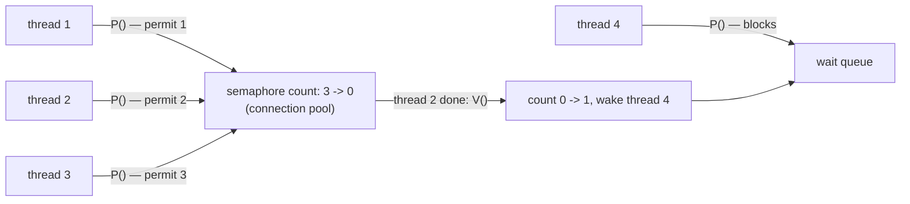

## In simple terms

A semaphore is like a bucket of permits. A thread must take a permit before entering a critical section; it returns the permit when done. If the bucket is empty, the thread waits until someone returns a permit. Dijkstra invented semaphores in 1965 as one of the first solutions to the critical section problem. They are the building block from which mutexes, condition variables, and higher-level concurrency primitives are constructed.

## The Visual Map

A counting semaphore guarding a pool of 3 database connections:



## More detail

A semaphore is a non-negative integer with two atomic operations:

- **wait / P / down / acquire** — if the count > 0, decrement and proceed; if count == 0, block the calling thread.
- **signal / V / up / release** — increment the count; if any threads are blocked, wake one.

(P and V are from Dutch: *proberen* — to try; *verhogen* — to increment.)

**Binary semaphore (count is 0 or 1):** equivalent to a mutex. Start at 1. `P` acquires, `V` releases. Unlike a mutex, any thread can call `V` — ownership is not enforced. This makes binary semaphores useful for producer-consumer signalling (producer signals, consumer waits) but risky as a mutex substitute (no priority inheritance, no deadlock detection).

**Counting semaphore:** count ≥ 0. Models a pool of resources — e.g., a semaphore initialised to 5 guards a pool of 5 database connections. Threads acquire a connection (`P`), use it, and release (`V`).

**Classic problems solved with semaphores:**

*Producer-Consumer (Bounded Buffer):*
```
empty = Semaphore(N)   // N slots available
full  = Semaphore(0)   // 0 items available
mutex = Semaphore(1)   // protect buffer

producer: P(empty); P(mutex); add_item(); V(mutex); V(full)
consumer: P(full);  P(mutex); get_item(); V(mutex); V(empty)
```

*Readers-Writers:* multiple readers may read concurrently; writers need exclusive access. Implemented with two semaphores and a reader count.

**Pitfalls:**
- **Deadlock** — if two threads each hold one semaphore and wait for the other.
- **Starvation** — if the semaphore's scheduling policy never wakes a particular thread.
- **Forgetting V** — a thread that crashes or returns without signalling permanently reduces the count.

**Semaphore vs. mutex:** a mutex has ownership (only the acquiring thread can release), priority inheritance, and is used purely for mutual exclusion. Semaphores are more general (signalling, counting) but lack ownership — bugs are harder to detect. Modern code prefers mutexes for mutual exclusion and condition variables for signalling; semaphores are used where counting semantics are needed.

**In POSIX:** `sem_init`, `sem_wait`, `sem_post`. In Linux, also futex-based for fast user-space semaphores.

Semaphores are the oldest synchronisation primitive and appear in every OS, RTOS, and concurrent programming textbook. They remain directly used in OS kernels, device drivers, and real-time systems where low-level control is required — and understanding them is foundational to every higher-level concurrency abstraction.

## Under the Hood

A bounded connection pool — the counting semaphore's signature use:

```python
import threading, time, random

pool = threading.Semaphore(3)        # 3 permits = 3 "connections"
active = 0
lock = threading.Lock()

def query(worker_id):
    global active
    with pool:                       # P(): blocks if all 3 permits are out
        with lock:
            active += 1
            print(f"worker {worker_id} in  (active: {active})")
        time.sleep(random.uniform(0.1, 0.3))   # "use the connection"
        with lock:
            active -= 1
    # leaving `with pool` = V(): permit returned, a waiter wakes

threads = [threading.Thread(target=query, args=(i,)) for i in range(8)]
for t in threads: t.start()
for t in threads: t.join()
```

Eight workers, three permits — `active` never exceeds 3, with no scheduling code anywhere. The semaphore *is* the admission control.

## Engineering Trade-offs

- **Semaphore vs mutex for exclusion.** A binary semaphore can play mutex, but with no ownership: any thread can `V()`, releasing a lock it never held, and the runtime can't detect it. Mutexes add ownership checks and priority inheritance. Rule of thumb: exclusion → mutex; *signalling between threads* or *counting* → semaphore.
- **Counting admission vs queueing.** A semaphore caps concurrency (3 connections, 10 inflight requests) with one line; it doesn't preserve order fairness on all platforms, can't time out uniformly everywhere, and gives no backpressure signal. A bounded queue costs more machinery and tells you when you're saturated.
- **Blocking vs failing fast.** `P()` that blocks keeps callers simple but hides saturation — threads pile up invisibly. `acquire(timeout=...)`/`try-acquire` surfaces overload as an explicit error you can shed or retry; rate limiters built on semaphores almost always want the latter.
- **Cross-process power vs lifecycle hazards.** POSIX named semaphores synchronise unrelated processes — nothing thread-local matches that. But a process that dies holding a permit leaks it permanently (no owner means no automatic release), which is why robust mutexes exist and why supervisors often just reset the world.

## Real-world examples

- POSIX `sem_t` is used in Linux IPC for process-level synchronisation (named semaphores in `/dev/shm`).
- RTOSes (FreeRTOS, VxWorks) expose binary and counting semaphores as their primary synchronisation primitives.
- Java's `java.util.concurrent.Semaphore` is used to implement connection pools and rate limiters.
- Linux kernel uses semaphores (`struct semaphore`) for sleeping locks in device drivers.

## Common misconceptions

- **"A semaphore is the same as a mutex."** A binary semaphore can be used like a mutex, but it lacks ownership semantics and priority inheritance — using it as a mutex introduces bugs that are hard to debug.
- **"Semaphores are outdated."** They remain the right tool for counting resources and for producer-consumer signalling where condition variables are unavailable (e.g., between processes via `sem_open`).

## Try it yourself

Run the connection pool from Under the Hood and watch `active` never pass 3:

```bash
python3 -c "
import threading, time, random
pool = threading.Semaphore(3)
active = 0
lock = threading.Lock()

def query(i):
    global active
    with pool:
        with lock:
            active += 1; print(f'worker {i} in  (active: {active})')
        time.sleep(random.uniform(0.05, 0.15))
        with lock:
            active -= 1

ts = [threading.Thread(target=query, args=(i,)) for i in range(8)]
[t.start() for t in ts]; [t.join() for t in ts]
"
```

Change `Semaphore(3)` to `Semaphore(1)` and you've built a (ownership-free) mutex; change it to `Semaphore(8)` and the gate disappears entirely.

## Learn next

- [Mutex](/t/mutex) — the ownership-enforcing special case.
- [Deadlock](/t/deadlock) — what multiple semaphores can still get you into.
- [Lock-free programming](/t/lock-free-programming) — coordinating without blocking at all.
