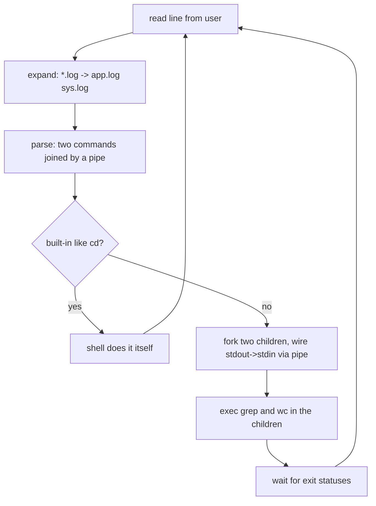

## In simple terms

A **shell** is the program that turns the text you type into work the operating system does. You type `ls`, the shell figures out you mean the `ls` program, asks the OS to run it, and shows you the result. It's a thin but powerful layer wrapped *around* the OS — the name comes from being the outer "shell" between you and the kernel. Common ones are **bash**, **zsh**, and **fish** on Unix, and **PowerShell** on Windows.

## The Visual Map

One trip around the read–evaluate loop for `grep err *.log | wc -l`:



## More detail

At its heart a shell is a **read–evaluate loop**: read a line, make sense of it, run it, repeat. For each command it:

1. **Reads** a line of input.
2. **Expands** it — fills in variables (`$HOME`), globs (`*.txt`), and command substitutions (`$(date)`).
3. **Parses** it into a command plus arguments, pipes, and redirections.
4. **Runs** it — for an external program, the shell **`fork`s** a child [process](/t/process) and **`exec`s** the program; for a *built-in* like `cd` or `export`, it does the work itself.
5. **Waits** for the result (unless you backgrounded it with `&`) and reports the exit status.

The features that make shells powerful are mostly about wiring processes together:

- **Pipes** (`a | b`) connect one program's output to the next program's input.
- **Redirection** (`> file`, `2>&1`) points file descriptors at files instead of the terminal.
- **Job control** lets you suspend, background, and foreground running commands.
- **Scripting** adds variables, conditionals, loops, and functions, turning the shell into a full (if quirky) programming language for automating tasks.

Crucially, a shell is just a normal user-space program — not part of the kernel. You can have many installed and swap between them. It reaches the OS the same way any program does: through [system calls](/t/system-call).

The shell is how you actually drive a server, automate repetitive work, and glue small tools into pipelines. It's the lingua franca of operations, CI pipelines, Dockerfiles, and setup scripts. And because every command is `fork`/`exec`/pipe/redirect underneath, learning the shell is one of the most direct ways to *see* core OS concepts in action.

## Under the Hood

A working shell is smaller than you'd think — read, split, run, repeat:

```python
import os, shlex, subprocess

while True:
    try:
        line = input("myshell$ ")
    except EOFError:
        break
    if not line.strip():
        continue
    args = shlex.split(line)            # parse, respecting quotes

    if args[0] == "cd":                 # built-in: must run IN the shell —
        os.chdir(args[1] if len(args) > 1 else os.path.expanduser("~"))
        continue                        # a child changing dir wouldn't affect us
    if args[0] == "exit":
        break

    result = subprocess.run(args)       # fork + exec + wait, wrapped
    if result.returncode != 0:
        print(f"[exit {result.returncode}]")
```

Twenty lines and it runs real programs. The `cd` special case is the classic lesson: a child process's working directory dies with it, so directory changes *must* be built in — the same reason `export` and `alias` are built-ins in bash.

## Engineering Trade-offs

- **Shell script vs real language.** For gluing programs, pipes, and files, ten lines of bash beat a hundred of Python. But shell scripts handle errors poorly by default (`set -euo pipefail` is the mandatory incantation), treat all data as whitespace-separated text, and grow unmaintainable fast. A common rule: past ~50 lines or any nontrivial data structure, switch languages.
- **POSIX portability vs modern features.** `sh`-compatible scripts run everywhere from Alpine containers to ancient AIX; bash arrays, zsh globs, and fish niceties don't. CI images and Docker `RUN` lines punish the assumption that `/bin/sh` is bash.
- **Interactive comfort vs scripting predictability.** Aliases, prompt frameworks, and auto-suggestions make a great interactive shell — and a booby-trapped scripting environment (an alias silently changing `rm`'s behaviour). Scripts deliberately run non-interactive, alias-free shells for this reason.
- **Text streams as the universal interface.** Everything-is-text makes any two tools composable — and means structure must be re-parsed at every pipe stage, breaking on spaces in filenames. PowerShell passes typed objects instead: more robust pipelines, much smaller tool ecosystem.

## Real-world examples

- `cat access.log | grep 500 | wc -l` strings three programs into a pipeline to count server errors — each stage is a separate process the shell connects.
- A CI job is usually just a shell script: install dependencies, build, test, deploy, each line a command whose exit status decides whether the pipeline continues.
- Pressing **Ctrl-C** tells the shell to send `SIGINT` to the foreground job — the shell is mediating between your keystroke and the running process.

## Common misconceptions

- **"The shell is the terminal."** No. The *terminal* (or terminal emulator) is the window that draws text and captures keystrokes; the *shell* is the program running inside it that interprets your commands. You can run a shell with no terminal at all (in a script).
- **"The shell is part of the operating system kernel."** It's an ordinary program in user space — replaceable, and one of several you can install.

## Try it yourself

Watch the shell's machinery from inside it:

```bash
type cd; type ls            # 'cd is a shell builtin' vs 'ls is /usr/bin/ls'
echo $$                     # the shell's own PID
ls | wc -l; echo "pipeline exit: $?"
sleep 30 &                  # background job — the shell didn't wait
jobs                        # ...and it's tracking it
kill %1                     # job control: signal it by job number
```

Then paste the Python mini-shell from Under the Hood into a file and live inside your own shell for a minute — `cd` around, run `ls`, type `exit`.

## Learn next

- [Process](/t/process) — what every command becomes via fork/exec.
- [System call](/t/system-call) — how the shell (like all programs) asks the kernel for anything.
- [Command-line interface](/t/command-line-interface) — the broader interaction paradigm shells implement.
