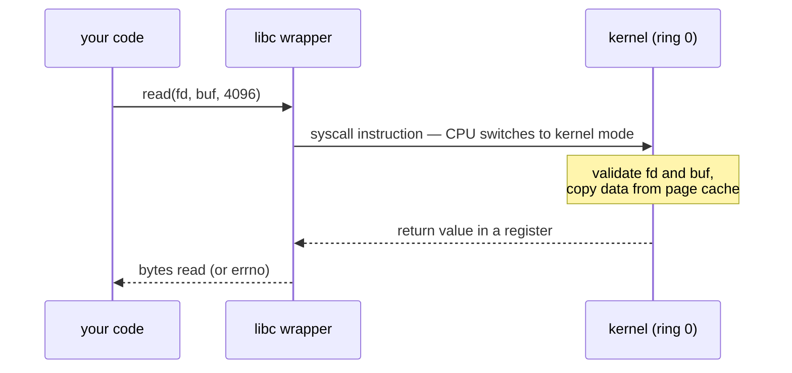

## In simple terms

A **system call** is how a normal program asks the operating system to do something it can't do itself. Reading a file, opening a network connection, allocating memory, starting a new process — none of those happen in your code. Your code makes a system call and the kernel does the privileged work on your behalf.

## The Visual Map



## More detail

User-space code runs in a restricted CPU mode that can't touch hardware, kernel memory, or other processes. To get anything done, it has to ask the kernel via a controlled gate — the system call.

The mechanics are roughly:

1. The program loads arguments into registers (and a "syscall number" naming what it wants).
2. It executes a special instruction (`syscall` on x86-64, `svc` on ARM64) that switches the CPU to kernel mode.
3. The kernel reads the syscall number, dispatches to the right handler, and validates every argument the user provided.
4. The handler does the work, sets a return value, and switches back to user mode.

System calls are expensive (~hundreds of nanoseconds each on modern hardware) because the mode switch has to save and restore CPU state plus invalidate parts of the cache. High-performance servers (databases, packet routers) work hard to minimise syscalls per request — batching, sendfile, io_uring, eBPF.

The Linux kernel exposes ~400 syscalls; macOS and Windows have similar counts. Common ones include `open`, `read`, `write`, `close`, `mmap`, `fork`, `execve`, `clone`, `socket`, `bind`, `epoll_wait`.

System calls are the line between "your program" and "everything else". Every interesting thing a program does — I/O, networking, concurrency, security — eventually crosses this line. Understanding the cost lets you write fast code; understanding the surface lets you understand how containers, sandboxes, and security policies work.

## Under the Hood

The same operation at three altitudes — and where the boundary actually is:

```c
#include <stdio.h>
#include <unistd.h>

int main(void) {
    /* 1. library function: buffered in user space, zero syscalls (yet) */
    printf("via printf\n");

    /* 2. POSIX wrapper: one thin function around the real thing */
    write(1, "via write()\n", 12);

    /* 3. the raw syscall, no wrapper at all */
    syscall(1 /* SYS_write */, 1, "via syscall()\n", 14);
    return 0;
}
```

`printf` may batch many calls into one `write`; `write()` is a near-1:1 wrapper; `syscall()` is the bare doorway. Buffering exists precisely because crossing the doorway is the expensive part.

## Engineering Trade-offs

- **Boundary cost vs protection.** Argument validation, mode switching, and post-Spectre mitigations (KPTI) make every crossing cost hundreds of nanoseconds. That price buys the property that no user program can touch hardware or other processes directly — nobody seriously proposes giving it back.
- **Chatty vs batched interfaces.** One syscall per operation (`read`, then `read`, then `read`...) is simple but boundary-bound at high rates. Batched designs (`io_uring` submission queues, `sendfile`, `writev`) trade API simplicity for crossing the boundary once per *thousands* of operations.
- **Small syscall surface vs rich kernel services.** Every syscall is attack surface — seccomp sandboxes (Docker's default filter, Chrome's renderer) exist to shrink the set a process may use. But pushing features out of the kernel means more round-trips for legitimate work; eBPF answers by letting verified user code run *inside* the kernel instead.
- **Portability vs performance.** POSIX wrappers work everywhere; the fast paths (`io_uring`, `kqueue`, IOCP) are per-OS. Async runtimes maintain one backend per platform precisely because of this fork in the road.

## Real-world examples

- `strace ls` shows you every system call a single `ls` makes — typically dozens before the first character hits the screen.
- A 2018 Spectre mitigation (KPTI) doubled the cost of every syscall on affected Intel CPUs by isolating kernel page tables.
- `io_uring` (Linux 5.1+) lets a program submit thousands of I/O operations with one syscall — Cloudflare reportedly saw 5× improvements on some workloads after adopting it.

## Common misconceptions

- **"Library functions are system calls."** `printf`, `malloc`, and `strlen` are user-space library functions; they *eventually* call syscalls (`write`, `brk`/`mmap`) but most of the work is in user space.
- **"Syscalls are slow because the kernel is slow."** They're slow because *crossing the user/kernel boundary* is expensive — saving CPU state, switching page tables, invalidating caches.

## Try it yourself

Measure the boundary: one million buffered writes vs ten thousand real syscalls:

```bash
python3 -c "
import os, sys, time, io

# user-space buffering: a million 'writes' into memory
buf = io.BytesIO()
t = time.perf_counter()
for _ in range(1_000_000):
    buf.write(b'x')
print(f'1,000,000 buffered writes: {time.perf_counter()-t:.3f}s', file=sys.stderr)

# real syscalls: every os.write crosses into the kernel
fd = os.open(os.devnull, os.O_WRONLY)
t = time.perf_counter()
for _ in range(10_000):
    os.write(fd, b'x')
print(f'   10,000 actual syscalls: {time.perf_counter()-t:.3f}s', file=sys.stderr)
os.close(fd)
"
```

100× fewer operations, comparable (or more) time — the boundary crossing dominates. On Linux, `strace -c ls > /dev/null` tabulates a real command's syscall bill.

## Learn next

- [Kernel](/t/kernel) — the other side of the doorway.
- [Context switch](/t/context-switch) — what the mode transition physically saves and restores.
- [Interrupt](/t/interrupt) — the hardware-initiated cousin of the same mechanism.
