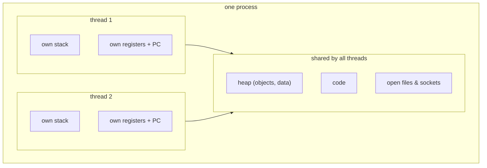

## In simple terms

A **thread** is one stream of instructions running through a program. A process has at least one thread (the main one), and it can spawn more so it can do several things at once — keep the UI responsive while a download runs, or process many web requests in parallel.

## The Visual Map

What threads share and what each owns:



The shared heap is both the superpower (cheap communication) and the danger (data races).

## More detail

Threads inside the same process share the process's memory, file handles, and other resources, but each has its own:

- **Stack** — a small private workspace for local variables and the call chain.
- **Program counter and registers** — what it is currently executing.

Because threads share memory, they can communicate cheaply, but they can also corrupt each other's data if they aren't careful. Coordinating threads is the job of **synchronisation primitives**: locks/mutexes, semaphores, condition variables, atomic operations, and channels.

Kinds of threads:

- **OS threads** — scheduled by the kernel. Heavy but truly parallel across CPU cores.
- **User threads / fibers / goroutines / async tasks** — multiplexed by a runtime onto a smaller pool of OS threads. Much cheaper to create, ideal for I/O-bound work.

Modern languages each have their own concurrency story: Java and C++ expose OS threads directly; Go has goroutines; Python is moving from the GIL toward real free-threading; JavaScript uses an event loop with a single thread plus workers.

Modern CPUs have many cores, and the only way to use them is concurrency — threads (or their lightweight cousins) are the primary mechanism. Even on a single core, threads let a program overlap CPU work with I/O latency.

## Under the Hood

Two threads, one shared counter, no lock — the textbook data race, made reliable enough to watch:

```python
import threading, time

counter = 0

def worker():
    global counter
    for _ in range(50_000):
        tmp = counter            # read ...
        time.sleep(0)            # ... invite a context switch ...
        counter = tmp + 1        # ... write back a stale value

threads = [threading.Thread(target=worker) for _ in range(2)]
for t in threads: t.start()
for t in threads: t.join()

print(f"expected 100000, got {counter}")   # almost always less
```

Each lost update is a moment where both threads read the same value, then both wrote back "that value + 1". A `threading.Lock()` around the read-modify-write makes the answer exactly 100000 — that is the entire story of synchronisation.

## Engineering Trade-offs

- **Threads vs processes.** Threads are cheap to create and share memory for free; processes give hard isolation. A thread that corrupts memory takes the whole process down — every thread in it.
- **OS threads vs green threads/async.** An OS thread costs a kernel object and megabytes of stack; you can run thousands. Goroutines and async tasks cost kilobytes; you can run millions — but they multiplex onto few OS threads, so one blocking call can stall many tasks, and debugging stacks gets harder.
- **More threads ≠ more speed.** Past the core count, CPU-bound threads just take turns, paying context-switch and cache-eviction costs for nothing. Thread pools sized to the hardware exist precisely to cap this.
- **Locking granularity.** One big lock is simple and serialises everything; fine-grained locks scale but invite deadlocks and subtle ordering bugs. Lock-free structures push further still, at a steep complexity cost.

## Real-world examples

- A web server uses one thread per request (Java) or one goroutine per request (Go).
- A video game uses separate threads for physics, rendering, and audio.
- A spreadsheet recalculates formulas on a background thread so typing stays smooth.
- Every native iOS or Android app starts on a main thread that owns the UI; everything that takes more than a few milliseconds has to happen on a background thread to avoid jank.

## Common misconceptions

- **"More threads means faster."** Past the number of CPU cores you have, more threads add overhead without more work being done in parallel.
- **"Threads are safe by default."** They are not. Two threads writing the same variable without synchronisation is a data race, and the result is undefined.

## Try it yourself

Run the race, then fix it and run again:

```bash
python3 -c "
import threading, time

counter = 0
lock = threading.Lock()
USE_LOCK = False        # flip to True and re-run

def worker():
    global counter
    for _ in range(50_000):
        if USE_LOCK:
            with lock:
                counter += 1
        else:
            tmp = counter; time.sleep(0); counter = tmp + 1

ts = [threading.Thread(target=worker) for _ in range(2)]
[t.start() for t in ts]; [t.join() for t in ts]
print('expected 100000, got', counter)
"
```

Without the lock the result is wrong *and different every run* — the signature of a race. With it, exactly 100000, every time.

## Learn next

- [Scheduler](/t/scheduler) — who decides which thread runs on which core.
- [Mutex](/t/mutex) — the primitive that made the counter correct.
- [Process](/t/process) — the isolation boundary threads live inside.
