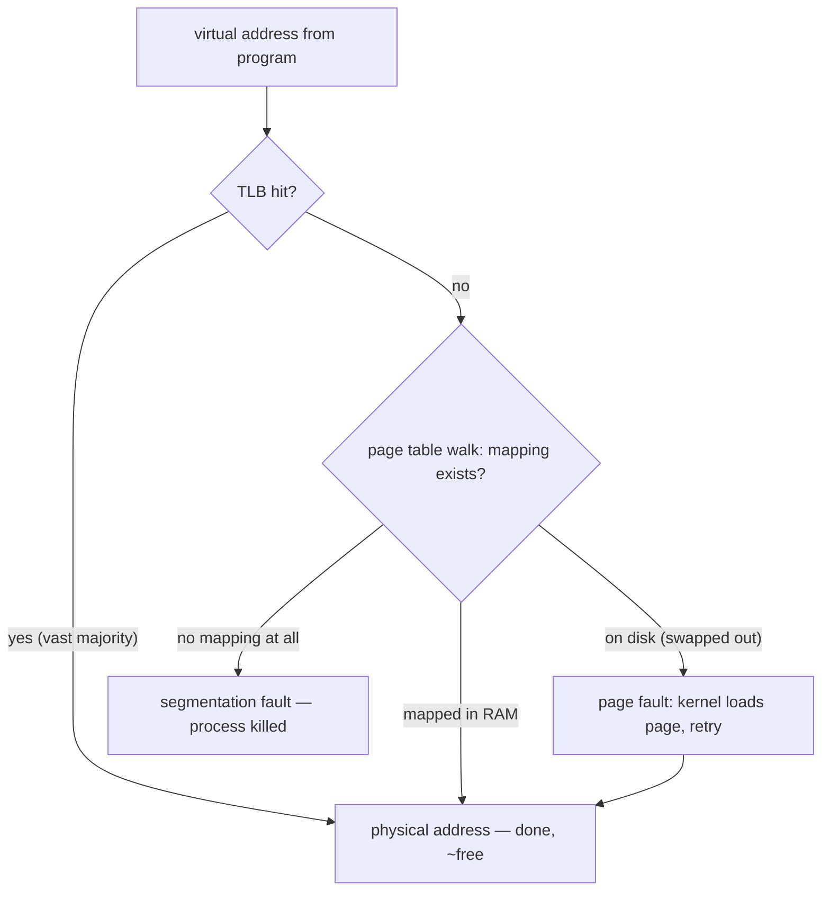

## In simple terms

Virtual memory is the trick that lets every program on your computer act as if it owns all of RAM. Each program sees a clean, private address space starting at zero; behind the scenes, the operating system and CPU translate those virtual addresses to scattered locations in real RAM, swap unused chunks to disk, and stop programs from peeking at each other's memory.

## The Visual Map

The journey of one memory access:



## More detail

The CPU and the OS together divide memory into fixed-size **pages**, typically 4 KB. A **page table** maps each virtual page to a physical frame in RAM (or marks it as "not in RAM right now").

When a program reads or writes an address:

1. The CPU looks up the virtual page in its **TLB** (translation lookaside buffer — a tiny cache of the page table).
2. On a TLB hit, the translation is essentially free.
3. On a miss, the CPU walks the page table to find the physical address; on a miss-miss, the OS handles a **page fault** and possibly loads the page from disk.

This buys several powerful features at once:

- **Isolation**: process A simply has no mapping for process B's memory, so it cannot read it.
- **Lazy loading**: programs only really occupy memory for the pages they touch.
- **Swapping / paging**: cold pages can be written out to disk to make room.
- **Shared memory**: two processes can map the same physical page for fast IPC.
- **Memory-mapped files**: a file becomes a region of memory the kernel pages in and out.

Modern systems also use **address-space layout randomisation (ASLR)** — placing each process's stack, heap, and libraries at random virtual addresses — as a security measure against exploits that depend on knowing where things live.

Without virtual memory, programs would clash over physical addresses, a single rogue write could corrupt the kernel, and computers would need as much RAM as the sum of their largest programs. It is the single most important abstraction in modern operating systems.

## Under the Hood

Lazy allocation, demonstrated: reserving address space costs nothing until pages are touched.

```python
import mmap

# "give me 1 GB" — the kernel just creates page-table entries, no RAM moves
region = mmap.mmap(-1, 1024 * 1024 * 1024)

# touch one byte every 4096 — each touch page-faults exactly one page in
for offset in range(0, 64 * 4096, 4096):
    region[offset] = 1            # first write to a page = one page fault

print("reserved 1 GB of address space, actually dirtied 64 pages = 256 KB")
region.close()
```

This is why a process's "virtual size" (VSZ) can be gigabytes while its "resident size" (RSS) is megabytes — address space is a promise, RAM is delivered page-by-page on first touch.

## Engineering Trade-offs

- **Translation overhead vs protection.** Every memory access goes through translation. The TLB makes the common case free, but TLB misses cost real cycles — which is why huge pages (2 MB instead of 4 KB) exist: fewer entries to cache, at the cost of coarser allocation and potential waste.
- **Swapping: more memory vs unpredictable latency.** Paging to disk lets the system survive memory pressure, but a page fault to disk is ~100,000× slower than a RAM access. Latency-critical services (databases, trading systems) lock their pages into RAM (`mlock`) or disable swap rather than risk it.
- **Overcommit vs guarantees.** Linux happily promises more memory than exists, betting processes won't touch it all — enabling cheap fork and sparse allocations, but punishable by the OOM killer choosing a victim under pressure. Strict accounting (Windows-style) refuses allocations earlier but never has to kill.
- **4 KB pages: granularity vs overhead.** Small pages waste little memory per allocation but need millions of page-table entries for big processes; large pages cut bookkeeping but fragment. Modern kernels mix both (transparent huge pages) — and inherit both failure modes.

## Real-world examples

- Run `top` or Task Manager: the "Virtual" or "VSZ" column is how much address space each process has reserved; "Resident" is how much is actually in RAM.
- A `Segmentation fault` or `Access violation` is the CPU telling the OS that a process touched a virtual address with no valid mapping.
- The operating system can run an 8 GB program on a 4 GB machine by paging cold pages out to disk (slowly).
- A 64-bit process can `mmap` a multi-gigabyte database file and treat it as memory; the kernel pages it in on demand, never loading the whole thing.

## Common misconceptions

- **"Virtual memory means swapping to disk."** Swapping is one feature it enables; the bigger story is per-process isolation and mapping.
- **"Address `0x7fff…` is a real RAM address."** It is a virtual address; what lives at the corresponding physical address depends entirely on the kernel's mapping for that process at that moment.

## Try it yourself

See ASLR scramble the address space — the *same* variable in the *same* program lands somewhere new every run:

```bash
python3 -c "x = 42; print(hex(id(x)))"
python3 -c "x = 42; print(hex(id(x)))"
python3 -c "x = 42; print(hex(id(x)))"
```

Three runs, three different virtual addresses. On Linux, look at a process's full memory map with `cat /proc/self/maps | head -15` — every line (stack, heap, libraries) is one mapped region of virtual address space.

## Learn next

- [Paging](/t/paging) — the page-fault machinery in detail.
- [Kernel](/t/kernel) — the code that owns the page tables.
- [Memory hierarchy](/t/memory-hierarchy) — where the TLB and caches fit in the bigger picture.
