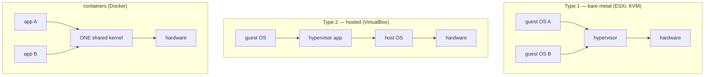

## In simple terms

A hypervisor is software that tricks an operating system into thinking it has dedicated hardware, while actually sharing that hardware with other operating systems. Each "guest" OS runs in its own isolated virtual machine (VM), with its own virtual CPU, virtual memory, and virtual devices. The hypervisor mediates all hardware access and maintains isolation between VMs — a bug in one VM's guest OS cannot affect another VM's memory. This is how AWS, Google Cloud, and Azure run thousands of customer VMs on the same physical server.

## The Visual Map

The three isolation stacks, side by side:



VMs virtualise the *hardware* (each guest brings its own kernel); containers virtualise the *OS* (everyone shares one kernel).

## More detail

**Type 1 (Bare-metal) hypervisor:** runs directly on hardware, without a host OS. Guest VMs run as processes of the hypervisor. Examples: VMware ESXi, Microsoft Hyper-V, Xen, KVM (Linux kernel itself becomes the hypervisor). Type 1 hypervisors are used in data centres for performance and isolation.

**Type 2 (Hosted) hypervisor:** runs on top of a host OS as a process. The host OS manages hardware; the hypervisor runs guest VMs inside it. Examples: VMware Workstation, VirtualBox, QEMU (without KVM). Higher overhead; used for development and testing on laptops.

**Hardware-assisted virtualisation:** modern CPUs (Intel VT-x, AMD-V) provide a "VMX root/non-root" mode. Guest code runs in non-root mode at near-native speed; privileged instructions (those that must be intercepted) cause a VM exit to the hypervisor. This makes virtualisation fast — most guest code runs at native CPU speed; only a few hundred events per second cause VM exits in a typical workload.

**Memory virtualisation:** the hypervisor must maintain the illusion that each VM has its own physical memory starting at address 0. Hardware Extended Page Tables (EPT on Intel, NPT on AMD) add a second layer of address translation (guest-physical → host-physical) handled in hardware — adding ~10% overhead vs. bare metal.

**I/O virtualisation:** disk and network I/O is intercepted by the hypervisor. Slow path: full device emulation (QEMU emulates an IDE disk). Fast path: **virtio** — a standardised paravirtualised device interface where the guest knows it's virtualised and uses an efficient ring buffer protocol directly to the hypervisor. virtio-blk and virtio-net are universal in Linux guests.

**KVM (Kernel-based Virtual Machine):** Linux kernel module turning Linux into a Type 1 hypervisor. Works with QEMU for device emulation. Used by Google, Amazon (EC2 Nitro), and most cloud providers. EC2 Nitro offloads virtio devices to dedicated hardware ASICs, achieving near-bare-metal I/O performance.

**Containers vs. VMs:** containers share the host kernel; VMs have isolated kernels. VMs provide stronger isolation (separate kernel, separate firmware attack surface) at higher overhead (hundreds of MB image, seconds to boot). Containers start in milliseconds and use ~10 MB. The answer is often both: containers run inside VMs (as on every public cloud).

**MicroVMs (Firecracker, gVisor):** AWS Firecracker is a KVM-based microVM with a minimal device model, booting in 125 ms, using under 5 MB memory overhead. Used for AWS Lambda — each function invocation gets a fresh microVM for security isolation.

Virtualisation is the foundation of cloud computing — it enables multi-tenancy, on-demand provisioning, VM migration (live migration for maintenance), and resource overprovisioning. Understanding it explains how cloud VMs work, why "noisy neighbours" exist, what Spectre/Meltdown meant for cloud providers (same physical CPU, different VMs), and how serverless functions achieve isolation.

## Under the Hood

Launching a full virtual machine is one (long) command — every flag is a piece of fake hardware:

```bash
qemu-system-x86_64 \
  -enable-kvm \                        # use VT-x/AMD-V: guest runs at native speed
  -cpu host -smp 2 \                   # 2 virtual CPUs that look like the host's
  -m 2048 \                            # 2 GB of guest-"physical" memory (EPT-mapped)
  -drive file=disk.qcow2,if=virtio \   # a file pretending to be a block device
  -netdev user,id=n0 -device virtio-net,netdev=n0 \   # paravirtual NIC
  -cdrom ubuntu.iso -boot d            # boot an installer like it's 2005
```

The guest kernel inside will probe "hardware", find virtio devices, and load drivers for them — never suspecting the disk is a `qcow2` file and the NIC is a ring buffer into QEMU. `-enable-kvm` is the line that matters: without it QEMU *interprets* every instruction; with it the CPU runs guest code directly and only traps the privileged ones.

## Engineering Trade-offs

- **VMs vs containers.** A VM carries its own kernel: strongest isolation boundary short of separate hardware, at hundreds of MB and seconds to boot. A container is just kernel namespaces around a process: milliseconds and megabytes, but a kernel exploit escapes *all* containers on the host. Clouds layer them — containers for density, inside VMs for tenant isolation. Firecracker microVMs deliberately split the difference.
- **Emulation vs paravirtualisation.** Emulating real hardware (an IDE disk) runs unmodified ancient guests but traps constantly; virtio requires the guest to *know* it's virtualised in exchange for near-native I/O. Modern guests all choose cooperation over illusion.
- **Overcommit vs guarantees.** Promising VMs more total vCPU/RAM than the host has raises utilisation (most guests idle) but creates noisy neighbours and ballooning under pressure. Cloud instance types are essentially priced positions on this dial — "burstable" vs "dedicated".
- **Live migration vs locality.** Moving a running VM between hosts enables zero-downtime maintenance, but requires shared/replicated storage and copies dirty memory pages across the network — workloads that dirty memory fast may never converge. Pinned-hardware features (GPU passthrough, SR-IOV) trade migration away entirely for performance.

## Real-world examples

- AWS EC2: each instance is a KVM VM on Nitro hypervisor; Nitro offloads networking and storage to dedicated hardware.
- Google Cloud VMware Engine and Azure VMware Solution run VMware ESXi on cloud hardware.
- AWS Lambda runs each function invocation in a Firecracker microVM (125 ms cold start, isolated kernel).
- Desktop virtualisation: macOS runs on Apple Silicon with Rosetta 2 via hardware virtualisation; VMware Fusion and Parallels run Windows in a Type 2 hypervisor.

## Common misconceptions

- **"VMs are always slow."** Hardware virtualisation (VT-x + EPT) adds ~2–10% overhead for CPU-intensive workloads. I/O-intensive workloads with full device emulation can be much slower, but virtio and hardware offload (Nitro, SR-IOV) bring it close to bare metal.
- **"Containers replaced VMs."** Containers complement VMs. Most container workloads run inside VMs on cloud platforms for the security isolation that containers alone don't provide.

## Try it yourself

Check whether you're *inside* a VM right now, and whether your machine can host one (Linux):

```bash
systemd-detect-virt                   # 'kvm', 'vmware', 'wsl'... or 'none'
grep -c -E 'vmx|svm' /proc/cpuinfo    # >0 = CPU supports hardware virtualisation
ls -l /dev/kvm                        # exists = the KVM hypervisor door is open
```

On WSL the first command prints `wsl` — you've been running this whole Atlas inside a VM. With QEMU installed (`# requires: qemu-system-x86`), the Under-the-Hood command boots a real guest from any ISO.

## Learn next

- [Container](/t/container) — the lighter-weight isolation primitive VMs are compared against.
- [Virtual memory](/t/virtual-memory) — the same translation trick, one level down.
- [Cloud provider](/t/cloud-provider) — the business built on top of hypervisors.
