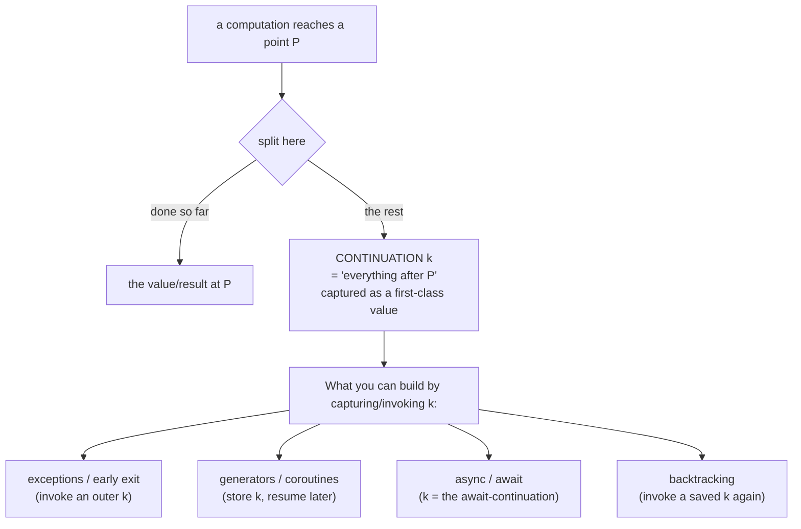

## In simple terms

When a function is called, the "continuation" is everything that will happen after it returns — the rest of the program. Normally this is implicit, managed by the call stack. Continuations make it explicit and first-class: you can capture it, store it, and invoke it later. This gives programs the ability to "save their place" mid-execution and jump back to it. Generators, coroutines, exceptions, backtracking, and async/await are all implementable using continuations — they are the most general control-flow primitive.

## The Visual Map



## More detail

**Continuation-passing style (CPS):** a transformation where every function takes an extra argument — the continuation `k` — and, instead of returning a value, calls `k` with the result.

```javascript
// Direct style
function add(a, b) { return a + b; }

// CPS
function addCPS(a, b, k) { k(a + b); }
addCPS(1, 2, result => console.log(result)); // 3
```

CPS makes control flow explicit — there is no implicit "return to caller"; every transition is a function call. Compilers (Scheme-to-C, SML/NJ) use CPS as an intermediate representation because it makes inlining and tail-call elimination obvious.

**call/cc (call-with-current-continuation):** Scheme's primitive for capturing the current continuation as a first-class value. `(call/cc (lambda (k) ...))` hands the body a reference `k` to "the rest of the computation after this call/cc"; invoking `k` with a value jumps back out and resumes there. With it you can build **early exit/exceptions** (call `k` to escape), **backtracking** (store `k`, re-invoke after a failed search), **coroutines** (switch by invoking stored continuations), and more.

**Delimited continuations:** `call/cc` captures the *entire* remaining computation up to the top level. Delimited continuations (`shift`/`reset`) capture only up to a delimiter — more composable and efficient. **Algebraic effects** (Koka, OCaml 5, Unison) are built on them.

**Tail-call optimisation (TCO):** a call in tail position invokes `k` without adding a stack frame — a jump, not a push. CPS + TCO means the call stack is never used (continuations are heap-allocated), enabling unbounded recursion without stack overflow. Scheme requires proper tail calls; few JavaScript engines fully implement the ES6 TCO spec.

In modern languages: Scheme has full `call/cc`; Ruby has `Fiber` (delimited); Python generators (`yield`) and `asyncio` coroutines are limited continuations; Go's goroutines are stackful coroutines with a similar effect; OCaml 5 exposes typed algebraic effects.

## Under the Hood

CPS in action: a factorial rewritten so it never "returns" — it threads a continuation `k` (the rest of the computation) through every step and finally hands it the answer:

```python
#!/usr/bin/env python3
"""Continuation-passing style: the result flows into k, not back to a caller."""

# Direct style: returns up the call stack
def fact(n):
    return 1 if n == 0 else n * fact(n - 1)

# CPS: each step builds a bigger continuation describing 'what to do next'
def fact_cps(n, k):
    if n == 0:
        return k(1)                          # base case: feed 1 into the continuation
    return fact_cps(n - 1, lambda r: k(n * r))  # 'after the recursive call, multiply by n'

print("direct:", fact(5))                    # 120
print("cps   :", fact_cps(5, lambda x: x))   # 120, identity continuation
# The continuation is just a value — swap it to redirect the whole result:
fact_cps(5, lambda x: print("cps via k:", x))  # the continuation does the printing
```

There is no `return` to a caller in CPS: control always moves *forward* into the next continuation. That uniformity is exactly why compilers like CPS — and why async/await desugars into it.

## Engineering Trade-offs

**Generality vs. comprehensibility**
Full continuations (`call/cc`) are the most powerful control primitive there is — every other control construct is a special case. But unrestricted, multi-shot continuations are notoriously hard to reason about (a function can "return" more than once), so most languages expose only *tamed* forms — generators, async/await, fibers — that cover the common cases legibly while forbidding the confusing ones.

**Full vs. delimited continuations**
`call/cc` capturing the entire rest of the program is conceptually clean but expensive and non-composable: you can't easily combine two such captures. Delimited continuations (`shift`/`reset`) capture only up to a marker, which is more efficient and composes — the reason modern effect systems chose them over `call/cc`.

**Explicit CPS vs. stack-based execution**
CPS makes every control transfer explicit, enabling tail-call elimination and unbounded recursion without stack overflow — continuations live on the heap, not the call stack. The cost is heap allocation and indirection on each step, and code (or compiler IR) that's far less readable than direct style. It's a great *compiler* representation and a poor *source* style.

**Language-level support vs. manual encoding**
When continuations are built in (Scheme's `call/cc`, OCaml effects, Kotlin `suspend`), coroutines and async are clean and efficient. Without them you hand-roll the CPS transform — the classic "callback hell" — or rely on a transpiler (Babel) to turn `async`/`await` into a state machine. The same capability, but legibility and tooling differ enormously.

## Real-world examples

- **Babel's** async-to-generator transform converts `async`/`await` functions into state machines that are exactly a CPS transformation.
- **Kotlin coroutines** compile each `suspend` point into a continuation object that can be resumed later — CPS done by the compiler.
- **React Fiber's** reconciler keeps an explicit continuation (its work loop) so it can pause rendering and resume it, enabling cooperative, interruptible UI updates.
- **Prolog's** backtracking is implemented with continuations: each choice point stores the continuation to retry on failure.

## Common misconceptions

- **"Continuations are only for functional programming."** They underlie async/await in JavaScript, coroutines in Python, fibers in Ruby, and goroutines in Go — across every paradigm.
- **"Continuations and callbacks are the same."** A callback is a function called once. A continuation is "the rest of the computation" — it can be invoked multiple times (backtracking) or stored and resumed later (coroutines).
- **"Generators are unrelated to continuations."** A generator's `yield` *is* a (delimited) continuation: it captures where to resume, then hands control back when you call it again.

## Try it yourself

Python generators are a practical, limited continuation — `yield` saves the place and `next()` resumes it. With nothing but generators you can build a cooperative scheduler that interleaves two "tasks", each resumed from exactly where it paused:

```bash
python3 - << 'EOF'
def worker(name, n):
    for i in range(n):
        print(f"  {name}: step {i}")
        yield                       # SUSPEND: capture the continuation, hand control back
    print(f"  {name}: done")

# Round-robin scheduler: resume each coroutine's continuation in turn.
tasks = [worker("A", 3), worker("B", 2)]
print("cooperative scheduling:")
while tasks:
    t = tasks.pop(0)
    try:
        next(t)                     # RESUME to the next yield
        tasks.append(t)             # not finished -> re-queue
    except StopIteration:
        pass                        # finished
EOF
```

The output interleaves A and B (`A:0, B:0, A:1, B:1, ...`) because each `next()` resumes a stored continuation at its `yield`. No threads, no OS scheduler — just continuations captured and invoked. This is precisely how async event loops and green-thread runtimes work under the hood.

## Learn next

- [Lambda calculus](/t/lambda-calculus) — the formal setting where CPS and the continuation concept are defined and studied.
- [Closure](/t/closure) — the building block: a continuation is represented as a closure capturing where (and with what state) to resume.
- [Formal verification](/t/formal-verification) — continuation semantics (operational/denotational) is core programming-language theory and underpins reasoning about control flow.
