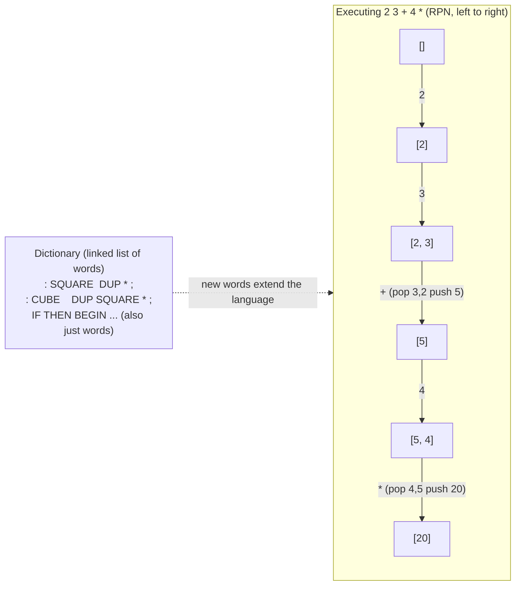

## In simple terms

Forth is a language where you build programs by defining "words" (functions) that push and pop values from a stack, then compose them. `2 3 + .` pushes 2, then 3, adds them (leaving 5), then prints. That's it — a stack, words, and composition. Forth is tiny: a complete Forth system fits in a few KB. It was used on early spacecraft and embedded systems, and influenced the design of PostScript, the JVM, and WebAssembly. It strips programming to its essence.

## The Visual Map



## More detail

**Execution model:** Forth uses a push-down **data stack** to pass values between words. Expressions are written in Reverse Polish Notation (RPN): `2 3 +` rather than `2 + 3`. Words (Forth's term for functions) take inputs from the stack and push outputs.

```forth
: SQUARE ( n -- n^2 )
  DUP * ;

: CUBE ( n -- n^3 )
  DUP SQUARE * ;

5 CUBE . \ prints 125
```

The stack-effect comment `( n -- n^2 )` documents what a word consumes and produces.

**The dictionary:** every Forth word lives in a dictionary — a linked list of definitions. Looking up a word walks the dictionary; new words are defined with `: name ... ;`. The compiler and interpreter share this one dictionary, so *defining a word extends the language itself*.

**Two stacks:** a data stack (operands) and a return stack (call return addresses); the return stack can double as scratch storage via `>R` and `R>`.

**Immediate words and the metacircular compiler:** some words are marked "immediate" — they run at *compile* time. This lets Forth define its own control flow (`IF`, `THEN`, `BEGIN`, `WHILE`) as ordinary words rather than built-in syntax. Forth is effectively self-hosting: most of it is written in itself. Chuck Moore's original implementations were ~1 KB; a full modern Gforth is ~1 MB, and Forth systems have bootstrapped on bare hardware with no OS, the programmer defining I/O, drivers, and the compiler all in Forth. The 1994 ANS standard pinned down a portable core vocabulary.

**Forth's influence** runs deep: **PostScript** (stack-based, RPN page description), the **JVM** and **WebAssembly** (stack machines at the bytecode level), **RPL** (HP calculators), and **Open Firmware** (the Forth-based boot firmware of SPARC, PowerPC, and early Macs).

## Under the Hood

A complete (if tiny) Forth interpreter in Python — a data stack, a dictionary of words, built-in primitives, and the `: name ... ;` mechanism for defining new words. This *is* how Forth works: numbers push, words execute, and user definitions are just token lists run recursively:

```python
#!/usr/bin/env python3
"""A minimal Forth: data stack + dictionary + colon definitions."""

BUILTINS = {
    "+":   lambda s: s.append(s.pop() + s.pop()),
    "*":   lambda s: s.append(s.pop() * s.pop()),
    "-":   lambda s: s.append(-s.pop() + s.pop()),   # a - b, order-careful
    "DUP": lambda s: s.append(s[-1]),                # duplicate top of stack
    ".":   lambda s: print(s.pop(), end=" "),        # pop and print
}

def run(tokens, words, stack):
    i = 0
    while i < len(tokens):
        t = tokens[i]
        if t == ":":                                  # define a new word
            name, body = tokens[i + 1], []
            i += 2
            while tokens[i] != ";":
                body.append(tokens[i]); i += 1
            words[name] = body                        # store its token list
        elif t.lstrip("-").isdigit():
            stack.append(int(t))                      # a number: push it
        elif t in BUILTINS:
            BUILTINS[t](stack)                        # a primitive: run it
        elif t in words:
            run(words[t], words, stack)               # a user word: run its body
        else:
            raise ValueError(f"unknown word: {t}")
        i += 1

words, stack = {}, []
program = ": SQUARE DUP * ; : CUBE DUP SQUARE * ; 5 CUBE . 2 3 + .".split()
run(program, words, stack)                            # prints: 125 5
print("\ndefined words:", list(words))                # ['SQUARE', 'CUBE']
```

`CUBE` is defined in terms of `SQUARE`, which is defined in terms of the primitive `*` — composition all the way down, with the dictionary growing as the program runs. That self-extension is the whole of Forth.

## Engineering Trade-offs

**Minimalism vs. ergonomics**
Forth's entire model — a stack, words, a dictionary — fits in a few KB and is trivially self-hosting, which is unmatched for tiny embedded targets and bare-metal bring-up. The cost is human ergonomics: RPN and implicit stack state mean there are no named local variables by default, deep stack juggling (`SWAP`, `ROT`, `>R`) gets hard to read, and large programs demand discipline most teams won't sustain.

**Extreme extensibility vs. no fixed language**
Because control flow and even the compiler are just words you can redefine, Forth is the ultimate malleable language — you reshape it to the problem. That same power means every Forth codebase is effectively its own dialect, with little portability of *idiom* between shops; there is no stable "the language" to learn once.

**Implicit stack vs. explicit safety**
Passing arguments on a shared stack is fast and allocation-free, but the stack is untyped and unchecked: a word that consumes the wrong number of items corrupts everything downstream, and the only documentation is the stack-effect comment, which the machine doesn't verify. Speed and simplicity are bought with fragility.

**Direct hardware control vs. modern abstractions**
Forth gives you the machine with essentially no runtime between you and it — ideal where every byte and cycle counts. But you forgo the conveniences modern languages assume (a type system, garbage collection, rich libraries, package ecosystems), which is why Forth thrives in niches and rarely beyond them.

## Real-world examples

- **Open Firmware** (Sun SPARC, IBM PowerPC, early Apple Macs) is implemented in Forth — the boot/firmware layer of a vast number of machines.
- **PostScript** (laser printers, the basis of PDF) is a stack-based, RPN language directly descended from Forth ideas.
- **HP-48 calculators** use RPL, a Forth/Lisp-influenced stack language, for user programming.
- **Spacecraft and instruments** — Forth flew on multiple NASA and ESA missions where a tiny, interactive, reliable system mattered more than a rich ecosystem.

## Common misconceptions

- **"RPN is backward."** RPN is exactly how stack machines (JVM, WASM) execute and how RPN calculators work — no parentheses, no precedence rules; it's *different*, not worse.
- **"Forth is obsolete."** Its stack-machine design is alive in WebAssembly and JVM bytecode; the pattern is everywhere, even if the language is niche.
- **"Forth has built-in `IF`/loops like other languages."** It doesn't — those are *immediate words* defined in Forth itself, which is precisely what makes the language self-extending.

## Try it yourself

Evaluate Reverse Polish expressions the way Forth (and the JVM and WebAssembly) does — one left-to-right pass over a single stack, no precedence rules needed:

```bash
python3 - << 'EOF'
def rpn(expr):
    stack = []
    for tok in expr.split():
        if tok in "+-*/":
            b, a = stack.pop(), stack.pop()       # operands come off the stack
            stack.append({"+": a+b, "-": a-b, "*": a*b, "/": a//b}[tok])
        else:
            stack.append(int(tok))                # a number: push it
    return stack

for e in ["2 3 +", "2 3 + 4 *", "5 1 2 + 4 * + 3 -"]:
    print(f"{e:18} -> {rpn(e)}")
EOF
```

`5 1 2 + 4 * + 3 -` evaluates to `14`: `(1 2 +)`→3, `(3 4 *)`→12, `(5 12 +)`→17, `(17 3 -)`→14 — and notice there are no parentheses in the actual input. The stack ordering *is* the grouping. Add your own expressions to feel why stack machines need no operator-precedence parser at all.

## Learn next

- [WebAssembly](/t/webassembly) — a modern stack machine whose instruction set executes by pushing and popping operands, exactly the Forth model at the binary level.
- [Lisp](/t/lisp) — the other minimal, self-extending language of the era, reaching the same metaprogramming power through trees (s-expressions) instead of a stack.
- [Pointer and reference](/t/pointer-and-reference) — Forth manipulates memory and addresses directly, much like C pointers, contrasting the stack model with explicit addressing.
