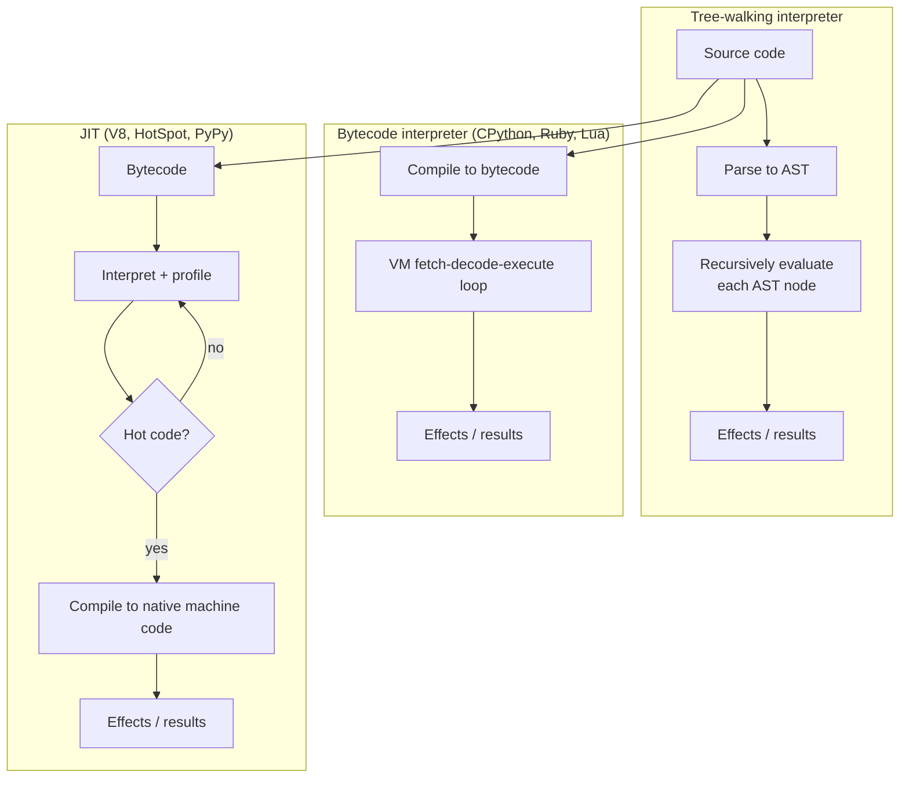

## In simple terms

An **interpreter** runs your code by walking through it and doing what it says, statement by statement. There is no separate "build" step that produces a binary; the interpreter itself is the program, and your source is its input. It is the dual of a [compiler](/t/compiler), which translates the whole program once and then steps out of the way.

## The Visual Map



## More detail

There are several flavours, increasing in sophistication and speed:

- **Tree-walking** — parse to an AST and recursively evaluate it. Simple to write, but slow because every operation re-traverses node objects. Many teaching interpreters (and config-language evaluators) work this way.
- **Bytecode** — compile the source to a compact intermediate instruction set that a **virtual machine** executes in a tight fetch-decode-execute loop. CPython, Ruby's YARV, and the Lua VM are bytecode interpreters.
- **JIT (just-in-time)** — start by interpreting bytecode while profiling, then compile the *hot* (frequently executed) parts to native machine code at run time. V8 (JavaScript), HotSpot (JVM), LuaJIT, and PyPy do this.

Many modern systems blur the line between compiler and interpreter. The Java toolchain compiles `.java` to `.class` bytecode *ahead of time*, then the JVM interprets and JIT-compiles it *at run time*. V8 parses JS to bytecode, interprets, profiles, and JITs hot functions. The boundary between "compiler" and "interpreter" is really just *where in the pipeline you stop translating and start executing*.

The interpreter also typically owns the runtime services the program depends on: the [garbage collector](/t/garbage-collection), the standard library, dynamic dispatch, and rich error reporting with full source context.

## Under the Hood

A complete **tree-walking interpreter** in Python for a tiny expression language with variables. Unlike a [compiler](/t/compiler), it never emits code — it parses to an AST and *evaluates the tree directly*, carrying an environment of variable bindings:

```python
#!/usr/bin/env python3
"""Tree-walking interpreter: parse to AST, then evaluate recursively."""
import re

# --- Lexer ---
def lex(line):
    return re.findall(r"[A-Za-z_]\w*|\d+|[-+*/()=]", line)

# --- Parser -> nested tuples (the AST) ---
class Parser:
    def __init__(self, toks): self.toks = toks; self.i = 0
    def peek(self): return self.toks[self.i] if self.i < len(self.toks) else None
    def eat(self):  t = self.peek(); self.i += 1; return t

    def statement(self):
        # name '=' expr  | expr
        if (self.i + 1 < len(self.toks)) and self.toks[self.i + 1] == "=":
            name = self.eat(); self.eat()           # consume name, '='
            return ("assign", name, self.expr())
        return self.expr()

    def expr(self):
        node = self.term()
        while self.peek() in ("+", "-"):
            op = self.eat(); node = (op, node, self.term())
        return node
    def term(self):
        node = self.factor()
        while self.peek() in ("*", "/"):
            op = self.eat(); node = (op, node, self.factor())
        return node
    def factor(self):
        t = self.eat()
        if t == "(":
            node = self.expr(); self.eat(); return node       # consume ')'
        return ("num", int(t)) if t.isdigit() else ("var", t)

# --- Evaluator: walk the AST against an environment ---
def evaluate(node, env):
    kind = node[0]
    if kind == "num":    return node[1]
    if kind == "var":    return env[node[1]]
    if kind == "assign":
        env[node[1]] = evaluate(node[2], env); return env[node[1]]
    a, b = evaluate(node[1], env), evaluate(node[2], env)
    return {"+": a+b, "-": a-b, "*": a*b, "/": a//b}[kind]

env = {}
for line in ["x = 6", "y = 7", "x * y + 1"]:
    result = evaluate(Parser(lex(line)).statement(), env)
    print(f"{line:12} => {result}   env={env}")
```

There is no separate binary: parsing and execution happen in the same run, and state (`env`) persists between lines — exactly how a REPL works.

## Engineering Trade-offs

**Startup latency vs. peak throughput**
Interpreters start almost instantly — no build step, no link — which is why REPLs, shell scripts, and serverless cold starts favour them. But a tree-walker re-interprets structure on every operation, and even a bytecode VM has dispatch overhead per instruction, so steady-state throughput trails AOT-compiled native code. JITs close this gap on long-running programs at the cost of warm-up time.

**Flexibility vs. speed**
Interpreting at run time enables `eval`, hot code reload, monkey-patching, and reflection — the dynamism that makes Python, Ruby, and JavaScript productive. That same late binding defeats many ahead-of-time optimisations: the interpreter can't assume a name's type or that a function won't be redefined, so it must check at run time.

**Portability vs. dependency**
The same source runs anywhere the interpreter is installed — write once, run on any platform with the runtime. The flip side: shipping a program means shipping (or assuming) the runtime (CPython, the JVM, Node). A compiled binary is self-contained; an interpreted program needs its interpreter present.

**Memory and error quality**
Carrying source/AST/bytecode plus a runtime in memory costs more than a lean native binary, but buys vastly better diagnostics — interpreters can report errors with full source context, line numbers, and live stack inspection, which is why they dominate the development inner loop.

## Real-world examples

- **CPython** compiles `.py` to bytecode then interprets it in a bytecode VM — so Python is *both* compiled and interpreted.
- **Node.js** runs JavaScript on the V8 engine, which interprets bytecode and JIT-compiles hot functions to native code.
- **The JVM** interprets and JIT-compiles `.class` bytecode for Java, Kotlin, Scala, and Clojure — one runtime, many languages.
- **bash** interprets shell scripts line by line, which is why a syntax error halfway down a script can run the first half before failing.
- **Excel** is effectively an interpreter: each cell's formula is parsed and re-evaluated whenever its inputs change, with clever incremental recomputation.

## Common misconceptions

- **"Interpreted languages are always slow."** Modern JITs (V8, HotSpot, LuaJIT, PyPy) can rival or beat naïvely compiled code, especially on dynamic patterns — the interpreter/compiler distinction is about *when* translation happens, not absolute speed.
- **"Python is purely interpreted."** CPython compiles to bytecode first (you can even see the `.pyc` files), then interprets that bytecode. "Pure" tree-walking interpreters are rare in production.
- **"There's a clean line between compilers and interpreters."** Almost every fast runtime is a hybrid: it compiles to some intermediate form and interprets/JITs that. The terms describe a *pipeline stage*, not mutually exclusive categories.

## Try it yourself

Run a working REPL for the tiny language above — type expressions and assignments, and state persists between lines just like `python3` with no arguments:

```bash
python3 - << 'EOF'
import re
def lex(s): return re.findall(r"[A-Za-z_]\w*|\d+|[-+*/()=]", s)
class P:
    def __init__(self,t): self.t=t; self.i=0
    def pk(self): return self.t[self.i] if self.i<len(self.t) else None
    def eat(self): x=self.pk(); self.i+=1; return x
    def stmt(self):
        if self.i+1<len(self.t) and self.t[self.i+1]=="=":
            n=self.eat(); self.eat(); return ("=",n,self.expr())
        return self.expr()
    def expr(self):
        n=self.term()
        while self.pk() in ("+","-"): o=self.eat(); n=(o,n,self.term())
        return n
    def term(self):
        n=self.fac()
        while self.pk() in ("*","/"): o=self.eat(); n=(o,n,self.fac())
        return n
    def fac(self):
        t=self.eat()
        if t=="(": n=self.expr(); self.eat(); return n
        return ("#",int(t)) if t.isdigit() else ("$",t)
def ev(n,env):
    k=n[0]
    if k=="#": return n[1]
    if k=="$": return env[n[1]]
    if k=="=": env[n[1]]=ev(n[2],env); return env[n[1]]
    a,b=ev(n[1],env),ev(n[2],env)
    return {"+":a+b,"-":a-b,"*":a*b,"/":a//b}[k]

env={}
program = ["price = 20", "qty = 3", "total = price * qty", "total + 5"]
for line in program:
    print(f">>> {line}")
    print("   ", ev(P(lex(line)).stmt(), env))
print("final environment:", env)
EOF
```

Swap in your own lines (e.g. `a = 2`, `a * a * a`) to see the interpreter evaluate them on the spot, with variables remembered across statements.

## Learn next

- [Compiler](/t/compiler) — the dual approach: translate the whole program ahead of time instead of executing source directly. Most real runtimes combine both.
- [Type system](/t/type-system) — the rules an interpreter enforces (often at run time, for dynamic languages) that determine what operations are legal.
- [Garbage collection](/t/garbage-collection) — the memory-management service the interpreter's runtime provides so interpreted programs don't manage memory by hand.
