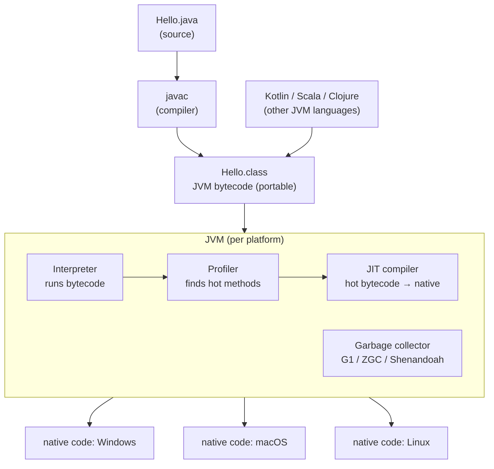

## In simple terms

**Java** is built around two big ideas: nearly everything is an object, and your code runs on a virtual machine instead of directly on the hardware. You compile Java *once* into **bytecode**, and that same bytecode runs unchanged anywhere a Java Virtual Machine (JVM) exists — Windows, macOS, Linux, a phone, a mainframe. That "write once, run anywhere" promise, plus industrial-strength tooling and decades of libraries, made Java the backbone of enterprise software and the original language of Android.

## The Visual Map



## More detail

Java was created at Sun Microsystems by James Gosling and released in 1995. Its defining properties:

- **Statically typed and class-based object-oriented** — types are checked at compile time, and code is organised into classes.
- **Compiled to JVM bytecode** by `javac`, not to native machine code. The JVM interprets that bytecode and **JIT-compiles** hot paths to native code at run time, so long-running Java approaches C++ speed.
- **Garbage collected** — a generational collector (G1 by default; ZGC and Shenandoah for very low pause times) frees memory automatically.
- **Verbose but predictable**, with an enormous ecosystem: Spring, Hibernate, and the Maven/Gradle build tools.

The real star is the **JVM** — one of the most heavily optimised managed runtimes ever built, and a *shared platform*: Kotlin, Scala, Clojure, and Groovy all compile to the same bytecode and run on it. Modern Java (records, sealed classes, pattern matching, and virtual threads in Java 21+) is far more concise than the ceremony-heavy Java of 2005, while keeping near-total backward compatibility — a 1998 `.class` file still runs on a 2026 JVM.

## Under the Hood

A small Java program showing generics, autoboxing, and the infamous `==` vs `.equals()` distinction. Because the JVM caches small `Integer` objects (−128..127), reference equality (`==`) gives a *surprising* answer that value equality (`.equals()`) does not:

```java
import java.util.List;

public class Demo {
    // Generic method: works for any Comparable type T (type-checked at compile time)
    static <T extends Comparable<T>> T max(List<T> xs) {
        T best = xs.get(0);
        for (T x : xs)
            if (x.compareTo(best) > 0) best = x;
        return best;
    }

    public static void main(String[] args) {
        System.out.println("max = " + max(List.of(3, 9, 2, 7)));   // 9

        // Autoboxing: int 100 becomes an Integer object.
        Integer a = 100, b = 100;     // cached (-128..127): SAME object
        Integer c = 200, d = 200;     // outside cache: DIFFERENT objects
        System.out.println("100 == 100 : " + (a == b));        // true  (cache)
        System.out.println("200 == 200 : " + (c == d));        // false (!)
        System.out.println("200 .equals : " + c.equals(d));    // true  (value)
    }
}
```

Compile and run with `javac Demo.java && java Demo`. The `200 == 200` printing `false` is the classic Java gotcha: `==` on objects compares *references*, not values — always use `.equals()` for object content.

## Engineering Trade-offs

**Portability vs. startup cost**
The "compile once, run anywhere" bytecode model is genuinely powerful — the same artifact ships everywhere — but the JVM must start, load classes, and warm up its JIT before reaching full speed. That heavyweight startup and high baseline memory use is why Java traditionally lost to Go for short-lived CLIs and serverless functions (though GraalVM native images now mitigate this).

**JIT (peak throughput) vs. AOT (predictable latency)**
The JIT can out-optimise an ahead-of-time compiler because it sees real run-time behaviour (actual types, hot branches) and re-compiles accordingly — great for long-running servers. The cost is warm-up: the first thousand calls are slow, and performance is less predictable than a statically compiled binary.

**Managed safety vs. control**
Garbage collection and the absence of raw pointers eliminate whole bug classes and make Java productive and safe at scale. The trade-off is less control over memory layout and timing, GC pause tuning as a discipline of its own, and higher memory overhead than C/C++/Rust.

**Stability vs. velocity**
Java's near-fanatical backward compatibility means decades-old code and libraries still run — invaluable for banks and enterprises. The flip side is that the language evolved slowly and accreted verbosity; only recently (records, `var`, virtual threads) has it shed much of the ceremony that gave it a reputation for boilerplate.

## Real-world examples

- Much of **Netflix's** backend runs as JVM microservices, with a large open-source toolkit (Hystrix, Zuul) born there.
- Core data infrastructure — **Apache Kafka, Elasticsearch, Hadoop, Cassandra** — is written in Java.
- **Android** apps were historically written in Java (now mostly Kotlin, which also targets JVM/Dalvik bytecode).
- **Minecraft: Java Edition** is, famously, Java — and its modding ecosystem exists precisely because the JVM bytecode is so easy to inspect and extend.
- High-frequency trading and banking systems lean on the JVM for its mature profilers, observability, and tunable low-pause collectors.

## Common misconceptions

- **"Java and JavaScript are related."** Only by a 1990s marketing decision — they're entirely different languages with different designers, runtimes, type systems, and uses.
- **"Java is slow."** Startup is heavyweight and memory use is high, but the JIT makes steady-state server Java competitive with C++ on many workloads.
- **"`==` compares values."** For objects, `==` compares *references* (identity); `.equals()` compares contents. The `Integer` cache makes this trap especially sneaky for small numbers.

## Try it yourself

You can't run the Java above without a JDK, but Python interns small integers exactly like the JVM caches small `Integer` objects — so the same identity-vs-value surprise is reproducible with stock `python3`:

```bash
python3 - << 'EOF'
# Python caches small ints (-5..256); Java caches Integer (-128..127).
# Different boundary, same trap:
#   'is' = reference identity  (Java '==')
#   '==' = value equality      (Java '.equals()')
for x in (100, 256, 257, 1000):
    a = int(str(x)); b = int(str(x))   # force fresh objects, defeat literal folding
    print(f"{x:>4}:  a is b -> {a is b!s:<5}   a == b -> {a == b}")
EOF
```

Values up to 256 report `a is b -> True` (cached, shared object); 257 and above report `False` — while `a == b` is always `True`. Python's cache boundary (256) differs from Java's `Integer` cache (127), but the lesson is identical: compare *values* with `.equals()`/`==`, never object *identity* with `==`/`is`.

## Learn next

- [Type system](/t/type-system) — Java's compile-time static checking (and generics) is a textbook nominal, static type system; the rules `javac` enforces before producing bytecode.
- [Garbage collection](/t/garbage-collection) — the JVM's automatic memory model, with some of the most advanced production collectors (G1, ZGC) ever shipped.
- [Compiler](/t/compiler) — `javac` plus the JVM's JIT is a two-stage compiler toolchain (source → bytecode → native) in action.
