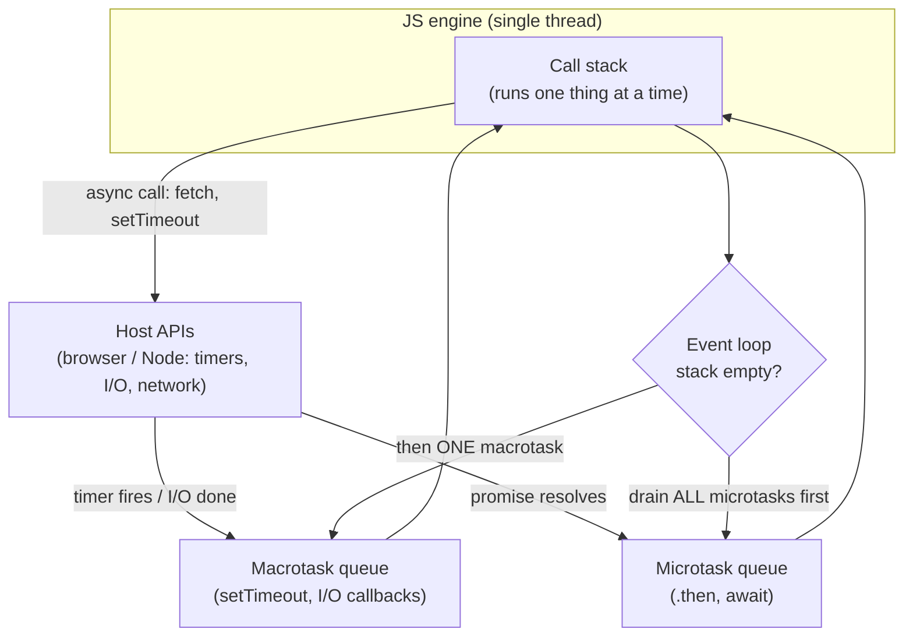

## In simple terms

**JavaScript** is the programming language of the web. Every web browser ships a JavaScript engine; every modern website runs JavaScript in your tab. Outside the browser it's also the runtime for backend platforms (Node.js, Deno, Bun), serverless edge platforms (Cloudflare Workers, Vercel Functions), and a huge slice of build tooling. Despite a famously messy history, it's now one of the fastest dynamically-typed languages in production use.

## The Visual Map



## More detail

JavaScript was created by Brendan Eich at Netscape in 1995 in (legend has it) ten days. The language has since gone through:

- **ES5** (2009) — strict mode, JSON, basic array methods.
- **ES2015 / ES6** — `let`/`const`, classes, modules, arrow functions, promises, template literals. The watershed modernisation.
- **ES2017+** — `async`/`await`, optional chaining, nullish coalescing, BigInt, top-level await, and a steady stream of yearly additions.

Core characteristics:

- **Dynamically typed**, single-threaded with an **event loop** for concurrency (no shared-memory threads by default).
- **First-class functions and closures** — functions are values you can pass, return, and capture state in.
- **Prototype-based OO** — `class` is syntactic sugar over prototype chains.
- **`null` and `undefined`** — two distinct flavours of "absent", a common pitfall.
- **Type coercion** — `"5" + 3 === "53"` is the famous example; modern code uses `===` and explicit `Number(...)` to avoid surprises.

Engines and runtimes are all aggressive JITs that compile hot functions to machine code: **V8** (Chrome, Edge, Node.js, Deno), **JavaScriptCore** (Safari, Bun), **SpiderMonkey** (Firefox). The 2026 ecosystem is enormous — bundlers (Vite, esbuild, Bun), package managers (npm, pnpm, yarn), frameworks (React, Vue, Svelte, Solid, Astro), and tooling (Vitest, Playwright, Prettier, ESLint, Biome). **TypeScript**, a superset that adds static types and compiles to JavaScript, backs most new projects.

## Under the Hood

Two things define how JavaScript actually behaves: **closures** (functions capturing their surrounding state) and the **event loop** (why async code runs in a non-obvious order). This runs on Node or any browser console:

```javascript
// CLOSURES: each counter captures its own private 'count'
function makeCounter() {
  let count = 0;                 // not global; captured by the returned fn
  return () => ++count;
}
const a = makeCounter(), b = makeCounter();
console.log("closures:", a(), a(), a(), b());   // 1 2 3 1  (independent state)

// EVENT LOOP: synchronous code, THEN microtasks (promises), THEN macrotasks (timers)
console.log("1: sync start");
setTimeout(() => console.log("4: setTimeout (macrotask)"), 0);
Promise.resolve().then(() => console.log("3: promise (microtask)"));
console.log("2: sync end");
// Prints 1, 2, 3, 4 — the microtask queue fully drains before any timer fires,
// even though the timer was scheduled first with a 0 ms delay.
```

The `setTimeout(…, 0)` does *not* run "immediately" — it waits until the call stack is empty *and* every pending microtask has run. Misunderstanding this ordering is the source of countless async bugs.

## Engineering Trade-offs

**Ubiquity vs. legacy baggage**
JavaScript is the only language guaranteed to run in every browser — an unmatched distribution advantage. The cost is that backward compatibility is sacred: the web can never break, so quirks from 1995 (`typeof null === "object"`, coercion surprises, two kinds of "nothing") are permanent. The language can only add, never remove.

**Dynamic flexibility vs. safety**
Dynamic typing and runtime mutability make JavaScript fast to write and endlessly adaptable, but defer whole classes of errors to run time and make large codebases hard to navigate safely. This gap is precisely why TypeScript now dominates serious JavaScript development — teams want the flexibility *and* a static safety net.

**Single-threaded simplicity vs. CPU-bound work**
The single-threaded event loop eliminates data races and locks for typical I/O-bound web work — you rarely think about concurrency primitives. But a long synchronous computation blocks *everything* (the UI freezes, the server stops responding), so CPU-heavy tasks must be offloaded to Web Workers / worker threads, reintroducing the complexity the model avoided.

**JIT speed vs. unpredictability**
Modern engines JIT hot code to near-native speed, but performance depends on the engine keeping objects in optimised "hidden class" shapes. Polymorphic code, changing object shapes, or deoptimisation triggers can silently drop you off the fast path — so JS performance is excellent but harder to reason about than an AOT-compiled language's.

## Real-world examples

- **VS Code, Slack, Discord, Figma, Notion, Linear** — desktop apps built with web technologies (JavaScript + HTML + CSS), packaged via Electron or similar.
- **Node.js** powers backends at LinkedIn, Netflix, Walmart, and PayPal — PayPal's famous Node rewrite halved response times and code size versus its Java predecessor.
- **Cloudflare Workers** runs JavaScript in lightweight V8 isolates at the edge — millions of small functions serving billions of requests per day.
- **React, Vue, and Svelte** define how most of the modern web's interactive UI is built, all in JavaScript/TypeScript.

## Common misconceptions

- **"JavaScript is slow."** Modern V8 matches Java on many workloads; JIT-compiled hot numeric code runs within a small multiple of C.
- **"JavaScript and Java are related."** They are not — the name was a 1995 marketing decision to ride Java's hype. Different designers, runtimes, type systems, and uses.
- **"`setTimeout(fn, 0)` runs `fn` immediately / next."** It schedules a *macrotask*; all pending *microtasks* (resolved promises, `await` continuations) run first. Timer order is not call order.

## Try it yourself

See JavaScript's notorious type-coercion table first-hand. With Node installed, run this and note how `+` and `-` behave completely differently on strings, and why `===` exists:

```bash
# requires: node
node -e '
const show = (label, v) => console.log(label.padEnd(20), JSON.stringify(v));
show("\"5\" + 3", "5" + 3);            // "53"  : + with a string concatenates
show("\"5\" - 3", "5" - 3);            // 2     : - forces numeric coercion
show("[] + []", [] + []);              // ""    : arrays stringify to ""
show("[] + {}", [] + {});              // "[object Object]"
show("0 == \"\"", 0 == "");            // true  : == coerces both sides
show("0 === \"\"", 0 === "");          // false : === never coerces
show("null == undefined", null == undefined);  // true
console.log("Lesson: prefer === and explicit Number()/String() to dodge coercion.");
'
```

`"5" + 3` gives `"53"` but `"5" - 3` gives `2` — the same operands, opposite type decisions, purely because of the operator. This is *the* canonical example of weak typing, and the reason experienced JS developers reach for `===` reflexively.

## Learn next

- [Web browser](/t/web-browser) — the runtime JavaScript grew up in and still defines; the DOM and Web APIs are most of what browser JS actually does.
- [Type system](/t/type-system) — the static-typing layer (via TypeScript) that most teams now bolt onto JavaScript to tame its dynamism.
- [Interpreter](/t/interpreter) — what actually executes JavaScript: a JIT-compiling interpreter that profiles and optimises hot code at run time.
