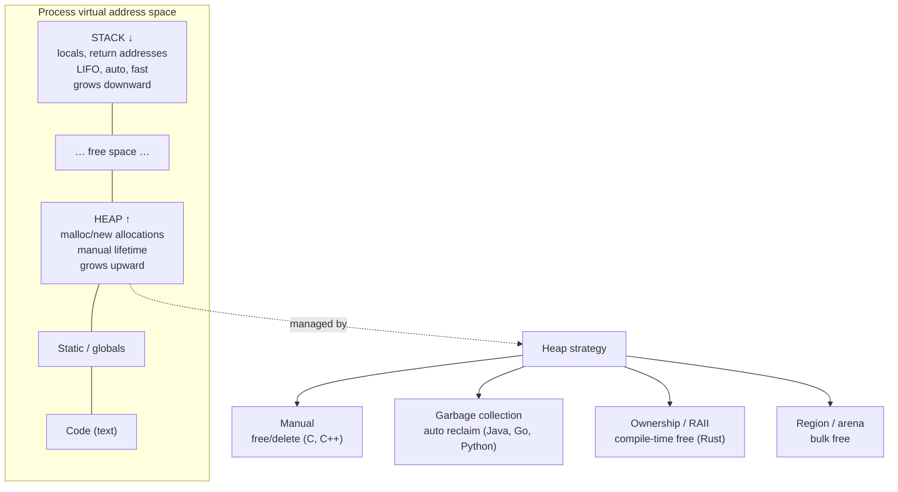

## In simple terms

**Memory management** is how a running program gets the memory it needs and gives it back when it's done. Every variable, object, and buffer has to live somewhere in RAM; something has to decide *where* it goes and *when* that space can be reused. Get it wrong and the program either leaks memory until it dies, or frees something too early and corrupts its own data.

## The Visual Map



## More detail

A program's memory is split into two regions that behave very differently:

- **The stack** — fast, automatic, last-in-first-out. Each function call pushes a frame holding its local variables and return address; returning pops it. Sizes are known in advance and freeing is essentially free (just move a pointer). It's why local variables "just work."
- **The heap** — flexible storage for data whose size or lifetime isn't known up front. You **allocate** a block and must arrange for it to be **freed** later. This is where all the hard problems live.

Languages take different approaches to the heap:

- **Manual** (C, C++): you call `free`/`delete` yourself. Maximum control, classic bugs — leaks, *use-after-free*, *double-free*, dangling pointers.
- **Garbage collection** (Java, Python, Go, JavaScript): the runtime automatically reclaims objects nothing references anymore — see [garbage collection](/t/garbage-collection).
- **Ownership / RAII** (Rust, modern C++): the compiler tracks who owns each allocation and frees it deterministically when it goes out of scope — no garbage collector, no manual frees.
- **Region / arena**: allocate many objects together and free the whole region at once — common in compilers and game engines.

Underneath all of these, the OS hands out memory in pages and gives each process its own private [virtual memory](/t/virtual-memory) address space; an *allocator* like `malloc` sub-divides those pages for the program and tracks which sub-blocks are free.

## Under the Hood

What does `malloc` actually do? A toy **free-list allocator** in Python: it manages one fixed buffer, hands out blocks, and reclaims freed blocks for reuse — exactly the bookkeeping a real allocator performs under the hood:

```python
#!/usr/bin/env python3
"""A toy free-list allocator over one fixed memory buffer."""

class Allocator:
    def __init__(self, size):
        self.size = size
        # free list: list of (offset, length) holes; initially one big hole
        self.holes = [(0, size)]
        self.live = {}                       # addr -> length

    def malloc(self, n):
        # first-fit: find the first hole big enough
        for i, (off, length) in enumerate(self.holes):
            if length >= n:
                self.holes[i] = (off + n, length - n)  # shrink the hole
                if self.holes[i][1] == 0:
                    self.holes.pop(i)
                self.live[off] = n
                return off
        raise MemoryError(f"no contiguous block of {n}")

    def free(self, addr):
        n = self.live.pop(addr)
        self.holes.append((addr, n))
        self._coalesce()                     # merge adjacent holes

    def _coalesce(self):
        self.holes.sort()
        merged = [self.holes[0]]
        for off, length in self.holes[1:]:
            poff, plen = merged[-1]
            if poff + plen == off:           # adjacent -> merge
                merged[-1] = (poff, plen + length)
            else:
                merged.append((off, length))
        self.holes = merged

    def report(self):
        total = sum(l for _, l in self.holes)
        biggest = max((l for _, l in self.holes), default=0)
        return f"free={total} largest_hole={biggest} holes={self.holes}"

a = Allocator(100)
x = a.malloc(30); y = a.malloc(30); z = a.malloc(30)
print("after 3x malloc(30):", a.report())
a.free(y)                                     # free the middle block
print("after free(middle):  ", a.report())   # 40 free, but split into two holes
a.free(x); print("after free(x):       ", a.report())  # coalesces with the hole
```

## Engineering Trade-offs

**Stack vs. heap**
The stack is almost free — allocation and deallocation are a single pointer move, and locality is excellent — but it's bounded (overflow on deep recursion) and its lifetimes are strictly scope-bound. The heap is unbounded and flexible but every allocation costs a search for space, every free risks a bug, and scattered allocations hurt cache locality. Good code keeps short-lived, fixed-size data on the stack and reserves the heap for what genuinely needs it.

**Control vs. safety (the strategy spectrum)**
Manual management gives the tightest control over timing and layout — essential for kernels and embedded — at the price of the most dangerous bug classes. Garbage collection removes those bugs and the cognitive load entirely, but costs pauses, memory headroom, and deterministic timing. Ownership (Rust) tries to get manual-level performance with compile-time safety, at the cost of a steeper learning curve and fighting the borrow checker.

**Fragmentation vs. allocation speed**
Simple, fast allocation policies (first-fit, bump pointers) can leave the heap *fragmented* — plenty of total free space, but no single hole big enough for a large request. Policies that fight fragmentation (best-fit, coalescing, compaction) reclaim usable space but cost CPU on every allocation or move objects around. There is no allocator that is simultaneously fastest and fragmentation-free.

**Throughput vs. latency in reclamation**
Batch reclamation (a stop-the-world GC, or freeing an entire arena at once) maximises throughput but creates latency spikes. Incremental reclamation (reference counting, concurrent GC, per-object `free`) spreads the cost out for smoother latency but lowers peak throughput. The right choice depends on whether the workload cares more about total work done or worst-case pause.

## Real-world examples

- A long-running server whose memory climbs forever under load has a **leak** — references kept alive that should have been dropped (a stale cache, a global list, an un-removed event listener).
- **Rust's** borrow checker rejects use-after-free *at compile time*, which is much of why it's prized for systems programming without a GC.
- A C program that reads or writes past the end of a buffer (a **buffer overflow**) is the root of countless historic exploits; Microsoft and Google have each reported ~70% of their serious security vulnerabilities are memory-safety failures in C/C++.
- **Game engines and compilers** lean on arena allocators: allocate everything for one frame or one compilation pass, then free the whole region in O(1) instead of tracking thousands of individual objects.

## Common misconceptions

- **"Garbage-collected languages can't leak."** They can — a cache, a global, or an un-removed listener keeps objects *reachable* forever, and the GC never reclaims reachable memory.
- **"The stack and the heap are different hardware."** They're just two disciplined ways of using the same RAM, distinguished by *how* allocation and freeing work, not by where the bytes physically sit.
- **"`malloc` asks the OS for memory every time."** Usually not — the allocator requests big chunks from the OS rarely (via `sbrk`/`mmap`) and sub-divides them itself; most `malloc` calls never touch the kernel.

## Try it yourself

Watch **external fragmentation** happen: free space exists, but it's chopped into pieces too small to satisfy a request. This is the central reason heap allocation is hard:

```bash
python3 - << 'EOF'
# 90-byte heap, hand out six 15-byte blocks, free every other one.
heap = 90
blocks = [("A",15),("B",15),("C",15),("D",15),("E",15),("F",15)]
allocated = 90                       # all six fit exactly
print(f"6 blocks of 15 fill the {heap}-byte heap. allocated={allocated}")

# Free B, D, F (alternating) -> 45 bytes free, but in three 15-byte holes
free_total = 45
largest_hole = 15
print(f"free B,D,F -> total free = {free_total}, but largest hole = {largest_hole}")

request = 30
print(f"\nmalloc({request})? need one contiguous {request}-byte hole.")
print("  enough TOTAL free space:", free_total >= request)       # True
print("  but a single hole fits:", largest_hole >= request)      # False
print("  => allocation FAILS despite 45 free bytes (fragmentation)")
EOF
```

The request for 30 bytes fails even though 45 bytes are free, because no single *contiguous* hole is large enough. Real allocators fight this with coalescing (merging adjacent holes) and compaction (moving live blocks together) — both of which cost time.

## Learn next

- [Garbage collection](/t/garbage-collection) — the most common automatic heap strategy; how runtimes reclaim memory without manual `free`.
- [Virtual memory](/t/virtual-memory) — how the OS gives each process the private, paged address space that allocators carve up.
- [Pointer and reference](/t/pointer-and-reference) — the handles to heap memory; understanding them explains dangling pointers, use-after-free, and why ownership models exist.
