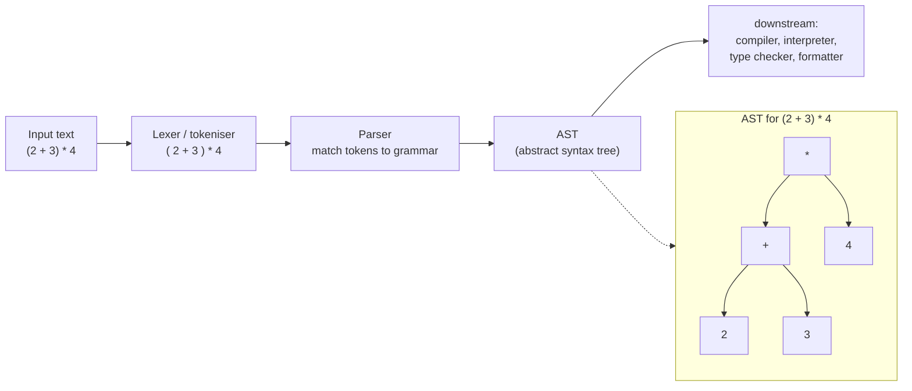

## In simple terms

**Parsing** is the act of taking flat text — source code, a JSON payload, a SQL query, a CSV row — and turning it into a structured tree (or other data structure) the program can reason about. Every compiler, every database, every web framework parses something. It's one of the oldest and best-studied problems in computer science.

## The Visual Map



## More detail

A parsing pipeline typically has two stages:

1. **Lexing / tokenisation** — split the input into tokens (`int`, `+`, `42`, `(`).
2. **Parsing proper** — match the token stream against a **grammar** to produce a syntax tree.

Major families:

- **Recursive descent** — write one function per grammar rule that consumes its expected tokens. Handwritten parsers (TypeScript, V8, the Rust compiler) are usually recursive descent because they give the best error messages.
- **LL(k) / predictive** — parses top-down with *k* tokens of lookahead. Many generator-produced parsers fall here.
- **LR / LALR** — parses bottom-up; handles a broader class of grammars but with harder-to-polish error messages. `yacc`/`bison` use this.
- **PEG (parsing expression grammar)** — composable and deterministic; Tree-sitter and Pest are based on it.
- **Combinators** — small parser functions composed with operators (Haskell's Parsec, Rust's nom).
- **GLR / Earley** — handle ambiguous grammars; used in natural-language tools and some IDEs.

Key concepts: the **AST (abstract syntax tree)** is the tree the parser emits, stripped of syntactic noise; a **concrete syntax tree** keeps whitespace and parens for formatting tools; **error recovery** lets a parser continue past a syntax error so an IDE can flag *every* error, not just the first; and **incremental parsing** (pioneered by Tree-sitter) re-parses only the changed region, essential for editing million-line files responsively.

## Under the Hood

A complete **recursive-descent parser** for a subset of JSON — lexer plus parser — turning flat text into nested Python structures. One function per grammar rule (`value`, `object`, `array`) is the hallmark of recursive descent:

```python
#!/usr/bin/env python3
"""Recursive-descent parser for a JSON subset: text -> Python data."""
import re

TOKEN = re.compile(r'\s*(?:(\{|\}|\[|\]|:|,)|"([^"]*)"|(-?\d+)|(true|false|null))')

def lex(s):
    toks, i = [], 0
    while i < len(s):
        m = TOKEN.match(s, i)
        if not m: 
            if s[i:].strip() == "": break
            raise SyntaxError(f"bad char at {i}: {s[i]!r}")
        i = m.end()
        punct, string, number, kw = m.groups()
        if punct:    toks.append(("punct", punct))
        elif string is not None: toks.append(("str", string))
        elif number: toks.append(("num", int(number)))
        elif kw:     toks.append(("kw", {"true": True, "false": False, "null": None}[kw]))
    return toks

class Parser:
    def __init__(self, toks): self.toks = toks; self.i = 0
    def peek(self): return self.toks[self.i] if self.i < len(self.toks) else (None, None)
    def eat(self):  t = self.peek(); self.i += 1; return t

    def value(self):                       # value := object | array | str | num | kw
        kind, val = self.peek()
        if (kind, val) == ("punct", "{"): return self.object()
        if (kind, val) == ("punct", "["): return self.array()
        self.eat()
        return val
    def object(self):                      # object := '{' (str ':' value (',' ...)?)? '}'
        self.eat()                         # consume '{'
        obj = {}
        if self.peek() != ("punct", "}"):
            while True:
                _, key = self.eat()        # string key
                self.eat()                 # ':'
                obj[key] = self.value()
                if self.peek() == ("punct", ","): self.eat(); continue
                break
        self.eat()                         # consume '}'
        return obj
    def array(self):                       # array := '[' (value (',' value)*)? ']'
        self.eat()
        arr = []
        if self.peek() != ("punct", "]"):
            while True:
                arr.append(self.value())
                if self.peek() == ("punct", ","): self.eat(); continue
                break
        self.eat()
        return arr

text = '{"name": "atlas", "tags": ["cs", "db"], "ok": true, "count": 42}'
print("input :", text)
print("parsed:", Parser(lex(text)).value())
```

## Engineering Trade-offs

**Handwritten vs. generated parsers**
Recursive-descent parsers written by hand give the best error messages and the most control, which is why nearly every production compiler (GCC, Clang, V8, Rust) ships one. Parser generators (yacc, ANTLR) derive a parser from a grammar file — faster to author and provably matching the grammar — but their machine-generated error messages and recovery are notoriously hard to make humane. Most serious languages start with a generator and eventually rewrite by hand.

**Grammar power vs. error quality and speed**
More powerful parsing algorithms (LR, GLR, Earley) accept broader grammar classes, including ambiguous ones, but are harder to produce good diagnostics from and can be slower. Simpler top-down methods (LL, PEG, recursive descent) constrain your grammar (no left recursion for naive recursive descent) but are fast and yield clear errors. You trade grammar expressiveness for diagnostic quality.

**Full re-parse vs. incremental parsing**
Re-parsing the whole file on every keystroke is simple and always correct, but doesn't scale to large files in an editor. Incremental parsers (Tree-sitter) re-parse only the edited region for responsiveness, at the cost of substantial implementation complexity and careful invalidation logic. The right choice depends on whether you parse once (a compiler) or continuously (an IDE).

**Strictness vs. tolerance**
A strict parser rejects malformed input immediately — ideal for security and data integrity. A tolerant one recovers from errors and keeps going — ideal for IDEs that must keep working on half-typed code. The same grammar needs different parsers depending on whether being wrong is dangerous or merely inconvenient.

## Real-world examples

- **Tree-sitter** powers syntax highlighting and structural editing in GitHub, Neovim, Helix, and Zed by giving each language an incremental parser.
- **JSON parsers** are surprisingly subtle: the spec is short, but real implementations diverge on duplicate keys, trailing commas, number precision, and Unicode edge cases.
- **`pg_query`** exposes PostgreSQL's own SQL parser as a library, so static analysers, ORMs, and formatters can understand SQL without a running database.
- **GraphQL** ships a precise grammar in its spec; every client and server re-implements that same parser in its host language.
- **Compilers and linters** — ESLint, Prettier, Babel, TypeScript, and rustc all begin with a parser; the AST they build is what every later pass operates on.

## Common misconceptions

- **"Parsing is mostly solved."** The *theory* is solved; the *practice* of building parsers with great error messages, fast recovery, and incremental re-parsing is still active research and engineering.
- **"Regular expressions are enough."** Regex recognises *regular* languages; programming languages and most data formats are at least *context-free* (they have arbitrarily nested structure), which a regex provably cannot match. "Parse HTML with regex" is the canonical Stack Overflow disaster.
- **"The AST is the same as the source."** The AST deliberately discards syntactic noise (parens, whitespace, redundant tokens); tools that must preserve formatting use a *concrete* syntax tree instead.

## Try it yourself

See *why* a regex can't replace a parser. Matching arbitrarily nested brackets requires *counting* (a stack) — something regular expressions provably cannot do. A regex for "balanced" can only hard-code a fixed depth; a tiny pushdown counter handles any depth:

```bash
python3 - << 'EOF'
import re

# A regex that only matches up to 2 levels of nesting (you must hard-code depth):
shallow = re.compile(r'^(\([^()]*(\([^()]*\))*[^()]*)*\)$')

def balanced(s):                 # a proper parser: count with a stack/depth
    depth = 0
    for c in s:
        if c == "(": depth += 1
        elif c == ")":
            depth -= 1
            if depth < 0: return False
    return depth == 0

tests = ["()", "(())", "((()))", "(()(()))", "(()", "())"]
print(f"{'input':12} {'regex(≤2 deep)':16} {'parser(any depth)'}")
for t in tests:
    r = bool(shallow.match(t))
    print(f"{t:12} {str(r):16} {balanced(t)}")
EOF
```

The regex starts giving wrong answers at three levels deep — `((()))` is valid but the shallow pattern rejects it — while the counting parser is correct at any depth. That counting ability is exactly the line between *regular* and *context-free* languages, and the reason real parsers exist.

## Learn next

- [Compiler](/t/compiler) — the larger pipeline parsing feeds: the parser is a compiler's front end, producing the AST every later stage consumes.
- [Interpreter](/t/interpreter) — what often walks the parsed tree directly to execute it.
- [Regular expression](/t/regular-expression) — the right tool for *tokenising* (the lexer) and for regular languages, and the wrong tool for nested structure — the contrast that defines what parsing is for.
