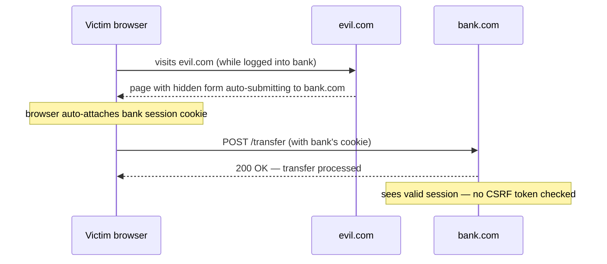

## In simple terms

**Cross-Site Request Forgery (CSRF)** exploits the fact that browsers automatically attach cookies to requests. The victim is logged into `bank.com` in one tab; in another tab they visit `attacker.com`, which contains an invisible form that POSTs to `bank.com/transfer?to=attacker&amount=10000`. The browser dutifully attaches the bank's session cookie. The bank sees an authenticated request and processes the transfer.

## The Visual Map



## More detail

Why it works: the browser attaches cookies to *any* request to a domain, regardless of which page initiated it.

The classic CSRF attack: a forged form on `evil.com` that auto-submits to `bank.com/transfer`, or an `` tag that fires a GET — both carry the victim's cookie.

Defences (use in combination):

1. **`SameSite` cookies** — `SameSite=Lax` blocks cookies on cross-site POSTs; `SameSite=Strict` blocks them on all cross-site navigation. Browsers default to `Lax` since 2020. Set it explicitly.
2. **CSRF tokens** — server embeds a random per-session token in every form; cross-site forms can't read it (same-origin policy). Django, Rails, Laravel, and Spring all do this by default.
3. **Custom request headers** — JavaScript-driven APIs require `X-Requested-With: XMLHttpRequest`; cross-site forms can't set custom headers without explicit CORS approval.
4. **Origin / Referer checks** — verify the request came from your own domain.
5. **Re-authentication for sensitive actions** — money transfers, password changes — re-prompt regardless of session.

`SameSite=Lax` has dramatically reduced naive CSRF, but it hasn't killed it: same-site subdomain attacks still work (`a.example.com` vs `b.example.com`), and Lax still allows top-level GET navigation.

CSRF is about **forcing a request**; [XSS](/t/xss) is about **executing code inside the origin**. XSS is strictly worse — if you have XSS, CSRF defences don't help.

## Under the Hood

The double-submit / HMAC token pattern — how frameworks like Django generate and verify CSRF tokens without server-side state:

```python
import secrets, hmac, hashlib

def make_csrf_token(session_id: str, secret: bytes) -> str:
    return hmac.new(secret, session_id.encode(), hashlib.sha256).hexdigest()

def verify_csrf(session_id: str, submitted_token: str, secret: bytes) -> bool:
    expected = make_csrf_token(session_id, secret)
    return hmac.compare_digest(expected, submitted_token)   # constant-time

secret = secrets.token_bytes(32)
session_id = "user-session-abc123"

token = make_csrf_token(session_id, secret)
print("csrf token:", token[:16], "...")
print("valid request:", verify_csrf(session_id, token, secret))
print("forged token: ", verify_csrf(session_id, "forged_token_here000000000000000000000000000000000000000000000000", secret))
print("wrong session:", verify_csrf("other-session", token, secret))
```

The attacker can't forge the token because the HMAC requires the server's secret, and they can't read it from the victim's browser due to the same-origin policy.

## Engineering Trade-offs

- **`SameSite` vs CSRF tokens.** `SameSite=Strict` is the strongest single control and requires no token logic, but breaks cross-origin navigations that some legitimate integrations rely on. CSRF tokens work on all cookie configurations but add a round-trip and token-injection into every form.
- **Stateless (HMAC) tokens vs stateful tokens.** HMAC tokens like above need no server storage and are trivially scalable; stateful tokens (stored per session in a DB/cache) can be invalidated immediately but add storage complexity.
- **`SameSite=Lax` blind spots.** Lax protects most POST-based attacks but is bypassed by top-level GET navigations (so never use GET to change state) and by same-site subdomain attacks (a malicious `cdn.example.com` can still CSRF `app.example.com`).
- **API clients vs browser forms.** Bearer-token APIs (mobile, SPA with Authorization header) are not CSRF-vulnerable because browsers don't auto-attach Authorization headers — only cookies. CSRF protection is only needed if you use cookies for auth.

## Real-world examples

- **The 2007 Gmail CSRF** changed account recovery email via a forged form — one of the first public CSRF disclosures that drove widespread awareness.
- **A 2018 Twitter CSRF** let attackers tweet on behalf of logged-in users via a crafted link.
- The shift to **`SameSite=Lax` as default** in Chrome 80 (2020) measurably reduced CSRF — and also broke some legitimate cross-site integrations, prompting waves of `SameSite=None; Secure` reconfigurations.
- Django's `` template tag has prevented countless CSRFs since 2005.

## Common misconceptions

- **"HTTPS prevents CSRF."** HTTPS protects in-flight content; CSRF exploits the browser's automatic cookie attachment, which happens over HTTPS just as readily.
- **"GET requests are safe from CSRF."** They aren't if they change state. Keep GET idempotent; use POST/PUT/DELETE for mutations.

## Try it yourself

See the CSRF token mechanism — the token is unforgeable without the server secret, and session-scoped so tokens don't transfer between users:

```bash
python3 -c "
import secrets, hmac, hashlib

def token(session, secret):
    return hmac.new(secret, session.encode(), hashlib.sha256).hexdigest()

def verify(session, tok, secret):
    return hmac.compare_digest(token(session, secret), tok)

secret = secrets.token_bytes(32)
legit_tok = token('alice-session', secret)
print('legit token:  ', verify('alice-session', legit_tok, secret))    # True
print('wrong session:', verify('bob-session',   legit_tok, secret))    # False
print('forged:       ', verify('alice-session', 'a'*64,    secret))    # False
"
```

## Learn next

- [XSS](/t/xss) — if the attacker has XSS, CSRF tokens are irrelevant; XSS is strictly more powerful.
- [Threat model](/t/threat-model) — the discipline for deciding which of these vulnerabilities matters most in your system.
- [Authentication](/t/authentication) — the session mechanism CSRF piggybacks on.
