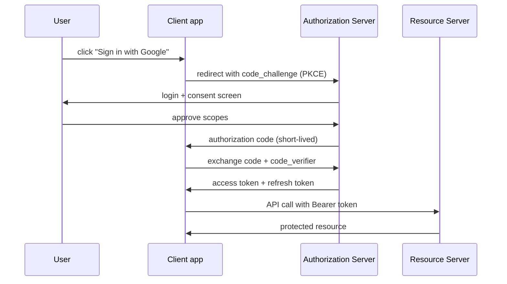

## In simple terms

**OAuth 2.0** is the standard that powers "Sign in with Google", "Connect your GitHub", and "Allow this app to post to Twitter on your behalf". An app (the *client*) wants to access your resources at another service (the *resource server*); OAuth defines the dance that lets the user grant that access without ever giving the app their password.

## The Visual Map



## More detail

The actors in OAuth 2.0:

- **Resource Owner** — the user.
- **Client** — the app asking for access.
- **Authorization Server** — issues access tokens (often the same domain as the resource server).
- **Resource Server** — the API holding the user's data.

The most common flow today is **Authorization Code with PKCE**:

1. The client redirects the user to the authorization server with a hashed `code_challenge`.
2. The authorization server authenticates the user, shows the consent screen, and redirects back with a short-lived authorization code.
3. The client exchanges the code + the original `code_verifier` for an access token (and usually a refresh token).
4. The client calls APIs with `Authorization: Bearer <access_token>`.

Older variants to recognise but not use for new work:

- **Implicit flow** — token returned in URL fragment; deprecated, vulnerable to interception.
- **Resource Owner Password Credentials** — user gives password to client; defeats the purpose.
- **Client Credentials** — for service-to-service, no user delegation.

**OpenID Connect (OIDC)** is a thin layer on top of OAuth that adds proper *authentication* — the `id_token`, a signed JWT with user identity. "Sign in with Google/Apple/Microsoft" is OIDC + OAuth.

Common pitfalls:
- **Treating OAuth as authentication** — OAuth alone proves "this user authorised this token", not "this user is present". Use OIDC if you need identity.
- **Storing access tokens in `localStorage`** — XSS-exploitable. Prefer HTTP-only cookies.
- **Missing PKCE** — required for public clients (browser, mobile); without it, the code flow is vulnerable to interception.
- **Wide scopes** — requesting more than needed is a privacy footgun.

## Under the Hood

PKCE (RFC 7636) — the mechanism that prevents an intercepted authorization code from being usable:

```python
import secrets, hashlib, base64

# Step 1: Client generates a random verifier and hashes it
code_verifier = secrets.token_urlsafe(64)     # 32+ bytes, URL-safe
code_challenge = base64.urlsafe_b64encode(
    hashlib.sha256(code_verifier.encode()).digest()
).rstrip(b'=').decode()

print(f"code_verifier (kept secret): {code_verifier[:20]}...")
print(f"code_challenge (sent to AS): {code_challenge[:20]}...")

# Step 2: Authorization Server verifies at token exchange
def verify_pkce(verifier: str, challenge: str) -> bool:
    recomputed = base64.urlsafe_b64encode(
        hashlib.sha256(verifier.encode()).digest()
    ).rstrip(b'=').decode()
    return recomputed == challenge

print()
print("legitimate exchange (correct verifier):", verify_pkce(code_verifier, code_challenge))
print("attacker uses intercepted code (wrong verifier):", verify_pkce("stolen_but_no_verifier", code_challenge))
```

An attacker who intercepts the authorization code still can't exchange it — they don't have the `code_verifier` that was never sent over the network.

## Engineering Trade-offs

- **OAuth vs API keys.** API keys are simpler but grant permanent, scope-less access; OAuth tokens expire, carry explicit scopes, and can be revoked without invalidating the user's credentials.
- **Access tokens vs refresh tokens.** Short-lived access tokens limit exposure windows; refresh tokens enable seamless renewal but are high-value secrets. Keep refresh tokens in server-side storage or HTTP-only cookies, never in JS memory.
- **Scope breadth vs user friction.** Narrow scopes are better for privacy and blast radius, but triggering too many OAuth prompts annoys users. Batch related scopes; never request scopes speculatively.
- **Token storage in SPAs.** HTTP-only cookies protect tokens from XSS but complicate cross-origin requests and require CSRF protection. In-memory (JS variable) tokens are XSS-safer than localStorage but don't survive a page refresh. There is no perfect answer; choose based on your XSS posture.

## Real-world examples

- **GitHub Apps and OAuth Apps** both use OAuth, with subtle differences — GitHub Apps install per-org with fine-grained permissions; OAuth Apps act as the user.
- **The 2021 Codecov breach** abused OAuth integration tokens silently exfiltrated from CI scripts, compromising many downstream environments. Token hygiene matters.
- **Apple's Sign in with Apple** is OAuth + OIDC with an extra privacy layer (anonymous email forwarding).
- The IETF continuously refines the spec via BCP 212 and the OAuth Security Best Current Practice — the space evolves.

## Common misconceptions

- **"OAuth is for authentication."** It's for authorisation. Use OIDC on top if you need identity.
- **"OAuth tokens are passwords."** They're time-limited, scoped capabilities — much safer than passwords, but treat them with similar care.

## Try it yourself

Generate a PKCE pair and verify it — the same logic a mobile or SPA client runs before each OAuth redirect:

```bash
python3 -c "
import secrets, hashlib, base64

verifier = secrets.token_urlsafe(64)
challenge = base64.urlsafe_b64encode(
    hashlib.sha256(verifier.encode()).digest()
).rstrip(b'=').decode()

print('verifier (secret):', verifier[:20], '...')
print('challenge (public):', challenge[:20], '...')

def verify(v, c):
    return base64.urlsafe_b64encode(hashlib.sha256(v.encode()).digest()).rstrip(b'=').decode() == c

print('correct verifier:', verify(verifier, challenge))
print('wrong verifier:  ', verify('attacker_does_not_have_this', challenge))
"
```

## Learn next

- [Authentication](/t/authentication) — the identity layer OIDC adds on top of OAuth.
- [Authorization](/t/authorization) — the per-request permission model OAuth tokens carry.
- [TLS](/t/tls) — the transport that makes OAuth safe by encrypting all token exchanges.
- [JWT](/t/jwt) — the token format most OAuth `id_token` and access tokens use.
