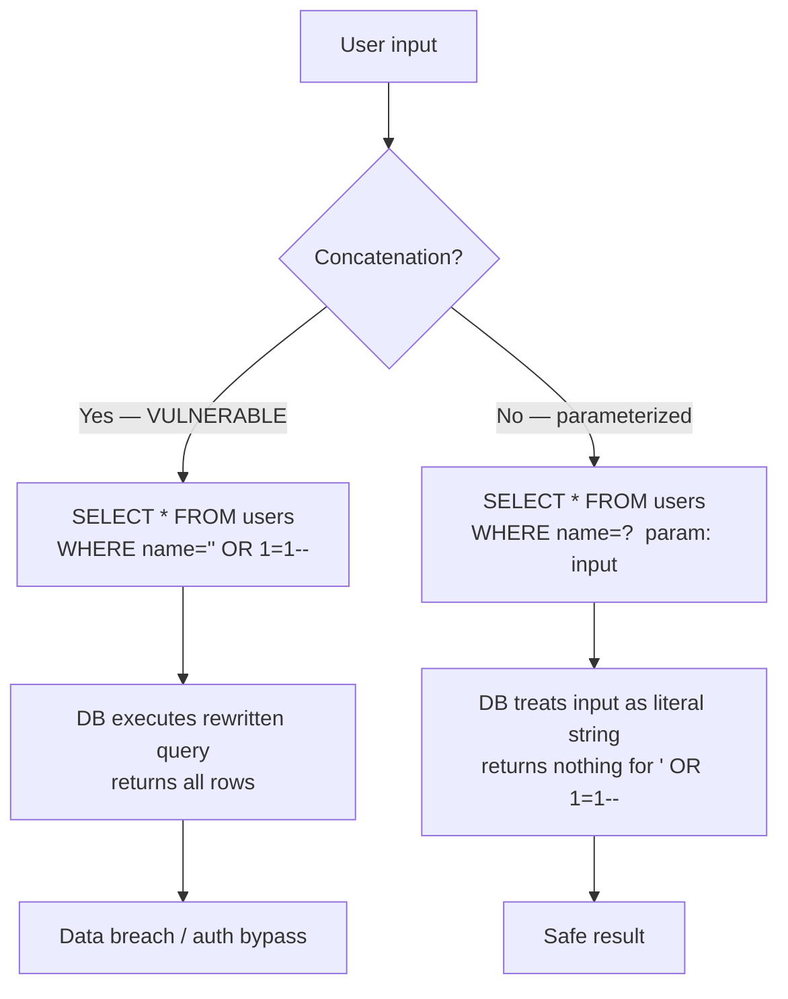

## In simple terms

**SQL injection** is when user-supplied text gets glued directly into a SQL query string, allowing the attacker to change what the query does. A login form that builds `SELECT * FROM users WHERE name = '$name'` lets an attacker enter `' OR 1=1 --` — the query becomes `WHERE name = '' OR 1=1 --`, which matches every row and bypasses authentication.

## The Visual Map



## More detail

The fix is simple: **never concatenate user input into SQL**. Use **parameterised queries** (prepared statements), where the SQL structure and the data are sent to the database separately — the engine never interprets the data as SQL:

```sql
-- Vulnerable
query = "SELECT * FROM users WHERE name = '" + name + "'"

-- Safe (parameterised)
cursor.execute("SELECT * FROM users WHERE name = ?", (name,))
```

Every modern database driver supports parameterised queries. Every ORM uses them by default. Writing injectable code in 2026 requires deliberately bypassing these defaults.

Classes of SQL injection:

- **In-band** — the attacker sees query results in the page.
- **Blind** — no visible output, but the attacker infers data via page behaviour (timing, true/false redirects).
- **Out-of-band** — the DB is forced to make a network call (DNS lookup, HTTP request) that leaks data.

What an attacker can do once they have injection:

- Read any data the app can read — usually the whole database.
- Write / modify data; escalate privileges via `UPDATE` on the users table.
- Execute OS commands via DB features (`xp_cmdshell` on SQL Server, `COPY ... TO PROGRAM` on PostgreSQL).
- Pivot to other services on the internal network.

Adjacent injection vulnerabilities follow the same pattern:

- **NoSQL injection** — against MongoDB/DynamoDB query languages.
- **Command injection** — `system("$user_input")` in shell calls.
- **LDAP injection**, **XPath injection**, **template injection**.

Additional defences:
- **Least privilege** — the app's DB user shouldn't be able to `DROP TABLE`.
- **Input validation** — numeric IDs as integers, enums validated against allowlists.
- **WAFs** — defence-in-depth, not a substitute for parameterised queries.

## Under the Hood

Live demonstration using Python's `sqlite3` — the difference between vulnerable and parameterised:

```python
import sqlite3

conn = sqlite3.connect(':memory:')
conn.execute("CREATE TABLE users (id INT, name TEXT, password TEXT)")
conn.execute("INSERT INTO users VALUES (1,'alice','s3cret')")
conn.execute("INSERT INTO users VALUES (2,'bob','hunter2')")
conn.commit()

def login_vulnerable(name, pw):
    q = f"SELECT * FROM users WHERE name='{name}' AND password='{pw}'"
    return conn.execute(q).fetchone()

def login_safe(name, pw):
    return conn.execute(
        "SELECT * FROM users WHERE name=? AND password=?", (name, pw)
    ).fetchone()

print("=== VULNERABLE ===")
print("normal login:", login_vulnerable("alice", "s3cret"))
injection = "' OR 1=1 --"
print("injected     :", login_vulnerable(injection, "anything"))   # bypasses auth!

print()
print("=== PARAMETERISED (safe) ===")
print("normal login:", login_safe("alice", "s3cret"))
print("injected     :", login_safe(injection, "anything"))          # returns None
```

The parameterised version treats the injection string as a literal search term — the DB looks for a user literally named `' OR 1=1 --`, finds none, and returns nothing.

## Engineering Trade-offs

- **Parameterised queries vs ORMs.** ORMs use parameterised queries internally and add a layer of abstraction — but they offer raw-query escape hatches (`execute()`, `raw()`) that bypass safety. Safety requires discipline, not just tool choice.
- **Parameterised queries vs stored procedures.** Stored procedures are safe if they don't dynamically build queries internally; they add DB coupling and migration complexity with no security benefit over parameterised queries in application code.
- **WAF as a supplement.** WAFs can block known injection patterns but are bypassable by obfuscation, and cannot distinguish malicious input from bizarre-but-legitimate queries. They reduce risk without eliminating it.
- **Least privilege reduces blast radius.** Even with injection, a DB user that can only `SELECT` from the app's tables limits the attacker far more than the `SUPERUSER` role most defaults use. Scope the DB account to exactly what the app needs.

## Real-world examples

- The **2008 Heartland Payment Systems breach** (130 million card numbers) started with SQL injection.
- The **2011 Sony Pictures hack** (LulzSec) was SQL injection; the published dump went on for pages.
- **TalkTalk's 2015 breach** (157,000 customer records, £77M fine) was SQL injection through a legacy page the company had forgotten existed.
- Bobby Tables is the universal mnemonic: `Robert'); DROP TABLE Students;--`

## Common misconceptions

- **"My ORM protects me."** Yes — *as long as you only use parameterised queries through it*. Raw queries with string interpolation bypass safety. Most ORMs have escape hatches.
- **"SQL injection is a solved problem."** The fix is well-known. The bugs are still shipped every year, usually in legacy code or "quick" raw queries added during debugging.

## Try it yourself

See injection bypass and parameterised defence side-by-side in an in-memory database:

```bash
python3 -c "
import sqlite3
conn = sqlite3.connect(':memory:')
conn.execute('CREATE TABLE users (name TEXT, pw TEXT)')
conn.execute(\"INSERT INTO users VALUES ('alice','s3cret')\")
conn.commit()

injection = \"' OR 1=1 --\"

# Vulnerable
row = conn.execute(f\"SELECT * FROM users WHERE name='{injection}' AND pw='x'\").fetchone()
print('vulnerable — got row:', row)

# Safe
row2 = conn.execute('SELECT * FROM users WHERE name=? AND pw=?', (injection, 'x')).fetchone()
print('parameterised — got row:', row2)
"
```

## Learn next

- [XSS](/t/xss) — the other half of the classic web injection pair.
- [Vulnerability](/t/vulnerability) — how flaws like this are tracked, scored, and disclosed via CVE/CVSS.
- [Threat model](/t/threat-model) — the discipline for deciding which injection surfaces in your app are highest priority.
