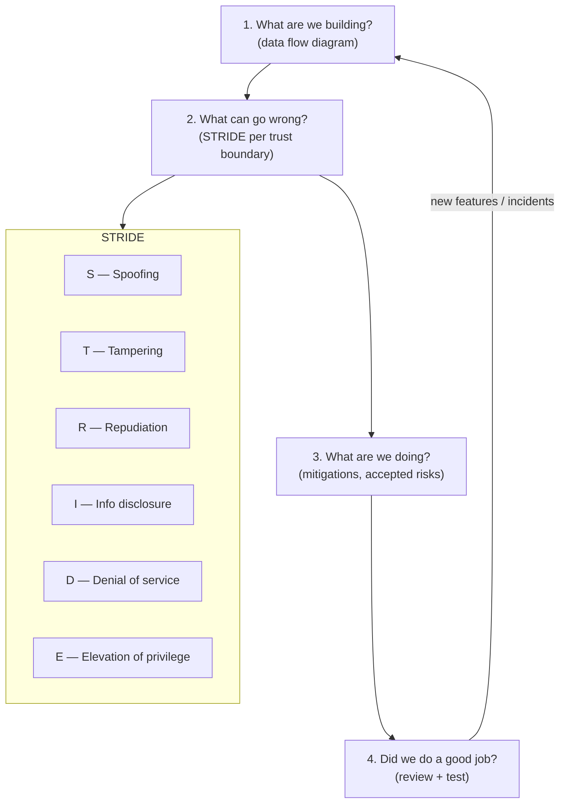

## In simple terms

A **threat model** is the answer to four questions about a system, written down before you ship:

1. What are we building?
2. What can go wrong?
3. What are we going to do about it?
4. Did we do a good job?

Most security bugs are not "I forgot to validate input" — they're "I never thought about that attacker". Threat modelling is the discipline of thinking about them up front.

## The Visual Map



## More detail

**STRIDE** (Microsoft) classifies threats by type:

| Letter | Threat | Example |
|---|---|---|
| **S**poofing | Pretending to be someone else | Stolen credentials, forged tokens |
| **T**ampering | Modifying data | Editing requests, mutating storage |
| **R**epudiation | Denying you did something | Missing audit trail |
| **I**nformation disclosure | Leaking data | Verbose errors, side channels |
| **D**enial of service | Making the system unavailable | Resource exhaustion, amplification |
| **E**levation of privilege | Getting more permissions | Privilege escalation bugs |

The lightweight version that fits in a design review: a **data flow diagram** (boxes for services, lines for data flows, trust boundaries marked) plus a list of threats per trust boundary crossing.

The **assume breach** mental model: don't assume your perimeter holds. Ask "if X is compromised, what damage can it do? What would we detect, and in how long?".

Practical outputs of a good threat model:
- A list of attacker personas (script kiddie, motivated insider, nation-state, supply-chain compromise).
- A list of assets (data, money, reputation, availability).
- Trust boundaries and what crosses them.
- Mitigations ordered by ROI.
- *Accepted risks* — things you've considered but chosen not to mitigate, with rationale.

Adam Shostack's four questions (from his book *Threat Modeling*) are the most-cited framing in the field.

## Under the Hood

Walk a simple web app component-by-component through STRIDE:

```python
STRIDE = {
    'S': 'Spoofing',
    'T': 'Tampering',
    'R': 'Repudiation',
    'I': 'Info disclosure',
    'D': 'Denial of service',
    'E': 'Elevation of privilege',
}

components = {
    'Login form':      list('STI'),
    'User data API':   list('STIDE'),
    'File upload':     list('STIDE'),
    'Admin endpoint':  list('STRIDE'),
    'Session cookie':  list('STIR'),
    'Audit log':       list('TR'),
}

print(f"{'Component':<20} {'Threats':<8}  Risk factors")
print('-' * 60)
for comp, threats in components.items():
    names = [STRIDE[c] for c in threats]
    print(f"{comp:<20} {''.join(threats):<8}  {', '.join(names)}")
```

Run it and you have the skeleton of a threat model for a login + CRUD + file-upload service. The output isn't mitigations — it's the *list of questions to answer* before shipping.

## Engineering Trade-offs

- **Lightweight vs formal.** The four-question framework + STRIDE fits on a whiteboard in 30 minutes and produces real value. PASTA and OCTAVE produce quantitative risk scores but take days; they're appropriate for regulated systems, not everyday feature work.
- **Threat modelling vs penetration testing.** Pentest finds vulnerabilities that exist; threat modelling finds vulnerabilities *before* you build the thing. Both are necessary; threat modelling is far cheaper because you can redesign rather than retrofit.
- **Continuous vs milestone.** A single threat model document written at project kickoff drifts out of date. A lightweight ritual in every design review — 10 minutes of "what can go wrong with this change?" — stays current and costs almost nothing.
- **Accepting risk.** Not every threat is worth mitigating. A "low-probability, low-impact" threat with a "high-complexity, high-cost" fix can be explicitly accepted. Recording accepted risks is what separates deliberate security decisions from security debt.

## Real-world examples

- **AWS publishes threat models** for many services as part of architecture documentation; for example, the Lambda security architecture document explicitly names which threats they defend against.
- **Signal's design papers** are essentially threat models written for the public — explicit about which attackers they defend against (network eavesdroppers, server operators) and which they don't (compromised device).
- **NIST 800-154 / ISO 27005** formalise the practice for regulated industries.
- **Cryptographers' security proofs** are threat models in mathematical form: they state exactly what the attacker can do and prove the scheme is secure under those assumptions.

## Common misconceptions

- **"Threat modelling is a once-a-year compliance activity."** It works best continuously, as a lightweight ritual in design reviews, not as a 100-page document.
- **"You need a security team to do threat modelling."** Any engineer can do useful threat modelling. The four-question framework fits on a whiteboard.

## Try it yourself

Apply STRIDE to a toy web app and see which components carry the most threat surface:

```bash
python3 -c "
STRIDE = {'S':'Spoofing','T':'Tampering','R':'Repudiation',
          'I':'Info disclosure','D':'DoS','E':'Elevation of privilege'}
components = {
    'Login form':     'STI',
    'User data API':  'STIDE',
    'File upload':    'STIDE',
    'Admin endpoint': 'STRIDE',
    'Session cookie': 'STIR',
}
print(f'{\"Component\":<20} {\"Risk surface\":<8}  Threat types')
print('-' * 60)
for comp, threats in sorted(components.items(), key=lambda x: -len(x[1])):
    names = [STRIDE[c] for c in threats]
    print(f'{comp:<20} {len(threats)} threats  {chr(10).join(names) if len(names) > 3 else \", \".join(names)}')
"
```

## Learn next

- [XSS](/t/xss) — one of the most common STRIDE-I/T threats in web apps.
- [SQL injection](/t/sql-injection) — another classic T/I threat that threat models frequently surface.
- [Vulnerability](/t/vulnerability) — how found threats are tracked (CVE), scored (CVSS), and prioritised.
