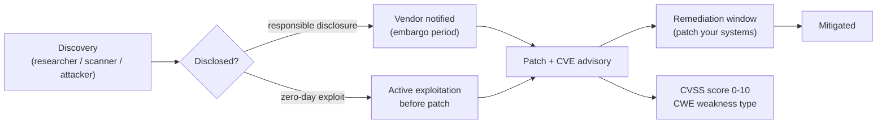

## In simple terms

A **vulnerability** is a weakness an attacker can take advantage of — a bug, a misconfiguration, or a design flaw that lets someone do something they shouldn't: read private data, run their own code, or take over an account. A vulnerability is the *hole*; an **exploit** is the technique that goes through it; an **attack** is someone actually using it. Most security work is about finding and closing holes before someone else does.

## The Visual Map



## More detail

Vulnerabilities come in families — memory-safety bugs (buffer overflows, use-after-free), injection flaws ([SQL injection](/t/sql-injection), [XSS](/t/xss)), broken authentication and authorization, insecure defaults, and exposed secrets. The industry tracks them with shared machinery:

- **CVE** (Common Vulnerabilities and Exposures) — a global ID like `CVE-2021-44228` (Log4Shell) so everyone refers to the same flaw.
- **CVSS** — a 0–10 severity score based on how easy a flaw is to exploit and how much damage it does.
- **CWE** — a catalogue of the underlying *weakness types* (e.g. "CWE-79: Cross-site Scripting").
- **NVD** (National Vulnerability Database) — the authoritative repository searchable by CVE, maintained by NIST.

The lifecycle matters as much as the bug:

1. **Discovery** — by researchers, internal teams, automated scanners, or attackers.
2. **Responsible disclosure** — report privately to the vendor, give them time (typically 90 days) to fix.
3. **Patch + advisory** — the fix ships with a CVE ID and CVSS score.
4. **Remediation** — everyone running the affected software updates. The dangerous window is the gap between public disclosure and your patch.

A **zero-day** is a vulnerability being exploited *before* a patch exists — defenders have "zero days" of warning.

## Under the Hood

Triage by priority score that combines CVSS severity with your deployment context — raw CVSS alone misleads:

```python
vulns = [
    {'cve': 'CVE-2021-44228', 'cvss': 10.0, 'component': 'log4j',   'in_use': True,  'exposed': True},
    {'cve': 'CVE-2014-0160',  'cvss': 7.5,  'component': 'openssl', 'in_use': True,  'exposed': True},
    {'cve': 'CVE-2022-0001',  'cvss': 6.5,  'component': 'curl',    'in_use': True,  'exposed': False},
    {'cve': 'CVE-2023-9999',  'cvss': 9.1,  'component': 'old-lib', 'in_use': False, 'exposed': False},
]

def priority(v: dict) -> float:
    score = v['cvss']
    if not v['in_use']:   score -= 4.0   # not deployed in this environment
    if not v['exposed']:  score -= 2.0   # not reachable from outside
    return max(score, 0.0)

for v in sorted(vulns, key=priority, reverse=True):
    p = priority(v)
    print(f"{v['cve']:18} CVSS {v['cvss']:.1f}  "
          f"in_use={str(v['in_use']):5}  exposed={str(v['exposed']):5}  "
          f"-> priority {p:.1f}")

print()
print("Highest CVSS (9.1) drops to 3.1 when the component isn't deployed.")
```

## Engineering Trade-offs

- **CVSS score vs contextual risk.** A CVSS 10.0 in a library you don't use is less urgent than a CVSS 6.5 in an internet-facing component. Context-adjusted scoring (as above, or via EPSS — Exploit Prediction Scoring System) dramatically reduces patch-fatigue false alarms.
- **Responsible disclosure vs immediate publication.** The 90-day disclosure window (Google Project Zero's standard) gives vendors time to patch while keeping researchers accountable. Longer embargos allow incomplete patches; shorter ones catch organisations before they can remediate.
- **Automated scanning vs manual review.** `npm audit`, `pip-audit`, and Dependabot catch known-CVE dependency vulnerabilities automatically. They generate noise; they don't find design flaws or business-logic vulnerabilities, which require manual threat modelling and review.
- **Zero-day economics.** Active zero-days have a market value (high-severity mobile zero-days can fetch millions); this means sophisticated attackers may exploit quietly rather than trigger disclosure. Assume undetected exploitation is possible for high-value targets.

## Real-world examples

- **Log4Shell (CVE-2021-44228, 2021)** — a single logging-library flaw allowed remote code execution on millions of servers; the patch scramble lasted months.
- **Heartbleed (CVE-2014-0160, 2014)** — an OpenSSL buffer over-read leaked memory (including private keys) to anyone who sent a malformed heartbeat message.
- A routine `npm audit` or `pip-audit` run flags known-CVE dependencies by matching them against the NVD.

## Common misconceptions

- **"A vulnerability means we've been hacked."** It means we *could* be. Many are found and patched before anyone exploits them.
- **"High CVSS = drop everything."** Severity is one input; whether the flaw is reachable in *your* configuration matters just as much. That triage is the job of a [threat model](/t/threat-model).

## Try it yourself

Simulate vulnerability triage — the same priority adjustment that feeds a real patch queue:

```bash
python3 -c "
vulns = [
    ('CVE-2021-44228', 10.0, True,  True),   # log4shell, in use, internet-exposed
    ('CVE-2014-0160',  7.5,  True,  True),   # heartbleed
    ('CVE-2022-0001',  6.5,  True,  False),  # internal only
    ('CVE-2023-9999',  9.1,  False, False),  # not deployed
]
print(f'{\"CVE\":<18} {\"CVSS\":<6} {\"In use\":<8} {\"Exposed\":<9} Priority')
for cve, cvss, in_use, exposed in sorted(vulns, key=lambda v: max(v[1] - (0 if v[2] else 4) - (0 if v[3] else 2), 0), reverse=True):
    p = max(cvss - (0 if in_use else 4) - (0 if exposed else 2), 0)
    print(f'{cve:<18} {cvss:<6} {str(in_use):<8} {str(exposed):<9} {p:.1f}')
print()
print('Raw CVSS 9.1 becomes priority 3.1 when the component is not deployed.')
"
```

## Learn next

- [Threat model](/t/threat-model) — the discipline for deciding which vulnerabilities in your system actually need attention.
- [XSS](/t/xss) — one of the most common web vulnerability classes tracked by CVE/CWE.
- [SQL injection](/t/sql-injection) — another high-frequency class with a simple, known fix.
