## In simple terms

**Cross-Site Scripting (XSS)** is when an attacker tricks a website into executing their JavaScript inside another user's browser. Because that script runs from the site's origin, it can read the victim's cookies, take actions on their behalf, change what they see — anything the site itself could do. XSS has been on the OWASP Top 10 for two decades because it keeps reappearing.

## The Visual Map

```mermaid
flowchart TD
  subgraph stored["Stored XSS"]
    A1["Attacker submits\nscript in comment"] --> DB["Server stores it"]
    DB --> V1["Victim loads page\n→ script executes"]
  end
  subgraph reflected["Reflected XSS"]
    A2["Attacker crafts\nmalicious URL"] --> V2["Victim clicks link\n→ server echoes script\n→ browser runs it"]
  end
  subgraph dom["DOM-based XSS"]
    A3["Attacker puts payload\nin URL hash / fragment"] --> JS["Page JS reads location.hash\nputs into innerHTML"]
    JS --> V3["Script executes\nentirely client-side"]
  end
  V1 & V2 & V3 --> IMPACT["Cookie theft / session hijack\nKeylogging / account takeover"]
```



## More detail

Three classical flavours:

- **Reflected XSS** — the attacker crafts a URL that puts script into a query parameter the site echoes back unsanitised. Victim clicks the link; script runs in their browser.
- **Stored XSS** — the attacker submits malicious script into a form (comment, profile bio, support ticket). The server stores it; every viewer who loads that page runs it.
- **DOM-based XSS** — the page's own JavaScript reads from `location.hash` or `window.name` and feeds it into `innerHTML` or `eval`, executing the payload entirely client-side.

The defences:

1. **Output encoding** — when rendering user-supplied text into HTML, escape `< > & " '`. Template engines (React's JSX, Vue, Svelte, Jinja with autoescape) do this by default.
2. **Content Security Policy (CSP)** — an HTTP header that restricts which scripts are allowed to run. `script-src 'self'` blocks inline scripts an attacker would inject.
3. **`HttpOnly` cookies** — JavaScript can't read them; limits damage even if an injection succeeds.
4. **Sanitisation libraries** — DOMPurify (browser), bleach (Python), sanitize-html (Node) — when you must render user-supplied HTML.
5. **Use `textContent`, not `innerHTML`** — for text, never compose HTML with strings.
6. **Subresource Integrity (SRI)** — hashes on `<script>` tags ensure remote scripts haven't been tampered with.

Modern framework defaults make naive XSS much rarer than 10 years ago — but it still appears via:
- Markdown renderers that allow embedded HTML
- Rich-text editors that don't sanitise
- Dangerous APIs misused (`dangerouslySetInnerHTML`, `v-html`)
- Third-party scripts that get compromised

## Under the Hood

Output encoding is the primary defence — `html.escape` makes any string safe to embed in HTML:

```python
import html

payloads = [
    "Hello, world!",
    "<script>alert('xss')</script>",
    '',
    "It's a <b>great</b> day & sunny",
]

print(f"{'Input':<55} Safe?")
print('-' * 80)
for raw in payloads:
    escaped = html.escape(raw)
    safe = '<' not in escaped and '>' not in escaped
    print(f"{repr(raw):<55} {'yes' if safe else 'no'}")
    if not safe:
        print(f"  escaped: {repr(escaped)}")
```

`html.escape("<script>alert(1)</script>")` → `"&lt;script&gt;alert(1)&lt;/script&gt;"` — a string the browser displays as text, never executes as code.

## Engineering Trade-offs

- **Escaping vs sanitisation.** Escaping is correct when you want to display user content as text. Sanitisation (allow-listing safe HTML tags) is needed only when users must be able to post rich content (bold, links). Sanitisation is harder to get right — use a vetted library (DOMPurify), never hand-roll.
- **CSP as defence-in-depth.** A strict CSP (`script-src 'self'`) limits the blast radius of an XSS by blocking inline scripts and arbitrary remote script loads. It doesn't prevent the injection; it prevents code execution if injection occurs. Getting to a strict CSP in a large legacy app is significant work.
- **`HttpOnly` session cookies.** Cookie theft is XSS's most common payoff. `HttpOnly` makes session cookies invisible to JS, so even a successful injection can't directly steal them — the attacker must make requests *as* the victim instead, which is more detectable.
- **Third-party scripts.** Bundled first-party scripts are covered by escaping and CSP; third-party tag-manager injected scripts are a separate trust boundary. A compromised tag manager can bypass CSP entirely if you allow its domain. Subresource Integrity + a strict allowlist is the mitigation, but most ad-driven sites trade this off for flexibility.

## Real-world examples

- **The 2005 Samy worm** infected over a million MySpace profiles in 20 hours via stored XSS in profile editing — one of the largest organic worms in history.
- **The 2018 British Airways breach** (380,000 customer cards) was traced to a compromised third-party JS loaded by the BA payment page — a supply-chain XSS.
- **HackerOne's annual reports** consistently show XSS as one of the most-paid bug bounty categories.
- **Slack's CSP** limited an exploitable XSS in 2019; the team's postmortem credits CSP for containing the blast radius.

## Common misconceptions

- **"My framework prevents XSS."** It prevents the common cases. The moment you use `dangerouslySetInnerHTML`, `v-html`, `bypassSecurityTrustHtml`, or render Markdown that allows raw HTML, you're back to manual defences.
- **"XSS only affects the user's session."** With XSS, the attacker can do anything the user can — change their email, post on their behalf, transfer money, install a keylogger.

## Try it yourself

See how HTML escaping neutralises XSS payloads — pure stdlib:

```bash
python3 -c "
import html
payloads = [
    ('<script>alert(1)</script>',    'script injection'),
    ('', 'event handler injection'),
    ('Hello & welcome <there>',      'normal text with symbols'),
]
for raw, label in payloads:
    escaped = html.escape(raw)
    has_tags = '<' in escaped          # any unescaped < means escaping failed
    print(f'{label}:')
    print(f'  raw has <tags>: {\"<\" in raw}   escaped has <tags>: {has_tags}')
    print(f'  escaped: {repr(escaped)}')
"
```

## Learn next

- [CSRF](/t/csrf) — the companion vulnerability: forces a request rather than injecting code, but defeated entirely if you have XSS.
- [Threat model](/t/threat-model) — how to decide where XSS is your highest-priority risk.
- [Vulnerability](/t/vulnerability) — how XSS instances are tracked (CWE-79), scored (CVSS), and disclosed.
