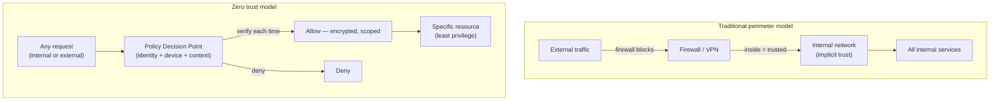

## In simple terms

**Zero trust** flips the old security assumption. The traditional model was a castle and moat: build a strong perimeter, and once inside the network, you're trusted. Zero trust says: **trust nothing based on where it is.** Every request — even from the desk next to the server — must prove who it is, prove it's allowed, and travel encrypted. "Never trust, always verify."

## The Visual Map



## More detail

The model exists because the perimeter stopped meaning anything. Employees work from home, services run across multiple clouds, and attackers who breach the perimeter once can historically move laterally through the flat internal network undetected ("lateral movement"). Zero trust assumes the attacker may already be inside.

Core principles:

- **Verify explicitly** — authenticate and authorize every request using all available signals (user identity, device health, location, behaviour), not just an IP address.
- **Least privilege** — grant the minimum access needed, for the shortest time. (Builds directly on [authorization](/t/authorization).)
- **Assume breach** — micro-segment networks so a compromise can't spread; encrypt traffic everywhere; log and inspect continuously.

In practice: strong [authentication](/t/authentication) (often phishing-resistant MFA), per-request authorization at an identity-aware proxy or gateway, mutual TLS between services (not implicit internal trust), and continuous device posture checks.

## Under the Hood

A policy decision point (PDP) — the evaluator that sits in front of every resource in a zero trust architecture:

```python
def evaluate_request(user: str, device_trusted: bool, location: str,
                     action: str, resource: str,
                     permissions: dict[str, set]) -> tuple[bool, str]:
    """Every request evaluated on full context — not just 'are they on the VPN'."""
    if action not in permissions.get(user, set()):
        return False, "no permission for this action"
    if not device_trusted:
        return False, "device health check failed"
    if location == "untrusted_network" and resource.startswith("/admin"):
        return False, "admin resources require trusted network or step-up auth"
    return True, "allow"

PERMS = {"alice": {"read", "write"}, "bob": {"read"}}

tests = [
    ("alice", True,  "office",            "read",  "/api/data"),
    ("alice", True,  "office",            "write", "/admin/config"),
    ("alice", True,  "untrusted_network", "write", "/admin/config"),
    ("alice", False, "office",            "read",  "/api/data"),
    ("bob",   True,  "office",            "write", "/api/data"),
]

for user, device, loc, action, resource in tests:
    ok, reason = evaluate_request(user, device, loc, action, resource, PERMS)
    status = "ALLOW" if ok else f"DENY ({reason})"
    print(f"{user:6} dev={device!s:5} {loc:20} {action:6} {resource:16} -> {status}")
```

Notice that "alice" in the office with a trusted device writing to `/admin/config` is **allowed**, but the same action from an untrusted network is **denied** — same user, same permission, different context. That context-sensitivity is zero trust.

## Engineering Trade-offs

- **Zero trust vs VPN.** A VPN grants network access broadly (once inside, you reach everything). Zero trust grants per-resource access. VPNs are simpler to operate; zero trust drastically limits lateral movement if credentials are stolen.
- **Identity-aware proxy overhead.** Every request going through a policy decision point adds latency and a new critical service. Caching policies and distributing PDP logic (e.g. as a sidecar) reduces this, but never to zero.
- **Device posture checks.** Requiring device health (OS patched, disk encrypted, no malware) is powerful but creates friction when employee devices don't pass. Mobile device management (MDM) and conditional access policies manage this at scale.
- **Micro-segmentation complexity.** Replacing a flat internal network with segment-per-service means hundreds of firewall rules, security groups, or network policies. The initial migration is expensive; the ongoing operations are more complex than a flat network, even if far safer.

## Real-world examples

- **Google's BeyondCorp** removed the corporate VPN entirely: employees access internal apps through an identity-aware proxy that checks user and device on every request from any network. This model originated from Google's 2009 Aurora breach response.
- A microservices backend using **mutual TLS** so that even internal service-to-service calls are authenticated and encrypted — a service can't be impersonated just because it's "on the inside".
- The **US federal government's Executive Order 14028 (2021)** mandated zero trust architecture for all federal agencies, driving widespread adoption in regulated industries.

## Common misconceptions

- **"Zero trust is a product you buy."** It's an architecture and a set of principles. Vendors sell tools that implement pieces of it; no single product provides zero trust.
- **"Zero trust means nobody can access anything."** It means access is *verified per request and scoped tightly* — legitimate users with the right context get in smoothly. The friction is for attackers who've stolen one credential, not for authorised users.

## Try it yourself

See how a PDP evaluates the same user differently based on device posture and location:

```bash
python3 -c "
def pdp(user, device_ok, location, action, resource, perms):
    if action not in perms.get(user, set()): return 'DENY: no permission'
    if not device_ok: return 'DENY: device check failed'
    if location == 'untrusted' and '/admin' in resource: return 'DENY: admin needs trusted network'
    return 'ALLOW'

perms = {'alice': {'read','write'}, 'bob': {'read'}}
cases = [
    ('alice', True,  'office',    'write', '/admin/config'),
    ('alice', True,  'untrusted', 'write', '/admin/config'),
    ('alice', False, 'office',    'read',  '/api/data'),
    ('bob',   True,  'office',    'write', '/api/data'),
]
for u, dev, loc, act, res in cases:
    print(f'{u} dev={dev!s:5} {loc:10} {act:6} {res:15} -> {pdp(u, dev, loc, act, res, perms)}')
"
```

## Learn next

- [Authentication](/t/authentication) — the "verify explicitly" principle starts here.
- [Authorization](/t/authorization) — the per-request access decisions zero trust demands.
- [Threat model](/t/threat-model) — the framework for deciding where zero trust controls give you the most risk reduction.
