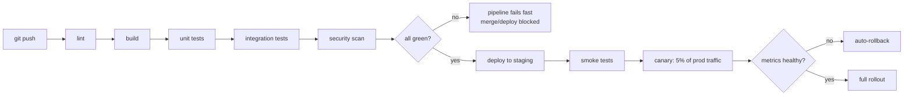

## In simple terms

**CI/CD** stands for *Continuous Integration* and *Continuous Delivery* (or Deployment). It's the practice — and the toolchain — that runs your tests on every commit and automatically packages and ships the code if those tests pass. The goal is to make releases boring: small, frequent, and reversible.

## The Visual Map



## More detail

**Continuous Integration (CI)** covers the path from commit to merged: every push triggers a pipeline (install deps, lint, type-check, build, run tests, scan for vulnerabilities), and a branch merges to `main` only when that pipeline is green. Failures are loud and quick to fix *while the change is still small*.

**Continuous Delivery** extends it so any green `main` is *deployable on demand*. **Continuous Deployment** removes even the manual click — every green `main` goes to production automatically. A typical pipeline:

```
push → lint → build → unit tests → integration tests → security scan
     → container image → deploy to staging → smoke tests → (approval?)
     → canary deploy to production → full rollout
```

Mainstream platforms include GitHub Actions, GitLab CI/CD, and Bitbucket Pipelines (Git-host-native); Jenkins, CircleCI, and Buildkite (standalone); and Argo CD / Flux (GitOps-style continuous deployment to Kubernetes). Healthy pipelines run in **under ~10 minutes**, cache aggressively (dependencies, build outputs, container layers), are **deterministic** (same commit, same result), and run on *every* commit, not just `main`.

## Under the Hood

A CI pipeline is, at its core, a sequence of stages that **fails fast** — the first failing stage aborts the rest and blocks the deploy. This Python runner captures that essence:

```python
#!/usr/bin/env python3
"""A CI pipeline: ordered stages that short-circuit on the first failure."""

def stage(name, ok):
    print(f"  > {name:14} {'PASS' if ok else 'FAIL'}")
    return ok

def pipeline(steps):
    for name, ok in steps:
        if not stage(name, ok):
            print(f"  x pipeline FAILED at '{name}' -- deploy skipped\n")
            return False
    print("  + all green -- deploying to production\n")
    return True

print("Run 1 (all pass):")
pipeline([("lint", True), ("build", True), ("unit tests", True),
          ("integration", True), ("deploy", True)])

print("Run 2 (a test fails):")
pipeline([("lint", True), ("build", True), ("unit tests", False),
          ("integration", True), ("deploy", True)])
```

In Run 2 the pipeline stops at `unit tests` and never reaches `deploy` — the failing gate protects production. Real CI systems add parallelism, caching, artifacts, and matrix builds, but this ordered-stages-with-a-gate is the mental model.

## Engineering Trade-offs

**Pipeline speed vs. thoroughness**
A fast pipeline (under ~10 minutes) keeps developers in flow and makes frequent merging painless, but you can't fit every possible check into it. Slower, exhaustive suites (full E2E, fuzzing, cross-platform matrices) catch more but stall the feedback loop — so teams split work into a fast per-commit pipeline and slower nightly/asynchronous jobs.

**Continuous deployment vs. release control**
Auto-deploying every green commit minimises batch size, so each change is small, easy to debug, and easy to roll back — and the DORA research links high deploy frequency to better outcomes. But it demands real investment: strong tests, canary/progressive rollout, feature flags, and observability. Without those, "deploy on green" is reckless; with them, it's *safer* than rare big-bang releases.

**Caching speed vs. correctness**
Caching dependencies, build outputs, and container layers dramatically speeds pipelines, but a stale or poisoned cache can hide a real breakage or produce "works in CI, fails in prod" mysteries. The trade is raw speed against the determinism guarantee — which is why cache keys must be derived precisely from inputs.

**Gating strictness vs. developer flow**
Blocking merges on a green pipeline enforces quality, but a flaky test (one that fails intermittently) erodes trust: people start re-running until green or ignoring failures, defeating the gate. A CI suite's value depends entirely on its *reliability*; one flaky test can poison the whole signal.

## Real-world examples

- A typical pull request opens, runs a few minutes of CI, gets reviewed, merges, and is in production within the hour.
- **Amazon and Google** deploy many thousands of times per day across their services, each change flowing through automated pipelines.
- A **canary deploy** shifts ~5% of traffic to the new version first; if error rates and latency stay healthy it rolls forward, otherwise it auto-rolls-back — exactly the `Healthy?` branch in the diagram.
- **GitOps** tools (Argo CD, Flux) treat a Git repo as the source of truth for cluster state, continuously reconciling production to match what's committed.

## Common misconceptions

- **"CI just means running tests."** Tests are the core, but lint, type-check, build, security scanning, and packaging are all part of the pipeline — CI verifies the change is *integratable*, not just that tests pass.
- **"Continuous deployment is reckless."** With solid tests, canary/progressive rollout, feature flags, and observability, it's *less* risky than infrequent large releases, because each change is tiny and instantly reversible.
- **"A green pipeline means the code is correct."** It means every *automated* check passed. Gaps in the tests are gaps in the guarantee — CI is only as good as the suite it runs.

## Try it yourself

Simulate the fail-fast gate at the heart of CI with a shell pipeline. Each stage runs in order; the first failure aborts the rest and blocks the deploy:

```bash
FAILED=""
for stage in "lint:pass" "build:pass" "test:FAIL" "deploy:pass"; do
  name=${stage%:*}; result=${stage#*:}
  echo "> $name"
  if [ "$result" = "FAIL" ]; then
    echo "  x $name failed -- pipeline aborts; later stages skipped"
    FAILED=$name; break
  fi
  echo "  + $name passed"
done
if [ -n "$FAILED" ]; then
  echo "RESULT: red (blocked at $FAILED, deploy NOT run)"
else
  echo "RESULT: green (deployed)"
fi
```

The pipeline stops at `test` and never runs `deploy` — flip `test:FAIL` to `test:pass` and it goes green and "deploys." This ordered, fail-fast gate is precisely what GitHub Actions, GitLab CI, and Jenkins do on every push, just with real lint/build/test commands in each stage.

## Learn next

- [Deployment](/t/deployment) — the release end of the pipeline: how green builds actually reach production (rolling, blue-green, canary).
- [Testing](/t/testing) — the discipline that fills the pipeline; CI is only as trustworthy as the test suite it runs.
- [Feature flag](/t/feature-flag) — decouples *deploy* from *release*, letting continuous deployment ship code dark and turn features on safely.
- [DORA metrics](/t/dora-metrics) — how teams measure whether their CI/CD is actually delivering (deploy frequency, lead time, change-fail rate, MTTR).
