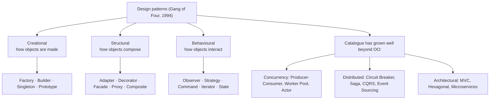

## In simple terms

A **design pattern** is a named recipe for solving a problem that comes up over and over in software. "Use a factory" or "wrap it in an adapter" lets two engineers describe a whole structure in three words instead of three paragraphs. Patterns aren't required, but knowing them makes conversation, code review, and design much faster.

## The Visual Map



## More detail

The canonical reference is *Design Patterns* (Gamma, Helm, Johnson, Vlissides — the "Gang of Four", 1994), which catalogued 23 object-oriented patterns in three families:

- **Creational** — how objects are made: Factory, Builder, Singleton, Prototype.
- **Structural** — how objects compose: Adapter, Decorator, Facade, Proxy, Composite.
- **Behavioural** — how objects interact: Observer, Strategy, Command, Iterator, State, Template Method.

Since then the catalogue has grown well beyond OO: **concurrency** (Producer-Consumer, Worker Pool, Pipeline, Actor), **distributed** (Circuit Breaker, Bulkhead, Saga, Event Sourcing, CQRS), **functional** (Map/Filter/Reduce, Either/Result, Optional), and **architectural** (MVC, Hexagonal, Microservices, Event-Driven).

Patterns are not building blocks you bolt on; they are *descriptions of structures you might choose*. Reach for one when its trade-offs match your problem — not because the pattern exists. Many patterns are also workarounds for a language's missing features: the GoF Iterator and Command patterns are largely subsumed by first-class iterators and closures in modern languages.

## Under the Hood

The **Strategy** pattern — "encapsulate the part that varies behind a common interface" — in Python. The `Order` doesn't change when you swap algorithms; you just inject a different strategy:

```python
#!/usr/bin/env python3
"""Strategy pattern: interchangeable algorithms behind one interface."""

# Each strategy is an algorithm with the same shape (weight -> cost).
def shipping_standard(weight): return 5.00 + 0.50 * weight
def shipping_express(weight):  return 12.00 + 1.20 * weight
def shipping_free(weight):     return 0.0

class Order:
    def __init__(self, weight, strategy):
        self.weight = weight
        self.strategy = strategy          # the pluggable algorithm
    def cost(self):
        return self.strategy(self.weight) # client code never changes

for name, strat in [("standard", shipping_standard),
                    ("express",  shipping_express),
                    ("free",     shipping_free)]:
    print(f"{name:9}: ${Order(10, strat).cost():.2f}")
```

Swapping `standard` → `express` → `free` changes the cost (\$10 / \$24 / \$0) with *zero* changes to `Order`. That separation — the client depends on an interface, the behaviour is injected — is the whole pattern. In a language with first-class functions, a "strategy" is often just a function, as here.

## Engineering Trade-offs

**Shared vocabulary vs. cargo-culting**
A pattern's biggest value is the *name*: "this is a Strategy" conveys an entire structure and its trade-offs in one word, speeding design and review. The danger is applying patterns for their own sake — adding a Factory or Singleton because it feels professional, when a plain function would do. The right pattern simplifies; the wrong one buries the logic under indirection.

**Flexibility vs. indirection**
Patterns like Strategy, Observer, and Decorator add seams where behaviour can change without touching existing code — great when that axis of change is real. But every seam is a layer of indirection: more files, more jumps to follow a call. If the flexibility is never used (the "you aren't gonna need it" trap), you've paid the complexity cost for nothing.

**Pattern vs. language feature**
Many GoF patterns are scaffolding around features older languages lacked. Iterator is built-in to Python/Java/Go; Strategy and Command collapse to closures in functional languages; Singleton is often just a module. Reaching for the heavyweight OO pattern when the language gives you the capability directly is over-engineering — recognise when the language already solved it.

**Premature structure vs. emergent design**
Choosing patterns up front can impose structure the problem doesn't actually have, locking in the wrong abstraction. The opposite discipline — let duplication accumulate, then *refactor toward* a pattern once the real axis of change is clear — usually yields better-fitting abstractions, which is why patterns and [refactoring](/t/refactoring) are close companions.

## Real-world examples

- **React's** component model is essentially Composite (components nest into a tree) plus Observer (state changes notify and re-render) — recognising the patterns explains why its mental model clicks.
- The **Repository** pattern wraps database access so domain code never sees SQL directly, keeping persistence swappable and testable.
- The **Adapter** pattern is what every "wrap their API behind our interface" change is doing — isolating your code from a third party's shape.
- A **Circuit Breaker** around a flaky external dependency trips after repeated failures, stopping one slow service from cascading into a system-wide outage.

## Common misconceptions

- **"More patterns means better code."** Patterns add structure *and* indirection. The right one simplifies; piling them on buries the logic and slows everyone down.
- **"Patterns are only for object-oriented languages."** Every paradigm has its catalogue — functional programming has Functor, Monad, Lens; concurrency and distributed systems have their own families.
- **"A pattern is a finished component you drop in."** It's a *description* of a structure adapted to your context, not a library you import — two Strategy implementations look nothing alike beyond the shape.

## Try it yourself

Python's `@decorator` syntax is literally the **Decorator** pattern — wrapping a function to add behaviour without modifying it. Here a `logged` decorator transparently adds call tracing to any function:

```bash
python3 - << 'EOF'
import functools

def logged(fn):                       # the Decorator pattern, as Python syntax
    @functools.wraps(fn)
    def wrapper(*args, **kwargs):
        print(f"  calling {fn.__name__}{args}")
        result = fn(*args, **kwargs)
        print(f"  -> {result!r}")
        return result
    return wrapper

@logged                               # add behaviour without touching add()
def add(a, b): return a + b

@logged
def greet(name): return f"hello, {name}"

add(2, 3)
greet("atlas")
EOF
```

Neither `add` nor `greet` knows it's being logged — the decorator *wraps* them, adding behaviour around the original. Add a second decorator (say a `@cached` one) and the wrappers stack, exactly as the Decorator pattern intends. The pattern is so useful the language gave it dedicated syntax.

## Learn next

- [Refactoring](/t/refactoring) — patterns are often the *target* you refactor toward once the right abstraction becomes clear; the two practices go hand in hand.
- [Code review](/t/code-review) — where pattern vocabulary pays off: "this is a Strategy in disguise" is an instant, shared suggestion.
- [Testing](/t/testing) — well-applied patterns create the seams (injected strategies, wrapped dependencies) that make code easy to test in isolation.
