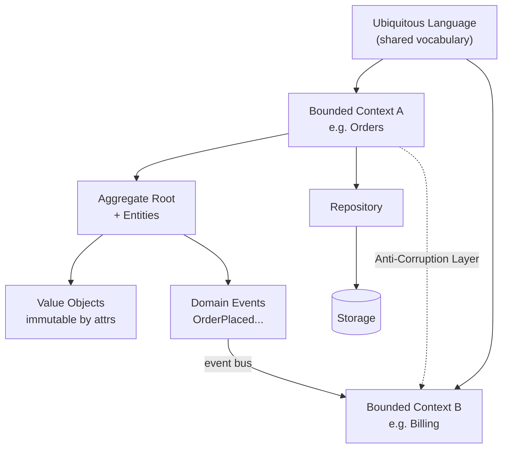

## In simple terms

Most software failures are not technology problems; they are miscommunication between developers and the people who understand the business. Domain-Driven Design (DDD) addresses this: developers and domain experts work together to build a shared vocabulary (the *ubiquitous language*) and encode it directly in the code. Rather than having a generic `Order` model that means different things to sales, billing, and shipping, DDD partitions the system into *bounded contexts*, each with its own model of `Order` that precisely reflects that context's needs.

## The Visual Map



## More detail

**Core DDD concepts:**

**Ubiquitous language:** the same terms used by domain experts in conversation are used verbatim in code — class names, method names, database columns. If a trader says "the desk books a trade," the code has `Desk.bookTrade(Trade)`. This eliminates the translation layer where meaning is lost.

**Bounded context:** an explicit boundary within which a domain model is consistent and has a single meaning. `Customer` in a CRM context (contact info, relationship history) differs from `Customer` in a billing context (payment methods, invoices). Each bounded context has its own model, code, and data store. Bounded contexts map naturally to microservices or teams.

**Aggregate:** a cluster of domain objects treated as a unit for data changes. Each aggregate has a **root** (the only externally-referenceable object) that enforces invariants. Example: an `Order` aggregate with root `Order`, containing `OrderLine` objects. Business rules like "an order cannot exceed 100 items" are enforced in the `Order.addLine()` method — the aggregate root is the only way to modify its children.

**Domain events:** something significant that happened in the domain, expressed as an immutable fact: `OrderPlaced`, `PaymentFailed`, `ItemShipped`. Domain events drive integration between bounded contexts — one context publishes events; others react. This is the foundation of event-driven communication in DDD.

**Value objects:** immutable objects defined by their attributes, not identity. `Money(amount=100, currency=USD)` is a value object — two instances with the same amount and currency are equal. Using value objects instead of primitives prevents "stringly typed" code and encapsulates validation.

**Repository:** provides a collection-like interface for accessing aggregates from the database, hiding persistence details. `orderRepository.findById(id)` returns a fully reconstituted `Order` aggregate.

**Strategic vs. tactical DDD:**
- **Strategic** — bounded contexts, context mapping (Shared Kernel, Customer-Supplier, Anti-Corruption Layer), ubiquitous language. High-level design.
- **Tactical** — entities, value objects, aggregates, repositories, domain services, domain events. Low-level implementation patterns.

**Context map patterns:**
- **Anti-Corruption Layer (ACL):** a translation layer that prevents a legacy or external model from "corrupting" your domain model.
- **Shared Kernel:** two contexts share a subset of the domain model (risky — coupling).
- **Published Language:** a well-documented integration format (like an industry standard API).

DDD addresses the hardest part of software engineering: understanding and modelling complex business domains correctly. Poorly modelled domains lead to anemic domain models (all logic in service classes, entities as dumb data containers), spaghetti integration, and endless misunderstandings between teams. Eric Evans' *Domain-Driven Design* (2003) and Vaughn Vernon's *Implementing Domain-Driven Design* are the foundational references.

## Under the Hood

A minimal Python example showing the three core tactical building blocks — Value Object, Aggregate Root, and Domain Event — in 30 lines:

```python
from dataclasses import dataclass, field
from typing import List
from uuid import UUID, uuid4

@dataclass(frozen=True)   # Value Object: equality by value, immutable
class Money:
    amount: float
    currency: str
    def __add__(self, other: "Money") -> "Money":
        assert self.currency == other.currency
        return Money(self.amount + other.amount, self.currency)

@dataclass(frozen=True)   # Domain Event: immutable fact
class OrderPlaced:
    order_id: UUID
    total: Money

@dataclass            # Aggregate Root: owns children, enforces invariants
class Order:
    id: UUID = field(default_factory=uuid4)
    _lines: List = field(default_factory=list, repr=False)
    _events: List = field(default_factory=list, repr=False)

    def add_line(self, product: str, price: Money, qty: int) -> None:
        if len(self._lines) >= 100:
            raise ValueError("Order cannot exceed 100 lines")  # invariant
        self._lines.append((product, price, qty))

    @property
    def total(self) -> Money:
        t = Money(0.0, "USD")
        for _, p, q in self._lines:
            t = t + Money(p.amount * q, p.currency)
        return t

    def place(self) -> None:
        self._events.append(OrderPlaced(self.id, self.total))

order = Order()
order.add_line("Widget", Money(9.99, "USD"), 3)
order.place()
print(f"Total: {order.total}")
print(f"Events: {order._events}")
```

## Engineering Trade-offs

**Where DDD wins:**
- Eliminates the translation gap between domain expert language and code, so requirements and bugs are easier to discuss across disciplines.
- Bounded contexts give explicit seams for splitting a monolith into services without arbitrary data coupling.
- Aggregates make invariant enforcement explicit and testable, instead of scattered across service classes.

**Where DDD adds friction:**
- Strategic DDD requires sustained engagement with domain experts — difficult with remote teams, shifting product owners, or short timelines.
- Tactical patterns (aggregates, repositories, domain services) introduce ceremony. In a simple CRUD app, they add indirection without value.
- Anemic domain model is the failure mode: teams adopt the vocabulary (classes named `Order`, `Customer`) but keep all logic in service layers — the worst of both worlds.
- Eventual consistency between bounded contexts (via domain events and message queues) is harder to reason about than a single shared database transaction.
- DDD has a steep learning curve; the vocabulary (aggregate, bounded context, anti-corruption layer) is non-obvious and often misapplied.

**Rule of thumb:** apply strategic DDD (bounded contexts, ubiquitous language) broadly; apply tactical patterns selectively in the core domain where business complexity justifies the cost.

## Real-world examples

- Shopify's platform is modelled around DDD bounded contexts: Catalogue, Orders, Fulfilment, Payments each have their own `Product` or `Order` model.
- Netflix uses event-driven DDD: bounded contexts publish domain events to Kafka; other contexts react.
- Zalando's open-source microservice platform was designed explicitly around DDD bounded contexts.
- The seL4 verified microkernel used a formal domain model as the foundation for its correctness proof.

## Common misconceptions

- **"DDD requires microservices."** DDD started in the monolith era. A well-structured monolith with clear module boundaries respecting bounded contexts is better than microservices with a big ball of mud inside each.
- **"DDD means using all the patterns."** Strategic patterns (bounded context, ubiquitous language) are universally valuable. Tactical patterns (aggregates, repositories) have costs — use them where they justify their complexity.

## Try it yourself

This script demonstrates the two most fundamental DDD concepts — Value Object equality and Aggregate invariant enforcement — with zero dependencies:

```bash
python3 - <<'EOF'
from dataclasses import dataclass

@dataclass(frozen=True)
class Money:
    amount: float
    currency: str

usd10a = Money(10.0, "USD")
usd10b = Money(10.0, "USD")
print("Value object equality (defined by attributes, not identity):")
print(f"  usd10a == usd10b : {usd10a == usd10b}")   # True
print(f"  usd10a is usd10b : {usd10a is usd10b}")   # False (different objects)

class Cart:
    MAX_ITEMS = 3
    def __init__(self): self._items = []
    def add(self, name, price: Money):
        if len(self._items) >= self.MAX_ITEMS:
            raise ValueError(f"Aggregate invariant: cart limit is {self.MAX_ITEMS} items")
        self._items.append((name, price))
    def total(self):
        return Money(sum(p.amount for _, p in self._items), "USD")

cart = Cart()
for name, amt in [("Book", 12.0), ("Pen", 1.5), ("Notebook", 3.0)]:
    cart.add(name, Money(amt, "USD"))
print(f"\nCart total: {cart.total()}")
try:
    cart.add("Extra item", Money(1.0, "USD"))
except ValueError as e:
    print(f"Blocked: {e}")
EOF
```

## Learn next

- [Design patterns](/t/design-pattern) — reusable structural solutions that DDD tactical patterns (Repository, Factory, Specification) build on
- [Test-driven development](/t/test-driven-development) — the natural testing approach for DDD: write a test against the domain model (not the database) to verify each invariant
- [Message queue](/t/message-queue) — the infrastructure that carries domain events between bounded contexts; understanding it is essential for implementing event-driven DDD
