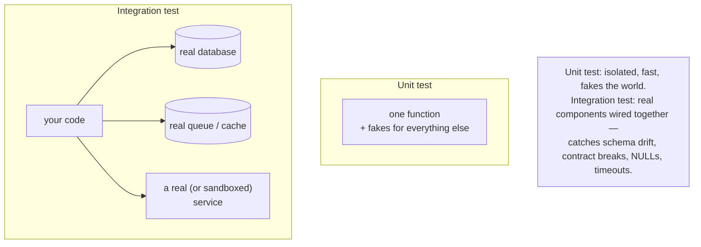

## In simple terms

An **integration test** exercises several real components together — your code, a real database, a real network, sometimes a real third-party service — and checks the whole flow works. They're slower than unit tests (often seconds each) but catch a class of bugs unit tests can't: wiring issues, schema drift, API contract violations, and environment mismatches.

## The Visual Map



## More detail

Integration tests sit in the middle of the testing pyramid: fewer than unit tests, more than end-to-end tests. They typically check database queries against a *real* database (not a mock), HTTP endpoints through the real routing layer, background jobs producing real side effects, service-to-service calls, and that migrations apply cleanly to a known schema.

Because real dependencies are slow, teams manage the cost with **test containers** (Testcontainers spins up a real Postgres/Redis/Kafka per run), **schema-per-test** isolation, snapshot fixtures, and parallel runners. A few things you still replace with test doubles: third-party APIs (use their sandboxes, or record/replay with VCR/WireMock), and *time* (a frozen clock so tests don't break tomorrow).

Adjacent concepts: **contract testing** (Pact — producer and consumer agree on a contract and each tests its side, no live integration needed), **end-to-end testing** (drives the whole system as a user via Playwright/Cypress; top of the pyramid, expensive and brittle), and **smoke testing** (a tiny "is the service even up?" check after each deploy).

## Under the Hood

You don't always need Docker for a real-dependency test: Python's stdlib `sqlite3` is a genuine SQL engine. This integration test runs real schema + real SQL, and catches a `UNIQUE` constraint violation that a **mocked** database would have silently allowed:

```python
#!/usr/bin/env python3
"""Integration test against a REAL database engine (stdlib sqlite3) — no mocks."""
import sqlite3

# --- code under test: a repository that runs real SQL ---
def create_schema(conn):
    conn.execute("CREATE TABLE users (id INTEGER PRIMARY KEY, email TEXT UNIQUE NOT NULL)")
def add_user(conn, email):
    conn.execute("INSERT INTO users (email) VALUES (?)", (email,)); conn.commit()
def find_by_email(conn, email):
    return conn.execute("SELECT id, email FROM users WHERE email = ?", (email,)).fetchone()

# --- the integration test ---
conn = sqlite3.connect(":memory:")        # a real engine, just in RAM
create_schema(conn)
add_user(conn, "alice@example.com")
print("found:", find_by_email(conn, "alice@example.com"))   # (1, 'alice@example.com')

# The REAL database enforces the UNIQUE constraint — a mock would not know to:
try:
    add_user(conn, "alice@example.com")   # duplicate email
    print("duplicate inserted?!")
except sqlite3.IntegrityError as e:
    print("real DB rejected duplicate:", e)
```

The duplicate insert is rejected by SQLite's actual constraint enforcement (`UNIQUE constraint failed`). A unit test that mocked the database would return whatever you told the mock to return — and would happily "succeed" on the duplicate, hiding a real bug. *That gap is the entire reason integration tests exist.*

## Engineering Trade-offs

**Realism vs. speed and isolation**
Integration tests exercise the real wiring, catching bugs (constraint violations, JOIN errors, NULL handling, timeouts) that fakes paper over. The price: they're slow (seconds, not milliseconds), need real infrastructure to spin up, and when they fail it's harder to pinpoint *which* component is at fault. The pyramid keeps them few for this reason.

**Real dependencies vs. flakiness**
Hitting real databases, queues, and services makes tests representative — and flaky. Network hiccups, container start-up races, shared state between tests, and clock dependence all cause intermittent failures that erode trust. Containers-per-test, schema isolation, and frozen clocks buy reliability back at the cost of setup complexity.

**Live integration vs. contract testing**
Testing two services by actually deploying both is maximally realistic but slow, fragile, and a coordination headache across teams. Contract testing (Pact) replaces the live call with a shared, versioned contract each side verifies independently — far cheaper and parallelisable, at the cost of trusting that the contract faithfully captures the real interaction.

**Test scope vs. diagnosis cost**
A wider test catches more integration bugs per test but tells you less about *where* the failure is — a red E2E test could be any of a dozen components. Narrower integration tests (one service + its database) localise failures better. Choosing scope trades coverage-per-test against debuggability.

## Real-world examples

- **Testcontainers** is a hugely popular cross-language library for spinning up real databases, queues, and brokers per test run — its tagline is essentially "stop mocking the database."
- **Stripe's** test cards (`4242 4242 4242 4242`) and signed test webhooks let you integration-test a full payment flow against their sandbox.
- **GitHub Actions** service containers let a workflow run integration tests against a real Postgres/Redis spun up alongside the job — the same pattern as the SQLite example, scaled up.
- Many teams run **post-deploy smoke tests**: a 30-second script that curls the critical endpoints, catching "the deploy succeeded but the service is broken."

## Common misconceptions

- **"Integration tests can replace unit tests."** They're slower, harder to isolate, and vaguer when they fail. You want both: units for fast logic feedback, integrations for wiring.
- **"If I mock the database, it's still an integration test."** No — mocking the database makes it a unit test with wider scope, and it loses exactly the value (real constraints, real SQL behaviour) integration testing provides.
- **"Integration tests are just slow unit tests."** They test a fundamentally different thing — the *connections* between components — which is invisible to any test that fakes those connections.

## Try it yourself

Write a real integration test for a SQL query using the stdlib `sqlite3` engine — a multi-table `JOIN` and `SUM` that only a real database computes. No mocks, no installs:

```bash
python3 - << 'EOF'
import sqlite3

conn = sqlite3.connect(":memory:")           # real SQL engine in RAM
conn.executescript("""
  CREATE TABLE orders (id INTEGER PRIMARY KEY, customer TEXT);
  CREATE TABLE items  (order_id INTEGER, price REAL, qty INTEGER);
""")
conn.execute("INSERT INTO orders VALUES (1, 'alice')")
conn.executemany("INSERT INTO items VALUES (?,?,?)", [(1, 9.99, 2), (1, 4.50, 1)])
conn.commit()

# The query under test: order total per customer (real JOIN + aggregate)
row = conn.execute("""
  SELECT o.customer, SUM(i.price * i.qty) AS total
  FROM orders o JOIN items i ON i.order_id = o.id
  GROUP BY o.customer
""").fetchone()

print(f"{row[0]} total = {row[1]:.2f}")       # alice total = 24.48
assert abs(row[1] - 24.48) < 0.001
print("integration test passed: real JOIN + SUM computed by SQLite")
EOF
```

The total (9.99×2 + 4.50×1 = 24.48) is computed by SQLite's actual query engine — your code's correctness *and* the SQL's correctness are tested together. Break the query (use a `LEFT JOIN` that double-counts, or the wrong column) and only an integration test like this catches it; a mocked database would just return whatever you stubbed.

## Learn next

- [Unit test](/t/unit-test) — the faster, narrower tier below this on the pyramid; isolated logic tests that integration tests complement.
- [Testing](/t/testing) — the overall strategy and the test pyramid that places unit, integration, and E2E tests in balance.
- [CI/CD](/t/ci-cd) — the pipeline that runs unit and integration suites (often spinning up service containers) automatically on every change.
