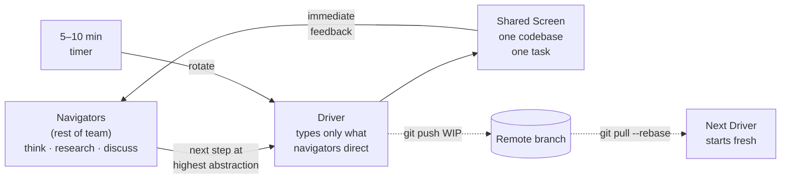

## In simple terms

Pair programming is two people at one computer. Mob programming (also called ensemble programming) is the whole team at one computer — one screen, one keyboard, one task at a time. One person "drives" (types), everyone else "navigates" (thinks, suggests, looks up things). The driver rotates every few minutes. It sounds inefficient — but practitioners report faster problem-solving, zero knowledge silos, instant code review, and a team that can independently handle any codebase task within days.

## The Visual Map



## More detail

**The roles:**
- **Driver:** types at the keyboard. Does not think ahead — only transcribes what the navigators direct, at the highest level of abstraction they can communicate: "Create a test that asserts the user gets a 404 when the resource is not found." The driver is the least intellectually burdened person in the room.
- **Navigator(s):** the rest of the team. Think, research, discuss, suggest next steps. Look up documentation. Catch errors before they're typed. A good navigator communicates *intent*, not keystrokes.

**Rotation:** the driver rotates every 5–10 minutes (timer-based). Everyone gets turns. No one is stuck in a role.

**Why it isn't as inefficient as it seems:**
- All decisions are made once, with full team context — no rework from miscommunication.
- Code is reviewed as it's written — no separate review cycle or PR wait.
- No handoffs or waiting for approvals.
- No one person becomes a single point of failure.
- Knowledge is distributed to the whole team in real time.
- Interruptions (Slack, email) are socially suppressed while mobbing.

**Outcomes reported by practitioners:**
- Dramatically reduced bug rate (many eyes catch bugs immediately).
- Zero knowledge silos — anyone on the team can work in any part of the code.
- Junior developers ramp up faster (real-time mentoring from the whole team).
- Better design decisions (group reasoning catches problems one person would miss).

**Remote mob programming:** works well with screen-sharing tools (VS Code Live Share, Tuple, Zoom). `mob.sh` automates the git rotation — it commits and pushes a WIP when the timer fires, and the next driver pulls and continues.

**When mob programming is not ideal:**
- Highly independent tasks that don't benefit from group input.
- Tasks requiring deep individual focus without collaboration.
- Teams with extreme time zone spread (synchronous requirement).

**Woody Zuill** popularised mob programming after discovering it by accident at Hunter Industries around 2012. The name "ensemble programming" is preferred by some as more inclusive.

Mob programming is the logical extension of pair programming's benefits to the whole team. It directly addresses one of the most persistent problems in software development: knowledge silos, where only one person understands a given system.

## Under the Hood

`mob.sh` (the standard CLI for remote mob sessions) wraps git to automate the driver handoff. When the timer fires, it commits all work-in-progress and pushes so the next driver can pull and continue without losing context:

```bash
# Install: go install github.com/remotemobprogramming/mob@latest
#          or: brew install remotemobprogramming/brew/mob

# Driver A starts a session on a feature branch
mob start --branch feature/payment --timer 10

# ... team works together for 10 minutes ...

# Timer fires — hand off
mob next
# internally: git add -A
#             git commit -m "mob session [wip]"
#             git push origin mob/feature/payment
#             git checkout main  (resets working tree)

# Driver B takes over
mob start
# internally: git fetch
#             git checkout mob/feature/payment
#             git pull --rebase

# Feature complete — squash WIP commits into one real commit
mob done
# internally: git rebase -i main  (squash all [wip] commits)
#             leaves changes staged for a proper commit message
```

The key insight: the WIP commit stream is never pushed to main — it lives on a dedicated `mob/<branch>` ref and is squashed before merging. This keeps git history clean while enabling real-time state sharing.

## Engineering Trade-offs

**Where mob programming wins:**
- Eliminates the largest sources of inter-developer waste: code review wait time, knowledge transfer meetings, onboarding ramp-up, debugging sessions where one person is stuck.
- Produces collective code ownership instantly — no "only Alex knows the payment module" situations.
- Continuous code review as it's written is faster and more thorough than async PR review.
- For complex problems (distributed system debugging, novel architecture decisions), group reasoning consistently outperforms individual experts working in parallel.

**Where mob programming adds cost:**
- Not every task warrants the synchronous overhead — routine independent tasks (updating a dependency, fixing a typo in docs) are faster alone.
- Requires team members to be available simultaneously: challenging across time zones, part-time schedules, or organisations with deep interruption cultures.
- Some individuals find pair/mob pressure stressful; psychological safety is a prerequisite.
- Tooling for remote mobbing (screen sharing, audio, code sharing) has latency and quality issues that erode the "one screen" illusion.
- Measuring productivity (lines of code, tickets closed) superficially makes mob programming look slow — it is not captured by individual output metrics.

**Economic framing:** if five engineers spend 8 hours mobbing and produce what four engineers would produce in 10 hours of parallel work, the mob is the better choice — plus the output has lower defect rate and full team understanding.

## Real-world examples

- Hunter Industries (automotive software): discovered mob programming organically around 2012; published results showing dramatically lower defect rates and faster delivery across multiple teams.
- Woody Zuill, now an international coach, popularised the practice and trains teams globally in ensemble programming.
- Many Agile and XP-influenced teams use mob programming for complex features or debugging sessions, even if not full-time.
- Remote teams at Shopify and GitHub report using ensemble programming (via VS Code Live Share) for complex cross-team features.

## Common misconceptions

- **"Mob programming means one person works while everyone else watches."** In a good mob, everyone is actively engaged — researching, thinking, discussing the problem. The driver is the least busy person.
- **"It's only for teaching juniors."** Mobs work because the collective reasoning of five experienced engineers consistently outperforms one experienced engineer alone. It scales to expert teams.

## Try it yourself

Plan a mock mob session — see how many driver turns a team of four gets across two rotation rounds:

```bash
python3 - <<'EOF'
team = ["Alice", "Bob", "Carol", "Dave"]
timer_min = 7
rounds = 2

total_min = len(team) * rounds * timer_min
print(f"Mob session: {len(team)} members, {timer_min}-min turns, {rounds} rounds")
print(f"Total duration: {total_min} minutes ({total_min // 60}h {total_min % 60}m)\n")
print(f"{'Turn':<6} {'Driver':<10} Navigators")
print("-" * 52)
for r in range(rounds):
    for i, driver in enumerate(team):
        turn = r * len(team) + i + 1
        navs = ", ".join(m for m in team if m != driver)
        print(f"{turn:<6} {driver:<10} {navs}")
EOF
```

## Learn next

- [Test-driven development](/t/test-driven-development) — integrates naturally with mob programming: the mob writes the failing test together before any code, making the next step always clear
- [Debugging](/t/debugging) — mob sessions excel at hard bugs; five pairs of eyes on a debugger session surface root causes faster than one engineer alone
- [Domain-driven design](/t/domain-driven-design) — the ubiquitous language emerges quickly in mob sessions because the whole team hears domain expert vocabulary being applied to code in real time
