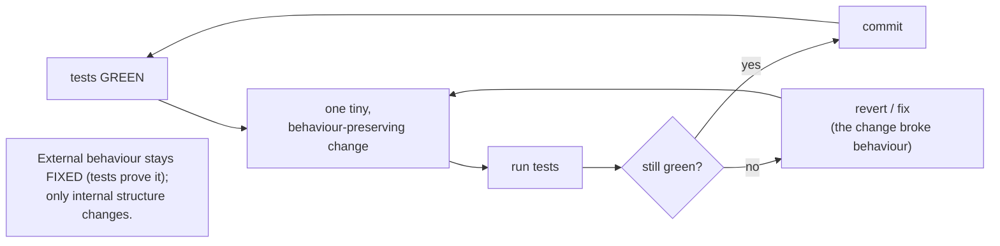

## In simple terms

**Refactoring** means changing the *shape* of code without changing what it does. Rename a variable; extract a function; split a class; replace a switch statement with a lookup — none of these add features or fix bugs. They make the code easier to understand, change, and test. Done continuously, refactoring is what stops a codebase from rotting into legacy.

## The Visual Map



## More detail

The term was popularised by Martin Fowler's *Refactoring: Improving the Design of Existing Code* (1999), which catalogued dozens of small, mechanical, reversible transformations: **Extract Function** (pull a block into its own named function), **Inline Function** (the reverse), **Rename**, **Move Function**, **Replace Conditional with Polymorphism** (turn a long `switch` into a strategy/hierarchy), **Introduce Parameter Object**, and more.

The discipline is a tight loop: **(1)** make sure tests pass, **(2)** do one tiny refactor, **(3)** run tests again, **(4)** commit, **(5)** repeat. Tests come first because refactoring without them is *guessing whether you broke anything* — the suite is what lets you change structure freely, and the tighter it is, the bolder you can be.

Refactoring is best done **continuously** in small bites alongside feature work — the "Boy Scout Rule" of leaving the code cleaner than you found it. Big-bang "refactoring sprints" that touch huge swaths of code tend to go badly: hard to review, hard to merge, prone to subtle bugs. Tools help: IDE refactorings (rename/extract/move/inline, done safely), AST-aware tools (`jscodeshift`, `comby`, `ts-morph`), and linters/formatters (Prettier, ESLint, ruff, gofmt) that enforce style continuously. Crucially, *adding a feature, fixing a bug, or mixing a behaviour change into a refactor are **not** refactoring* — a PR that does both leaves reviewers unable to tell which change is which.

## Under the Hood

The defining property of a refactoring is that **external behaviour is unchanged**. Here a long conditional is refactored into a lookup table — and the *same* tests (values and error cases) pass against both versions, which is exactly what proves the refactor is safe:

```python
#!/usr/bin/env python3
"""Replace Conditional with Lookup — same behaviour, verified by the same tests."""

# BEFORE: a chain of conditionals
def price_before(kind, base):
    if kind == "standard": return base
    elif kind == "member": return base * 0.9
    elif kind == "vip":    return base * 0.8
    else: raise ValueError(kind)

# AFTER: a lookup table (clearer, easier to extend)
DISCOUNTS = {"standard": 1.0, "member": 0.9, "vip": 0.8}
def price_after(kind, base):
    if kind not in DISCOUNTS: raise ValueError(kind)
    return base * DISCOUNTS[kind]

# The SAME tests must pass for both — that is what makes it a refactoring.
for kind, base, expected in [("standard", 100, 100), ("member", 100, 90), ("vip", 100, 80)]:
    assert price_before(kind, base) == expected
    assert price_after(kind, base) == expected
print("both pass identical value tests -> behaviour preserved")

for impl in (price_before, price_after):     # error behaviour preserved too
    try: impl("bogus", 100); print("FAIL: no error raised")
    except ValueError: pass
print("both raise on unknown kind -> refactor is behaviour-preserving")
```

The lookup version is shorter and easier to extend (add a row, not a branch), but produces identical results — including the error on an unknown kind. If any test had failed, you'd have *changed behaviour*, which is a bug, not a refactor.

## Engineering Trade-offs

**Continuous small refactors vs. big rewrites**
Refactoring in tiny, reversible steps keeps the code shippable at every commit and each change easy to review and revert. The opposite — a sweeping rewrite or "refactoring sprint" — promises a clean slate but is high-risk: long-lived branches, painful merges, and a tendency to reintroduce old bugs while losing hard-won edge-case handling. Small and continuous almost always wins.

**Investment now vs. compounding debt**
Time spent refactoring doesn't ship a feature today, which makes it easy to defer. But skipping it lets [technical debt](/t/technical-debt) compound: each new feature gets a little harder than the last until change becomes dangerous. Refactoring is the interest payment that keeps a codebase roughly as easy to evolve at year 5 as at year 1.

**Boldness vs. test coverage**
With a strong test suite you can refactor aggressively, trusting green tests to catch regressions. With little coverage, every structural change is a gamble — which is why the canonical advice is to *add characterization tests first*, then refactor. The safety of refactoring is bounded by the quality of the tests behind it.

**Cleanliness vs. scope discipline**
The Boy Scout Rule encourages improving code you touch, but unbounded "while I'm here" cleanup bloats a PR, mixes concerns, and obscures the actual change. The discipline is to separate refactoring commits from behavioural commits so each is independently reviewable and revertible.

## Real-world examples

- The **Linux kernel** routinely does "tree-wide cleanups" — mechanical refactors across thousands of files to remove legacy patterns — as normal patch sets.
- **Rust's compiler** team treats large internal reorganisations as first-class engineering work, sometimes with multi-month plans, precisely because keeping the structure healthy enables future features.
- **Working Effectively with Legacy Code** (Michael Feathers) is the canonical guide to *adding tests to untested code* as the prerequisite that makes refactoring safe.
- Modern **IDE refactorings** (rename-across-project, extract method) are so reliable that developers refactor continuously without thinking of it as a separate activity.

## Common misconceptions

- **"Refactoring means rewriting."** It's the opposite — tiny, behaviour-preserving changes. Rewriting discards working code and is high-risk; refactoring evolves it in safe steps.
- **"You can refactor without tests."** You can *change the code*, but you can't know whether you preserved behaviour — which is the whole definition. Pair "I have tests" with "I am refactoring," or you're just editing and hoping.
- **"Refactoring fixes bugs."** A pure refactor preserves behaviour, including bugs. Fixing a bug is a behaviour change — a separate commit, ideally with its own test.

## Try it yourself

Prove a refactor preserves behaviour the strongest way possible: run *both* versions on thousands of random inputs and assert they always agree. Here an "Extract Function" refactor is checked against the original over 10,000 random shopping carts:

```bash
python3 - << 'EOF'
import random

# ORIGINAL: inline, duplicated rounding
def total_original(items):
    subtotal = sum(p * q for p, q in items)
    tax = round(subtotal * 0.08, 2)
    return round(subtotal + tax, 2)

# REFACTORED: extract a money() helper (same logic, less duplication)
def money(x): return round(x, 2)
def total_refactored(items):
    subtotal = sum(p * q for p, q in items)
    return money(subtotal + money(subtotal * 0.08))

random.seed(1)
for _ in range(10_000):
    items = [(round(random.uniform(1, 100), 2), random.randint(1, 5))
             for _ in range(random.randint(1, 4))]
    assert total_original(items) == total_refactored(items)   # must ALWAYS agree

print("10,000 random carts: refactored output == original -> behaviour preserved")
EOF
```

The two implementations agree on every random cart — the refactor is safe. Now sabotage it (drop a `money()` call so rounding differs) and the assertion fails on the first divergent input, instantly flagging that you changed behaviour rather than just structure. That equivalence check *is* what a test suite gives you for free during refactoring.

## Learn next

- [Testing](/t/testing) — the safety net that makes refactoring possible; green tests are what let you change structure with confidence.
- [Design pattern](/t/design-pattern) — the named structures refactoring often moves *toward* once the right abstraction becomes clear.
- [Technical debt](/t/technical-debt) — what accumulates when you skip refactoring, and the pressure that makes deliberate, continuous refactoring worthwhile.
