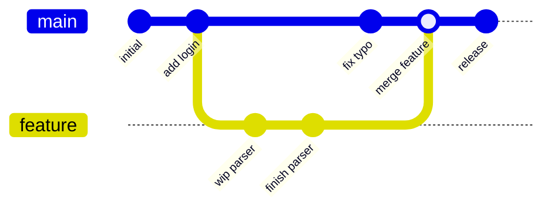

## In simple terms

Version control is "Track Changes" for code. It remembers every saved snapshot of your files, who made each change, and lets many people work on the same project in parallel without overwriting each other.

## The Visual Map



A commit history is a **directed graph**: each commit points back to its parent(s). A *branch* is just a moving label on a line of commits; a *merge* commit has two parents, rejoining diverged work.

## More detail

A version control system (VCS) gives you:

- A **history** of every committed change — who, when, and (via the message) why.
- The ability to **branch** — make an independent line of work — and later **merge** it back.
- A way to **collaborate** by sharing branches with others, usually via a remote server.
- **Blame/annotate** views so you can see why a particular line is the way it is.

Two model families exist:

- **Centralised** (Subversion, Perforce) — one canonical server holds the history; you check out and commit against it. Simple mental model, but the server is a single point of failure and offline work is limited.
- **Distributed** (Git, Mercurial) — *every* working copy has the full history, so commits, branches, history browsing, and diffs are all local and offline. Git won this race decisively.

The core data idea behind modern VCS is the **commit graph** (a DAG): commits are immutable snapshots that point to their parent(s), and branch names are lightweight pointers into that graph. Merging two branches creates a commit with two parents.

## Under the Hood

A minimal snapshot-based VCS in Python: each `commit` stores content, a message, and a pointer to its parent; a `branch` is just a named pointer; and history is found by walking parent links. This is the essential model every VCS shares:

```python
#!/usr/bin/env python3
"""A toy VCS: commits with parent pointers, branches as labels."""
import hashlib

class Repo:
    def __init__(self):
        self.commits = {}                  # id -> {parent, msg, content}
        self.branches = {"main": None}     # branch name -> commit id (a pointer)
        self.head = "main"

    def commit(self, content, msg):
        parent = self.branches[self.head]
        cid = hashlib.sha1(f"{parent}{content}{msg}".encode()).hexdigest()[:7]
        self.commits[cid] = {"parent": parent, "msg": msg, "content": content}
        self.branches[self.head] = cid     # advance the current branch pointer
        return cid

    def branch(self, name):                # a branch is just a label on a commit
        self.branches[name] = self.branches[self.head]

    def checkout(self, name):
        self.head = name

    def log(self):                         # walk parent links back to the root
        cid, out = self.branches[self.head], []
        while cid:
            c = self.commits[cid]
            out.append((cid, c["msg"]))
            cid = c["parent"]
        return out

r = Repo()
r.commit("line1\n", "initial")
r.commit("line1\nline2\n", "add line2")
r.branch("feature"); r.checkout("feature")     # diverge
r.commit("line1\nline2\nfeature\n", "feature work")

print("feature history:", r.log())   # 3 commits
r.checkout("main")
print("main history   :", r.log())   # 2 commits — main never saw 'feature work'
```

The `feature` branch shares history with `main` up to the divergence point, then has its own commit — exactly the structure the diagram above shows. Branching is cheap because it only creates a new pointer, not a copy.

## Engineering Trade-offs

**Distributed vs. centralised**
Distributed VCS (Git) makes every operation local and fast, enables offline work, and has no single point of failure — which is why it dominates open source and most teams. The trade-offs: every clone holds the *entire* history (painful for huge repos or large binaries), and the flexibility brings a steeper mental model than "check out, edit, check in." Centralised systems (Perforce) stay competitive precisely where those weaknesses bite: massive monorepos and large binary assets (game studios, film/CG).

**Branching freedom vs. merge cost**
Cheap branching lets teams isolate features, experiments, and releases freely. But branches that live long *diverge*, and the longer two lines of work drift apart, the harder and riskier the eventual merge — the motivation behind trunk-based development and frequent integration.

**Snapshot storage vs. delta storage**
Storing full snapshots (Git's model, deduplicated by content hash) makes checkout and history operations fast and robust, at the cost of more storage that compression and packing must reclaim. Older systems stored per-file *deltas* (compact, but slow to reconstruct a given version). Modern systems lean on snapshots plus background packing to get the best of both.

**History as immutable record vs. tidy history**
Treating history as an append-only audit trail maximises traceability and trust. But teams also want *readable* history, so they rewrite it (squash, rebase) before sharing — trading a faithful record of what happened for a curated story that's easier to review. Rewriting shared history, though, breaks everyone who already pulled it.

## Real-world examples

- Almost every open-source project on **GitHub, GitLab, or Bitbucket** uses Git.
- **The Linux kernel** has well over a million Git commits from tens of thousands of contributors — collaboration at a scale that is simply impossible without distributed version control (Git was created for exactly this).
- **Game and film studios** still use Perforce because it handles enormous binary assets (textures, models, footage) far better than Git.
- **Google and Meta** run gigantic monorepos on custom/centralised systems (Piper, a Mercurial-derived setup), because no single developer needs — or could hold — the whole history locally.

## Common misconceptions

- **"Git and GitHub are the same."** Git is the version-control tool that runs on your machine; GitHub is a website that hosts Git repositories and layers on collaboration features (pull requests, issues, CI). You can use Git with no GitHub at all.
- **"Version control is just backups."** Backups restore a single latest state; version control records *every* state, who changed what and why, and supports parallel lines of work and merging — a different capability entirely.
- **"Branches are expensive copies."** In modern VCS a branch is a tiny pointer to a commit; creating one copies nothing. The cost is in *merging* diverged branches later, not in making them.

## Try it yourself

The heart of version control is answering "what changed between two versions?" Python's stdlib `difflib` produces the same unified-diff format Git shows — run it on two revisions of a file:

```bash
python3 - << 'EOF'
import difflib

v1 = "alpha\nbeta\ngamma\n".splitlines(keepends=True)
v2 = "alpha\nBETA\ngamma\ndelta\n".splitlines(keepends=True)

diff = difflib.unified_diff(v1, v2, "report.txt@v1", "report.txt@v2")
print("".join(diff), end="")
EOF
```

You'll see `-beta` / `+BETA` (a changed line) and `+delta` (an added line), with `@@ -1,3 +1,4 @@` marking the affected region — exactly what `git diff` prints. A VCS stores a chain of these changes (plus who and why), which is what lets you reconstruct, compare, and merge any version.

## Learn next

- [Git](/t/git) — the dominant distributed VCS; learn its commit graph, branching, and merging in depth.
- [CI/CD](/t/ci-cd) — automation that runs on every commit/branch, turning version control into a continuous build-and-deploy pipeline.
- [Semantic versioning](/t/semantic-versioning) — the convention for *naming* the versions you tag in source control so consumers know what changed.
